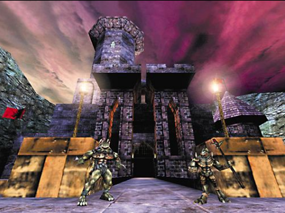
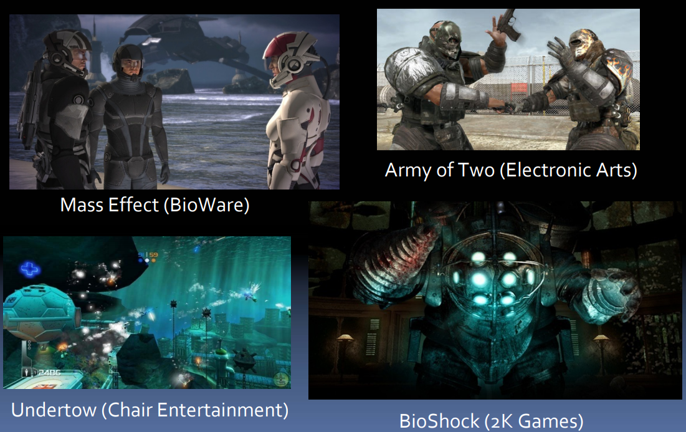
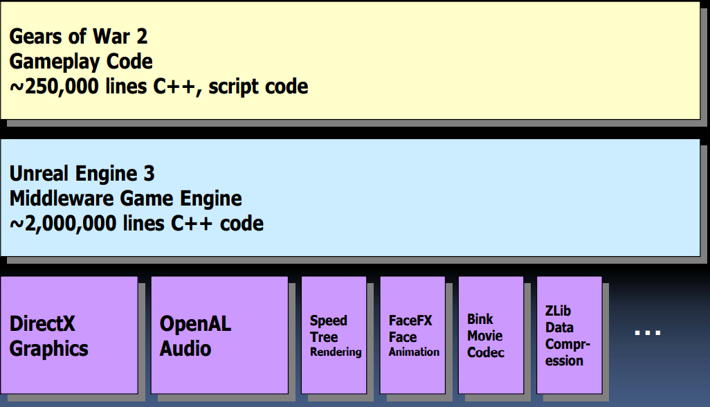
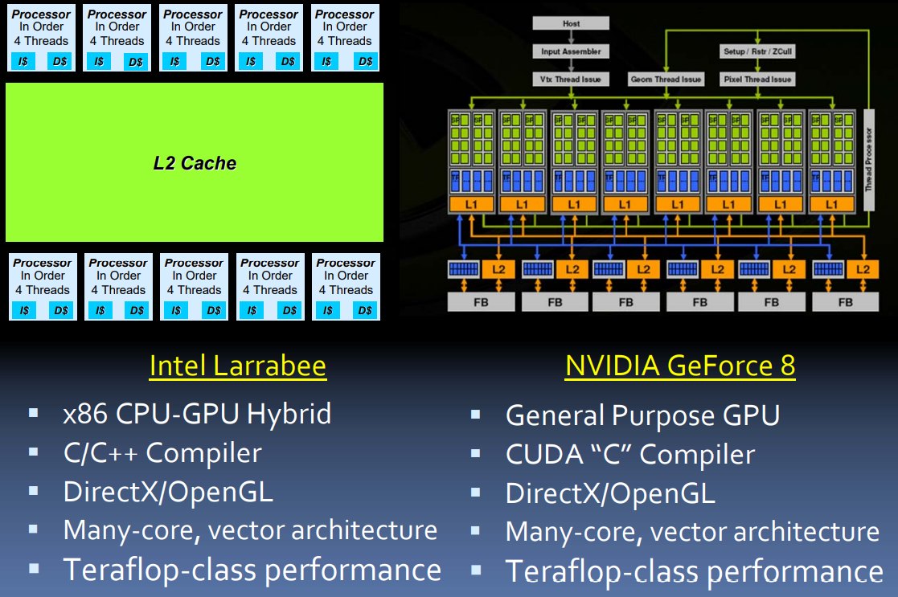
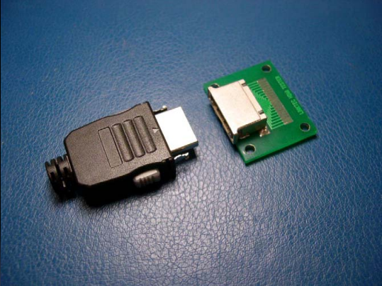
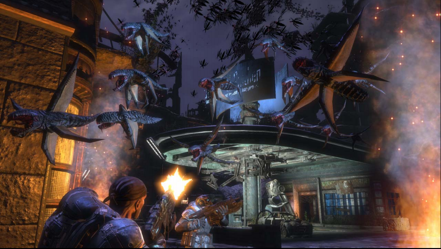

# Game Development 2012 - 2020

* Tim Sweeney 在 [IISWC-2008][1]/[CEDEC-2008][2] 的演讲稿
* PS3/XBOX360

## Background: Epic Games

* Independent game developer
* Located in Raleigh, North Carolina, USA
* Founded in 1991
* Over 30 games released
  * Gears of War
  * Unreal series
* Leading supplier of Game Engines

## History: Unreal Engine

### Unreal Engine 1 (1996 - 1999)

* First modern game engine
  * Object-oriented
  * Real-time, visual toolset
  * Scripting language
* Last major software renderer
  * Software texture mapping
  * Colored lighting, shadowing
  * Volumetric lighting & fog
  * Pixel-accruate culling
* 25 games shipped

### Unreal Engine 2 (2000 - 2005)

* PlayState 2, Xbox, PC
* DirectX 7 graphics
* Single-threaded
* 40 games shipped

### Unreal Engine 3 (2006 - 2012)

* PlayStation 3, Xbox 360, PC
* DirectX 9 graphics
  * Pixel shaders
  * Advanced lighting & shadowing
* Multithreading (6 threads)
* Advanced physics
* More visual tools
  * Game scripting
  * Materials
  * Animation
  * Cinematics
* 150 games in development

## Game Development: 2008

### Gears of War 2: Project Overview

* Project Resources
  * 15 programmers
  * 45 artists
  * 2-year schedule
  * $12M development budget
* Software Dependencies
  * 1 middleware game engine
  * ~20 middleware libraries
  * Platform libraries

### Gears of War 2: Software Dependencies

## Hardware: History

### Computing History

* 1985 - Intel 80386: Scalar, in-order CPU
* 1989 - Intel 80486: Caches!
* 1993 - Pentium: Superscalar execution
* 1995 - Pentium Pro: Out-of-order execution
* 1999 - Pentium 3: Vector floating-point
* 2003 - AMD Opteron: Multi-core
* 2006 - PlayStation 3, Xbox 360: "Many-core"
  * ... and we're back to in-order execution

### Graphics History

* 1984 - 3D workstation (SGI)
* 1997 - GPU (3dfx)
* 2002 - DirectX 9, Pixel shaders (ATI)
* 2006 - GPU with full programming language (NVidia GeForce 8)
* 2009 - x86 CPU/GPU Hybrid? (Intel Larrabee)

## Hardware: 2012 - 2020

* Conclusion
  * CPU, GPU architectures are converging

### The Graphics Hardware of the Future

* All else is just computing!

### potential Hardware 2012 - 2020

* A unified architecture for computing and graphics
* Hardware Model
  * Three performance dimensions
    * Clock rate
    * Cores
    * Vertor width
  * Executes two kinds of code
    * Scalar code (like x86, PowerPC)
    * Vector code (like GPU shaders or SSE/Altivec)
  * Some fixed-function hardware
    * Texture sampling
    * Rasterization?

### Teraflop Consumer Applications

* Games
* THE END

## Game Development: 2012 - 2020

* Programming
  * How do we write code for 100 cores?
* Graphics
  * What's possible beyond DirectX / OpenGL?
* Implications for Performance Analysis

### Programming: 2012 - 2020

#### The Essentials

* Developer Productivity
  * A programmer's time is valuable
  * Productivity is **very important!**
  * We must make multi-core programming easy!
* Performance
  * Supporting "many cores" with multithreading
  * Scaling to "vectors instruction sets"
  * Understanding Performance Implications

### Multithreading in Unreal Engine 3: "Task Parallelism"

* Gameplay thread
  * AI, scripting
  * Thousands of interacting objects
* Rendering thread
  * Scene traversal, occlusion
  * Direct3D command submission
* Pool of helper threads for other work
  * Physics Solver
  * Animation Updates
* Good for 4 cores
  * No good for 40 cores!

### The standard C++/Java threading model: "Shared State Concurrency"

* Many threads are running
* There is 512MB of data
* Any thread can modify any data at any time
* All synchronization is explicit, manual
  * See: LOCK, MUTEX, SEMAPHORE
* No compile-time verification of correctness properties
  * Deadlock-free
  * Race-free
  * Invariants

### Mutithreaded Gameplay Simulation

* 1000+ of game objects
* Each object is
  * Modifyable
  * Updated once per frame
    * Each update touches 5-10 other objects
    * Updates are object-oriented, so contorl-flow isn't statically known
* Code written by 10's of programmers
  * They aren't computer scientists!

### Mutithreaded Gameplay Simulation: How?

* Problems
  * Games must scale to "many cores" (20-100)
  * Must avoid **all** single-threaded bottlenecks
* Solutions
  * "Shared State Concurrency"
  * "Message Passing Concurrency"
  * "Software Transactional Memory"
  * "Pure Functional Programming"

### Mutithreaded Gameplay Simulation: Manual Synchronization

* Idea
  * Update objects in multiple threads
  * Each object contains a lock
  * "Just lock an object before using it"
* Problems
  * "Deadlocks"
  * "Data Races"
  * Debugging is difficult/expensive

### Mutithreaded Gameplay Simulation: Message Passing

* Idea
  * Update objects in multiple threads
  * Each object can only modify itself
  * Communicate with other objects by sending messages
* Problems
  * Requires writting 1000's of message protocols
  * Still need synchronization

### Mutithreaded Gameplay Simulation: Software Transactional Memory

* Idea
  * Update objects in multiple threads
  * Each thread runs inside a **transaction block** and has an **atomic** view of its "local" changes to memory
  * C++ runtime detects conflicts between transactions
    * Non-conflicting transactions are applied to "global" memory
    * Conflicting transactions are "rolled back" and re-run
  * Implemented 100% in software; no custom hardware required
* Problems
  * "Object update" code must be free of side-effects
  * Requires C++ runtime support
 * Cost around 30% performance
* See: ["Composable Memory Transactions"][3]

### Mutithreaded Gameplay Simulation: Conclusion

* Manual synchronization
  * Very difficult, error-prone
* Message passing
  * Difficult, error-prone
* Transaction Memory
  * 

[1]:http://www.iiswc.org/iiswc2008/sildes/keynote_1.pdf
[2]:https://cedil.cesa.or.jp/cedil_sessions/view/168
[3]:https://www.microsoft.com/en-us/research/wp-content/uploads/2005/01/2005-ppopp-composable.pdf
