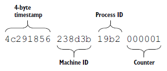

# pymongo初探

[https://docs.mongodb.com/ecosystem/drivers/python/][1]

$ python -m pip install pymongo


## 插入操作

```python
>>> from pymongo import MongoClient
>>> client = MongoClient('localhost', 27017)
>>> db = client.tutorial
>>> c = db.numbers
>>> c.find_one()
{u'_id': ObjectId('5acea89e54d690fac5052ce4'), u'num': 0.0}

>>> c = db.newcollection
>>> c.insert_one({'name':'waterdragon', 'age':18}).inserted_id
ObjectId('5aea56b9dafe745a9c758bfe')

>>> c.insert_one({'name':'phay', 'age':38})
>>> for a in c.find({'age':{'$gt':30}}):
...  print a
...
{u'age': 38, u'_id': ObjectId('5aea5730dafe745a9c758bff'), u'name': u'phay'}

>>> new_data = [{'name':'waterstar', 'age':22}, {'name':'adu', 'age':28}]
>>> result = c.insert_many(new_data)
>>> result.inserted_ids
[ObjectId('5aea58dddafe745a9c758c00'), ObjectId('5aea58dddafe745a9c758c01')]

>>> c.count()
4
```


## 查询操作

```python
>>> c.find({'name':'phay'})
<pymongo.cursor.Cursor object at 0x7fe80b619810>
```

返回的是个 cursor，那就要

```python
>>> results = c.find({'name':'phay'})
>>> for a in results:
...  print a
...
{u'age': 38, u'_id': ObjectId('5aea5730dafe745a9c758bff'), u'name': u'phay'}
```

查询条件

```python
>>> c = db.numbers
>>> results = c.find({'num':{'$lt':5}})
>>> for a in results:
...   print a
...
{u'_id': ObjectId('5acea89e54d690fac5052ce4'), u'num': 0.0}
{u'_id': ObjectId('5acea89e54d690fac5052ce5'), u'num': 1.0}
{u'_id': ObjectId('5acea89e54d690fac5052ce6'), u'num': 2.0}
{u'_id': ObjectId('5acea89e54d690fac5052ce7'), u'num': 3.0}
{u'_id': ObjectId('5acea89e54d690fac5052ce8'), u'num': 4.0}
```

## 更新操作

```python
>>> c = db.newcollection
>>> c.update({'name':'phay'}, {'$set':{'country':'usa'}})
{'updatedExisting': True, u'nModified': 1, u'ok': 1, u'n': 1}
>>> c.find_one({'name':'phay'})
{u'country': u'usa', u'age': 38, u'_id': ObjectId('5aea5730dafe745a9c758bff'), u'name': u'phay'}

>>> c.find_one_and_update({'name':'phay'}, {'$unset':{'country':1}})
{u'country': u'usa', u'age': 38, u'_id': ObjectId('5aea5730dafe745a9c758bff'), u'name': u'phay'}
>>> c.find_one({'name':'phay'})
{u'age': 38, u'_id': ObjectId('5aea5730dafe745a9c758bff'), u'name': u'phay'}
```

## ObjectID 格式



```python
>>>> c.find_one({"name":"kk"})
{u'_id': ObjectId('5bc4a2cc25e2692517709ef8'), u'name': u'kk', u'age': 35}
```

* 5bc4a2cc，timestamp
* 25e269，machine ID
* 54d6，Process ID
* d77d86，Counter

```python
>>>> from datetime import datetime
>>>> datetime.fromtimestamp(0x5bc4a2cc)
datetime.datetime(2018, 10, 15, 22, 23, 8)
```

不同的 mongo client driver，实现的 object id generator 不一样。

```
>>>> import bson
>>>> oid = bson.ObjectId('5bc4a2cc25e2692517709ef8')
>>>> oid.generation_time
datetime.datetime(2018, 10, 15, 14, 23, 8, tzinfo=<bson.tz_util.FixedOffset object at 0x000014a34aef9360>)
```

[1]:https://docs.mongodb.com/ecosystem/drivers/python/
