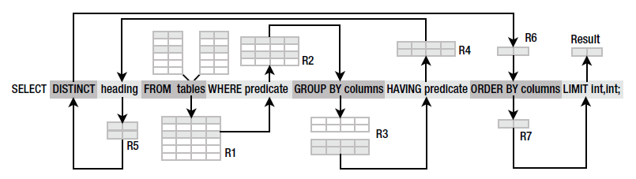
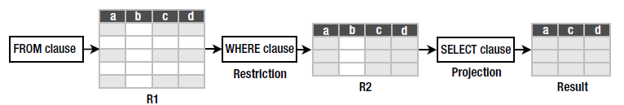
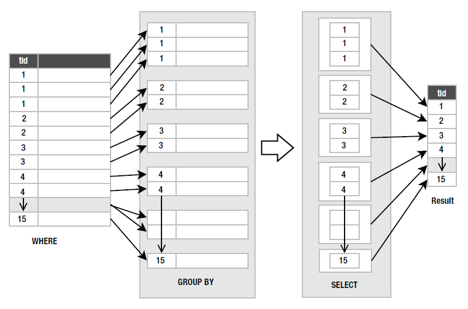
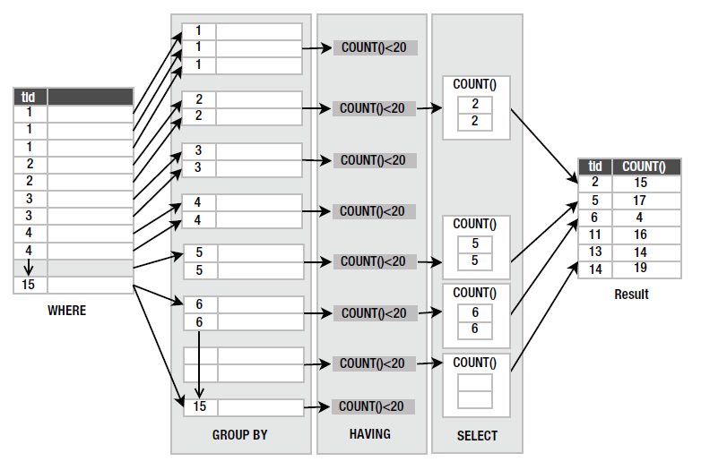

# About SELECT

《The Definitive Guide to SQLite 2nd》中看到的关于 SELECT 的实现流程。很赞，便于理解 SELECT 的行为。

```
SELECT [DISTINCT] heading
FROM tables
WHERE predicate
GROUP BY columns
HAVING predicate
ORDER BY columns
LIMIT count
OFFSET count;
```

整个 SELECT 的 pipeline



R1. FROM 从多张表合并成一张表

R2. WHERE 选择 row 的条件



R3. GROUP BY 按某个 field 分组



R4. 每个分组我们还希望 WHERE 一下（HAVING）

```
> SELECT type_id, count(*) FROM foods GROUP BY type_id HAVING COUNT(*) < 20;
```



R5. SELECT heading 选择需要的 field(column)

R6. SELECT 如果有 DISTINCT，则去掉重复的 row

R7. ORDER BY 根据某个 field 排序。ASC升序、DESC降序。

Result. 最后经过 LIMIT/OFFSET 跳过 OFFSET 个 row，选择接下来的 LIMIT 个 row。
