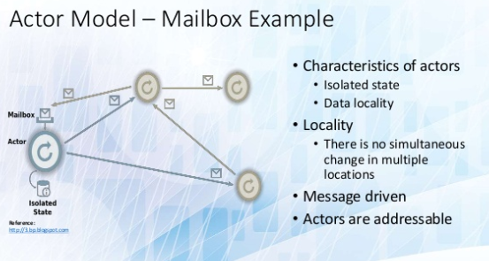
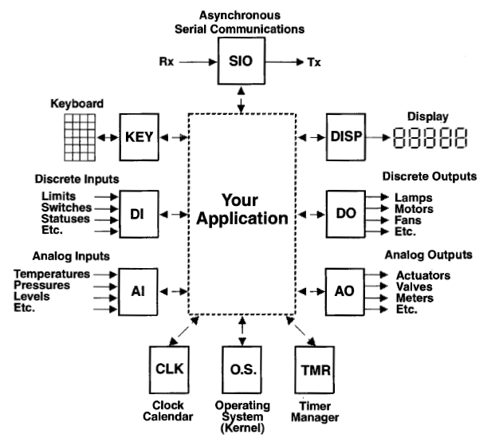
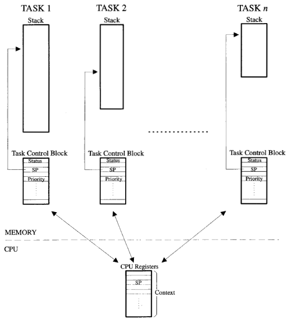

# [SAP01] Actor Model

最早接触 [Actor Model][1] 是在学习 [erlang][2] 的时候。

[Actor Model][1] 是一种业务的抽象模型，通过：

 * primitive unit - actor
 * asynchronous communication - message passing

来抽象业务模型。业务根据功能，划分为各种 Actor，然后 Actor 之间通过异步消息，来互相协作。

按照 [Actor Model][1] 设计的系统，可以做到：

 * 更好的业务切分
 * 更好的性能（利用多核）
 * 更好的实现分布式系统



从嵌入式系统到通用操作系统，再到分布式系统，无不渗透着 [Actor Model][1] 的设计。


## 实例一：uC/OS-II 中的 Task

uC/OS-II 本身是一个嵌入式的 Kernel，支持抢占式的 Task 调度。



然后它周围的功能模块（KEY / CLK / TMR 等等），都是独立的 Task。



模块之间如果有通讯需求，uC/OS-II 提供了 MailBox 这种 message-queue 机制。

以 TMR 为例。TMR 是个 timer 模块，管理一堆 timer func，时间到了就 call 一下。

TMR 模块启动

```C
void TmrInit(void)
{
    ...
    OSTaskCreate(TmrTask, (void *)0, &TmrTaskStk[TMR_TASK_STK_SIZE], TMR_TASK_PRIO);
}
```

TMR 主循环

```C
static void TmrTask(void *data)
{
    ...

    for (;;) {

        OSTimeDlyHMSM(0, 0, 0, 100);  /* Delay for 1/10 second (Task context-switch) */

        ...                           /* Trigger timer callback                      */
    }
}
```


## 实例二：操作系统的 Process

通用操作系统中的进程（Process），就是一个 Actor。然后进程之间，可以通过操作系统提供的 Inter-Process Communication API 来互相通讯。通讯方式包括：

 * TCP/IP
 * [NamedPipe(win32)][3]、[domain socket(*nix)][4]


## 实例三：Win32 中窗体的 message-queue

写过 Win32 API 程序的同学，都应该对 Win32 message-queue 很熟悉。每个 Win32 窗体，都可以看成一个 Actor。

在 Windows 上，进程中的 **每条线程(Thread)** 都会有自己的 message-queue。通过 [GetMessage()][6] 从 message-queue 中获取消息，然后处理业务。

窗体之间、线程之间、进程之间，可以通过

 * [SendMessage()][5]，给窗体发消息
 * [PostThreadMessage()][6]，给某条线程发消息

注意，窗体消息是发送给"其所依附的线程的 message-queue"中的。

```C
#include <windows.h>

LRESULT CALLBACK WndProc(HWND, UINT, WPARAM, LPARAM);

int WINAPI WinMain(HINSTANCE hInstance, HINSTANCE hPrevInstance,
                   PSTR szCmdLine, int iCmdShow)
{
    ...

    while (GetMessage(&msg, NULL, 0, 0))
    {
        TranslateMessage(&msg);
        DispatchMessage(&msg);
    }
    return msg.wParam;
}
```

[GetMessage()][7] 中的第一个参数 hWnd，来决定是获取窗体的消息，还是线程的消息。如果 hWnd == NULL，则窗体消息、线程消息都会处理，这就保证如上的一个 while 循环，可以处理所有的消息。

```
A handle to the window whose messages are to be retrieved. The window must
belong to the current thread.

If hWnd is NULL, GetMessage retrieves messages for any window that belongs
to the current thread, and any messages on the current thread's message queue
whosehwnd value is NULL (see the MSG structure). Therefore if hWnd is NULL,
both window messages and thread messages are processed.

If hWnd is -1, GetMessage retrieves only messages on the current thread's
message queue whose hwnd value is NULL, that is, thread messages as posted
by PostMessage (when the hWnd parameter is NULL) or PostThreadMessage.
```


## 实例四：DOOM3 中的 GameSystem

[GameSystem][8]，DOOM3 用于写游戏逻辑的一个基础模块，可以让每个 C++ 的类，变成一个 actor。actor 之间，通过互相发送消息来通讯。

游戏中，会有很多 NPC 和 Monster 之类的 actor，需要创建、删除，actor 本身会有受到攻击、攻击别人 等等行为。切分为 actor，逻辑上会很清晰。

idClass + idEventDef + idEvent，形成了一套 idClass 之间可以互相发消息的结构。很巧妙，不需要任何 template，代码结构也简单。

 * idEventDef，定义了 event 参数类型
 * idEvent，保存每个 event 的实际参数

看看 idClass 自带的两个 Event：

```C
const idEventDef EV_Remove( "<immediateremove>", NULL );
const idEventDef EV_SafeRemove( "remove", NULL );

ABSTRACT_DECLARATION( NULL, idClass )
  EVENT( EV_Remove       idClass::Event_Remove )
  EVENT( EV_SafeRemove,  idClass::Event_SafeRemove )
END_CLASS
```

触发 Event

```
PostEventMS( &EV_Remove, 0 );   // 0 ms 之后，调用 idClass::Event_Remove
```


## 实例五：Task + Scheduler 在游戏引擎中的应用

对于 3D 客户端引擎，其内部每一帧，都会出现很多业务：

 * 游戏玩法运算
 * 物理运算
 * 动画运算
 * 裁剪、准备绘制内容
 * 等等，其实都是不同的业务

这些业务，是否可以切分为可以并行的 Task，然后丢到 Thread Pool 中并发执行，以榨取 CPU multi-core 的最大性能。

Task + Scheduler 在游戏引擎中的应用，出于顽皮狗的GDC演讲《[Parallelizing the Naughty Dog Engine Using Fibers][9]》。

[Skyforge][10] 的程序员，将这套系统实现了，开源在[这里][11]，支持 PC、PS4。

我司的M记引擎，用的 [boost.asio][12] strand，也做了类似的系统，支持所有 mobile platform。

Task + Scheduler，本质上也是一种 Actor Model。


## 实例六：分布式系统

基本任何一个分布式系统，构建到最后，都是一个 [Actor Model][1] 模型。参考 Twitter 对于业务的改造《[How Twitter Is Scaling][13]》。

值得研究的分布式系统：

 * [erlang][2]
 * [Orleans][14]


[1]:https://en.wikipedia.org/wiki/Actor_model
[2]:http://www.erlang.org/
[3]:https://msdn.microsoft.com/en-us/library/windows/desktop/aa365146(v=vs.85).aspx
[4]:http://pubs.opengroup.org/onlinepubs/9699919799/functions/socketpair.html
[5]:https://docs.microsoft.com/en-us/windows/desktop/api/winuser/nf-winuser-sendmessage
[6]:https://docs.microsoft.com/en-us/windows/desktop/api/winuser/nf-winuser-postthreadmessagea
[7]:https://docs.microsoft.com/en-us/windows/desktop/api/winuser/nf-winuser-getmessage
[8]:https://github.com/TTimo/doom3.gpl/tree/master/neo/game/gamesys
[9]:http://www.swedishcoding.com/wp-content/uploads/2015/03/parallelizing_the_naughty_dog_engine_using_fibers.pdf
[10]:https://sf.my.com/us
[11]:https://github.com/SergeyMakeev/TaskScheduler
[12]:https://www.boost.org/doc/libs/1_68_0/doc/html/boost_asio.html
[13]:https://waimingmok.wordpress.com/2009/06/27/how-twitter-is-scaling/
[14]:https://dotnet.github.io/orleans/
