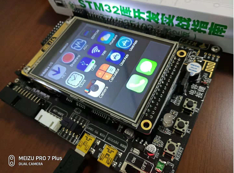
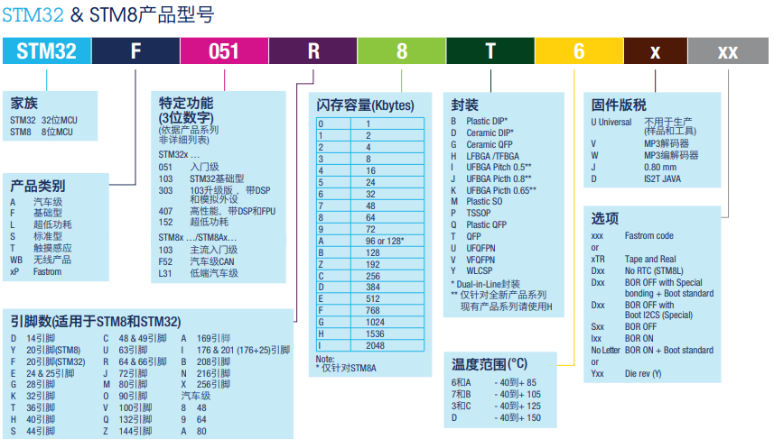
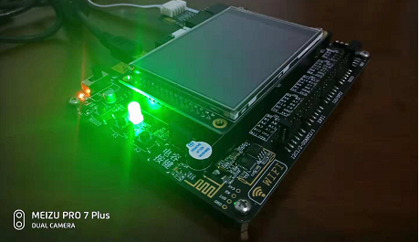

# 初识 STM32

开始读《[STM32库开发实战指南(第二版)][1]》，在闲鱼上淘了的对应的 秉火-STM32F103-指南者 的板子。

 * [野火论坛][9]
 * [附书光盘内容][8]，资料非常全，赞

刚到货，点亮一看，帅。[uC/OS-III][3] + [emwin][2] 做的系统，跑起来了。




## 关于 STM32 的命名

STM32 是[意法半导体][4]生产的 32-bit CPU，专用于嵌入式系统。有 STM32-F0、STM32-F1、STM32-F4、STM32-F7 等型号，对应使用 ARM Crotex-M0、ARM Cortex-M3、ARM Cortex-M4、ARM Cortex-M7 不同的内核。

STM32F103 完整的含义，参见《[STM8和STM32产品选型手册][5]》。




## 安装 KEIL 5

要给板子写程序：

 * [下载 KEIL 5][6]，安装
 * 找到 STMicroelectonics STM32F1 Series 的包，[下载][7]，安装


## 通过寄存器点亮 LED

打开工程"8-使用寄存器点亮LED灯"。

 * 位于："A盘（资料盘）\3-程序源码\1.固件库例程.zip"

通过寄存器点亮 LED，只需要三个文件：

 * startup_stm32f10x_hd.s
 * stm32f10x.h
 * main.c

### startup_stm32f10x_hd.s

启动文件，系统上电后第一个运行的程序。这个文件由硬件的官方提供。位于：

 1. C:\Keil_v5\ARM\PACK\Keil\STM32F1xx_DFP\2.3.0\Device\Source\ARM\startup_stm32f10x_hd.s
 2. 附属光盘："A盘（资料盘）\3-程序源码\【固件库】STM32F10x_StdPeriph_Lib_V3.5.0.zip"

### stm32f10x.h

存放寄存器映射代码。内容如下：

```C
/* 外设基地址 */
#define PERIPH_BASE           ((unsigned int)0x40000000)

/* APB2 总线基地址  */
#define APB2PERIPH_BASE       (PERIPH_BASE + 0x10000)
/* AHB 总线基地址   */
#define AHBPERIPH_BASE        (PERIPH_BASE + 0x20000)

/* GPIOB 外设基地址 */
#define GPIOB_BASE            (APB2PERIPH_BASE + 0x0C00)

/* GPIOB寄存器地址 */
#define GPIOB_CRL             *(unsigned int*)(GPIOB_BASE+0x00)
#define GPIOB_CRH             *(unsigned int*)(GPIOB_BASE+0x04)
#define GPIOB_IDR             *(unsigned int*)(GPIOB_BASE+0x08)
#define GPIOB_ODR             *(unsigned int*)(GPIOB_BASE+0x0C)
#define GPIOB_BSRR            *(unsigned int*)(GPIOB_BASE+0x10)
#define GPIOB_BRR             *(unsigned int*)(GPIOB_BASE+0x14)
#define GPIOB_LCKR            *(unsigned int*)(GPIOB_BASE+0x18)

/* RCC外设基地址 */
#define RCC_BASE              (AHBPERIPH_BASE + 0x1000)
/* RCC的AHB1时钟寄存器地址 */
#define RCC_APB2ENR           *(unsigned int*)(RCC_BASE+0x18)
```

### main.c

```C
#include "stm32f10x.h" 

int main(void)
{
	// 开启 GPIOB 端口时钟
	RCC_APB2ENR |= (1<<3);

	// 清空控制 PB0 的端口位
	GPIOB_CRL &= ~( 0x0F<< (4*0));	
	// 配置 PB0 为通用"推挽输出"，速度为10M
	GPIOB_CRL |= (1<<4*0);

	// PB0 输出 低电平
	GPIOB_ODR &= ~(1<<0);
	
	while(1);
}

// 系统初始化函数，startup_stm32f10x_hd.s 中会调用
void SystemInit(void)
{	
}
```



我自己的LED代码，在 [这里][11]。


## 寄存器映射原理

硬件寄存器，映射到内存地址，然后直接内存地址写入 1 or 0，控制发送高/低电平，控制硬件。

硬件的详细资料，就去看硬件生产厂商的各种手册。

 * 1-STM32F10x-英文参考手册.pdf，位于：A盘（资料盘）\6-STM32官方手册.zip
 * 《[The Definitive Guide to the ARM Cortex-M3][10]》


## 开机例程

板子开机自带的系统

 * 位于："A盘（资料盘）\3-程序源码\0.开机例程.zip"
 * 解压，打开工程文件："\UCOSIII_emWin_DEMO\Project\RVMDK（uv5）\iSO-STM32.uvprojx"
 * 编译，刷入即可。

本以为可以顺利刷入的，但编译出错：（有待研究）

```
error: L6050U: The code size of this image (184248 bytes) exceeds the maximum allowed for this version of the linker.
```

统计了下代码量，13w+ 而已，不算多。

```
-------------------------------------------------------------------------------
Language                     files          blank        comment           code
-------------------------------------------------------------------------------
C                              131           8724          30353          77075
C/C++ Header                   200           8228          21260          27413
HTML                             2           1531              0          21690
D                              120              0              0           5365
Assembly                        11            361            721           2349
DOS Batch                        1              1              0             26
-------------------------------------------------------------------------------
SUM:                           465          18845          52334         133918
-------------------------------------------------------------------------------
```


[1]:https://book.douban.com/subject/27076457/
[2]:https://www.segger.com/products/user-interface/emwin/
[3]:https://www.micrium.com/
[4]:https://www.stmcu.com.cn/
[5]:http://www.stmcu.org.cn/document/detail/index/id-218179
[6]:https://www.keil.com/demo/eval/arm.htm
[7]:http://www.keil.com/dd2/pack/
[8]:https://pan.baidu.com/s/1itqFOQwW0i03XfFhVPB0EQ#list/path=%2F
[9]:http://www.firebbs.cn/
[10]:https://download.csdn.net/download/d3000/2257520
[11]:https://github.com/kasicass/stm32f103/tree/master/01-RegisterLED
