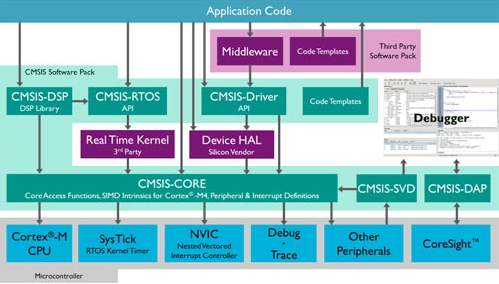

# STM32标准库函数

直接用寄存器来操作硬件，太繁琐。

这就出现了软件世界的第一层封装：将寄存器操作，变成一堆 C API。

```C
/* stm32f10x.h */

/*
 * GPIO 寄存器结构定义
 */

#define __IO            volatile
typddef unsigned int    uint32_t;
typedef unsigned short  uint16_t;

typedef struct {             //                       offset
    __IO uint32_t CRL;       // 端口配置低寄存器        0x00
    __IO uint32_t CRH;       // 端口配置高寄存器        0x04
    __IO uint32_t IDR;       // 端口数据输入寄存器      0x08
    __IO uint32_t ODR;       // 端口数据输出寄存器      0x0C 
    __IO uint32_t BSRR;      // 端口位设置/清除寄存器   0x10
    __IO uint32_t BRR;       // 端口位清除寄存器        0x14
    __IO uint32_t LCKR;      // 端口配置锁定寄存器      0x18
} GPIO_TypeDef;

/*
 * 外设存储器地址映射
 */

/* 外设基地址 */
#define PERIPH_BASE           ((unsigned int)0x40000000)

/* APB2 总线基地址  */
#define APB2PERIPH_BASE       (PERIPH_BASE + 0x10000)
/* AHB 总线基地址   */
#define AHBPERIPH_BASE        (PERIPH_BASE + 0x20000)

/* GPIO 外设基地址 */
#define GPIOA_BASE            (APB2PERIPH_BASE + 0x0800)
#define GPIOB_BASE            (APB2PERIPH_BASE + 0x0C00)
#define GPIOC_BASE            (APB2PERIPH_BASE + 0x1000)
#define GPIOD_BASE            (APB2PERIPH_BASE + 0x1400)
#define GPIOE_BASE            (APB2PERIPH_BASE + 0x1800)
#define GPIOF_BASE            (APB2PERIPH_BASE + 0x1C00)
#define GPIOG_BASE            (APB2PERIPH_BASE + 0x2000)

/* RCC 外设基地址 */
#define RCC_BASE              (AHBPERIPH_BASE + 0x1000)

/*
 * 外设声明
 */

/* GPIO 外设声明 */
#define GPIOA                 ((GPIO_TypeDef *) GPIOA_BASE)
#define GPIOB                 ((GPIO_TypeDef *) GPIOB_BASE)
#define GPIOC                 ((GPIO_TypeDef *) GPIOC_BASE)
#define GPIOD                 ((GPIO_TypeDef *) GPIOD_BASE)
#define GPIOE                 ((GPIO_TypeDef *) GPIOE_BASE)
#define GPIOG                 ((GPIO_TypeDef *) GPIOF_BASE)
#define GPIOG                 ((GPIO_TypeDef *) GPIOG_BASE)

/* RCC 的 AHB1 时钟使能寄存器地址 */
#define RCC_APB2ENR           *(unsigned int*)(RCC_BASE + 0x18)

/*
 * GPIO 位操作函数
 */

#define GPIO_Pin_0            ((uint16_t) 0x0001)
#define GPIO_Pin_1            ((uint16_t) 0x0002)
#define GPIO_Pin_2            ((uint16_t) 0x0004)
...
#define GPIO_Pin_15           ((uint16_t) 0x8000)

void GPIO_SetBits(GPIO_TypeDef* GPIOx, uint16_t GPIO_Pin);
void GPIO_ResetBits(GPIO_TypeDef* GPIOx, uint16_t GPIO_Pin);

/*
 * GPIO 初始化函数
 */

typedef enum
{
    GPIO_Speed_10MHz = 1,         // 10MHz - (01)b
    GPIO_Speed_2MHz,              // 2MHz  - (10)b
    GPIO_Speed_50MHz,             // 50MHz - (11)b
} GPIOSpeed_TypeDef;

typedef enum
{
    GPIO_Mode_AIN         = 0x0,  // 模拟输入
    GPIO_Mode_IN_FLOATING = 0x04, // 浮空输入
    GPIO_Mode_IPD         = 0x28, // 下拉输入
    GPIO_Mode_IPU         = 0x48, // 上拉输入
    GPIO_Mode_Out_OD      = 0x14, // 开漏输入
    GPIO_Mode_Out_PP      = 0x10, // 推挽输入
    GPIO_Mode_AF_OD       = 0x1C, // 复用开漏输入
    GPIO_Mode_AF_PP       = 0x18, // 复用推挽输入
} GPIOMode_TypeDef;

typedef enum
{
    uint16_t          GPIO_Pin;
    GPIOSpeed_TypeDef GPIO_Speed;
	GPIOMode_TypeDef  GPIO_Mode;
} GPIO_InitTypeDef;

void GPIO_Init(GPIO_TypeDef* GPIOx, GPIO_InitTypeDef* GPIO_InitStruct);
```

LED 例子，改用库函数实现：

```C
int main(void)
{
    GPIO_InitTypeDef GPIO_InitStructure;

    // 开启 GPIO 端口时钟
    RCC_APB2ENR |= (1<<3);

    GPIO_InitStructure.GPIO_Pin   = GPIO_Pin_0;       // 选择要控制的 GPIO 引脚
    GPIO_InitStructure.GPIO_Mode  = GPIO_Mode_Out_PP; // 设置引脚模式为通用"推挽输出"
    GPIO_InitStructure.GPIO_Speed = GPIO_Speed_50MHz; // 设置引脚速率为 50MHz

    GPIO_Init(GPIOB, &GPIO_InitStructure);

    while (1)
    {
        // 引脚输出低电平，点亮 LED		
        GPIO_ResetBits(GPIOB, GPIO_Pin_0);
        Delay(0xFFFF);

        // 引脚输出高电平，熄灭 LED		
        GPIO_SetBits(GPIOB, GPIO_Pin_0);
        Delay(0xFFFF);
    }
}
```


## CMSIS 标准

基于 Cortex 系列芯片采用的内核都是相同的，区别主要为核外的片上外设的差异，而这些差异却导致软件在同内核、不同外设的芯片上移植困难。

为了解决不同的芯片厂商生产的 Cortex 微控制器软件的兼容性问题，ARM 与芯片厂商建立了 CMSIS 标准（Cortex MicroController Software Interface Standard）。

其中，CMSIS-CORE、CMSIS-SVD、CMSIS-DAP 提供了统一的硬件 API。而 STM32 的库就是按 CMSIS 标准建立的。




##

 * 位于："A盘（资料盘）\3-程序源码\【固件库】STM32F10x_StdPeriph_Lib_V3.5.0.zip"

