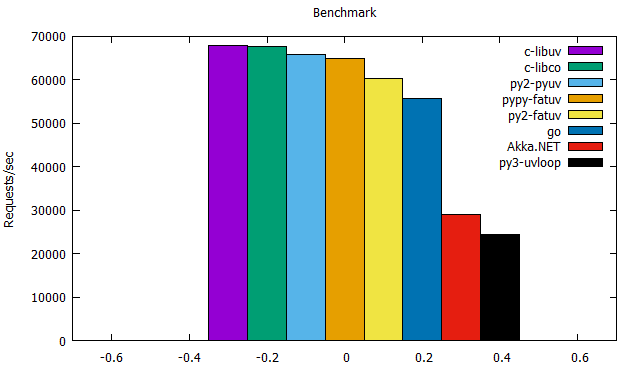

# fatuv benchmark

[fatuv][1] 还处于早期开发阶段，把 tcp, timer 封装完了，对比其它库做了下 echo server 的 benchmark。性能还不错，满意 :-)。


## 测试环境

CPU: Intel Core Processor (Broadwell)，2G MHz，4 核

```
$ uname -a
Linux 4.9.0-4-amd64 #1 SMP Debian 4.9.51-1 (2017-09-28) x86_64 GNU/Linux
```


## 结果汇总




## 单项分析

### No.1 - c + libuv

代码在 [这里][4]。

pure c 的 [libuv][3]，自然是最快的。

```
2037047 0.98KiB messages in 30 seconds
Latency: min 0.01ms; max 10.75ms; mean 0.038ms; std: 0.031ms (81.73%)
Requests/sec: 67901.57
Transfer/sec: 64.76MiB
```

### No.2 - c + libco

代码在 [这里][5]。

微信的 [libco][2] (6 tasks + 1 process)，用于老业务改造，C/C++ 老项目 select/send/recv 可以无缝切换成 multi-task / multi-process。鹅厂还是厉害。:-)

```
2031969 0.98KiB messages in 30 seconds
Latency: min 0.01ms; max 6.76ms; mean 0.039ms; std: 0.027ms (70.63%)
Requests/sec: 67732.3
Transfer/sec: 64.59MiB
```

### No.3 - python2 + pyuv

代码在 [这里][8]。

[pyuv][6] 第三名，是没想到的。转念一想，echo server 这种业务，主要比拼的还是网络库的能力。相比 c + libuv，这里的性能折损，主要来自 [libuv][3] 注册到 python。可惜 [pyuv][6] 的注册方式没选用 [cffi][13]，否则我就可以偷懒不用做 [fatuv][1] 了。

```
1973017 0.98KiB messages in 30 seconds
Latency: min 0.01ms; max 12.06ms; mean 0.04ms; std: 0.031ms (78.55%)
Requests/sec: 65767.23
Transfer/sec: 62.72MiB
```

### No.4 - pypy + fatuv

代码在 [这里][7]。

为何会比 python2 + pyuv 慢？说明 [cffi][13] 的注册方式，还是不如手写 CPython 注册。不过随着我对 [cffi][13] 越来越熟悉，应该有优化空间。

```
1948240 0.98KiB messages in 30 seconds
Latency: min 0.01ms; max 10.63ms; mean 0.04ms; std: 0.032ms (80.32%)
Requests/sec: 64941.33
Transfer/sec: 61.93MiB
```

### No.5 - python2 + fatuv

代码在 [这里][7]。

这个数据和 python2 + pyuv 对比，就是目前我的 [cffi][13] 注册方式和 [pyuv][6] 的差距了。

```
1807252 0.98KiB messages in 30 seconds
Latency: min 0.02ms; max 15.47ms; mean 0.044ms; std: 0.036ms (81.89%)
Requests/sec: 60241.73
Transfer/sec: 57.45MiB
```

### No.5 - Go

代码在 [这里][9]。

```
1674506 0.98KiB messages in 30 seconds
Latency: min 0.01ms; max 6.5ms; mean 0.045ms; std: 0.032ms (71.27%)
Requests/sec: 55816.87
Transfer/sec: 53.23MiB
```

### No.6 - dotnet core + Akka.NET

代码在 [这里][15]。

[dotnet core][15] 和 [Akka.NET][14] 比较厚重，对于 echo server 这种业务，肯定是劣势。放在这里对比，对它不公平。:-)

而且我对 [Akka.NET][14] 还不够熟悉，应该有优化的空间。

```
873675 0.98KiB messages in 30 seconds
Latency: min 0.03ms; max 25.59ms; mean 0.095ms; std: 0.222ms (232.92%)
Requests/sec: 29122.5
Transfer/sec: 27.77MiB
```

### No.7 - python3 + uvloop

代码在 [这里][10]。

[uvloop][12] 只是将 [libuv][3] 的 event loop 对接了 python3 的 [asyncio][13]，并没有使用 [libuv][3] 提供的 tcp, timer 功能。[uvloop][12] 用于无缝对接一些 [asyncio][13] 写的项目，还成。

[uvloop][12] 作者写过一篇《[uvloop: Blazing fast Python networking][11]》，要超越他，so easy~

```
732578 0.98KiB messages in 30 seconds
Latency: min 0.04ms; max 8.84ms; mean 0.115ms; std: 0.062ms (53.45%)
Requests/sec: 24419.27
Transfer/sec: 23.29MiB
```

## gnuplot 脚本

plot.txt

```
set key inside top right
set xlabel ''
set ylabel 'Requests/sec'
set title 'Benchmark'
set xrange [-0.7:0.7]
set yrange [0:70000]
set style histogram
set style fill solid border -1
plot "plot_data1.txt" using 1 title columnheader(1) with histogram, "plot_data1.txt" using 2 title columnheader(2) with histogram, "plot_data1.txt" using 3 title columnheader(3) with histogram, "plot_data1.txt" using 4 title columnheader(4) with histogram, "plot_data1.txt" using 5 title columnheader(5) with histogram, "plot_data1.txt" using 6 title columnheader(6) with histogram, "plot_data1.txt" using 7 title columnheader(7) with histogram, "plot_data1.txt" using 8 title columnheader(8) with histogram
```

data.txt

```
c-libuv    c-libco    py2-pyuv    pypy-fatuv    py2-fatuv    go        Akka.NET    py3-uvloop
67901      67732      65767       64941         60241        55816     29122       24419
```


[1]:https://github.com/kasicass/fatuv
[2]:https://github.com/Tencent/libco
[3]:http://libuv.org/
[4]:https://github.com/kasicass/fatbench/blob/master/servers/c-libuv-echo.c
[5]:https://github.com/Tencent/libco/blob/master/example_echosvr.cpp
[6]:https://github.com/saghul/pyuv
[7]:https://github.com/kasicass/fatuv/blob/master/examples/04-tcp-echo-server.py
[8]:https://github.com/kasicass/fatbench/blob/master/servers/uv-echo.py
[9]:https://github.com/kasicass/fatbench/blob/master/servers/goecho.go
[10]:https://github.com/kasicass/fatbench/blob/master/servers/asyncioecho.py
[11]:https://magic.io/blog/uvloop-blazing-fast-python-networking/
[12]:https://github.com/MagicStack/uvloop
[13]:https://docs.python.org/3/library/asyncio.html
[14]:http://getakka.net/
[15]:https://github.com/kasicass/kasicass/tree/master/akka.net/echosvr
