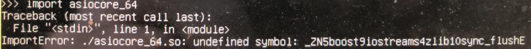

# C/C++项目构建 (CMAKE & EMAKE)

最近在整理一个老的 C++ 项目。顺便尝试了 cmake 和 emake 构建。


## 基本目标

* static link，尽量不依赖 .so，方便发布


## CMAKE

* [https://cmake.org/][2]

cmake 对于 C++ 项目，确实很方便，几行 CMakeLists.txt，就把 boost 跑起来了。不过前提是，有人帮你把编译 boost 的 cmake file 写好了：

* [https://github.com/Orphis/boost-cmake][5]

目前 cmake 在 C++ 项目中属于事实上的构建标准。大部分开源库都有 CMakeLists.txt，很容易整合到自己的项目中。

做了一个 project template，方便使用：

* [https://github.com/kasicass/bootstrap-cmake][3]

```
$ mkdir build
$ cd build
$ cmake ..

$ make

$ GLOG_logtostderr=1 ./bin/test-glog
```


## EMAKE

* [https://github.com/skywind3000/emake][1]

emake 其实是 gnu make 加强版，简单、易用。

做了一个 project template，方便使用：

* [https://github.com/kasicass/bootstrap-emake][4]

构建前

```
.
|-- 3rdparty
|   |-- README.md
|   |-- boost-emake
|   |   |-- program_options.mak
|   |   |-- system.mak
|   |   `-- thread.mak
|   |-- clean.sh
|   |-- download.sh
|   |-- gflags.mak
|   |-- glog.mak
|   `-- prepare.sh
|-- build_3rdparty.sh
|-- build_all.sh
|-- clang.ini
`-- src
    |-- boost
    |   `-- thread
    |       |-- simple_thread.cpp
    |       `-- simple_thread.mak
    |-- test-gflags
    |   |-- main.cpp
    |   `-- test-gflags.mak
    `-- test-glog
        |-- main.cpp
        `-- test-glog.mak
```

下载 & 构建 3rdparty

```
$ sh 3rdparty/download.sh         # 下载 3rdparty source
$ sh 3rdparty/prepare.sh          # 生成 .h / .cpp
$ sh build_3rdparty.sh            # emake 编译 .a

$ sh build_all.sh                 # 编译所有项目

# 编译单个项目
$ emake --ini=clang.ini src/test-glog/test-glog.mak

$ GLOG_logtostderr=1 ./bin/test-glog
```

构建后会多出 bin, lib, build 三个目录

```
|-- bin
|   |-- simple-thread
|   |-- test-gflags
|   `-- test-glog
|-- build (中间文件 .o)
...
|-- lib
|   `-- 3rdparty
|       |-- boost
|       |   |-- program_options.a
|       |   |-- system.a
|       |   `-- thread.a
|       |-- gflags.a
|       `-- glog.a
...
```

这里选取了三个很典型的项目：

* boost, 自带的 bjam 构建
* glog，使用传统的 autoconf & automake (./configure & ./make)
* gflags，使用 cmake

不管怎么构建，最关键的是生成需要的 .h / .cpp 文件，以 ./configure 为例，最喜欢生成的就是 config.h。那么，只需要将生成的文件(.h / .cpp)准备好。就可以用 emake 将它们 build 出来了。

这里最关键的是 boost，其 ./bootstrap.sh 会生成一堆 .cpp，放在 boost/libs/* 下。

```shell
# 3rdparty/prepare.sh

(cd 3rdparty/boost && ./bootstrap.sh)
(cd 3rdparty/glog && ./configure)
(cd 3rdparty/gflags && cmake .)
```

以 boost::system 的 build 为例：

```
; 3rdparty/boost-emake/system.mak

mode: lib

out: ../../lib/3rdparty/boost/system.a
int: ../../build/emake-obj-boost-system

flag: -Wall
flag: -O3, -std=c++11
flag: -g

inc: ../../3rdparty/boost

src: ../../3rdparty/boost/libs/system/src/error_code.cpp
```

跑完 prepare.sh，只需要

```
$ emake --ini=clang.ini 3rdparty/boost-emake/system.mak
compiling ...
3rdparty/boost/libs/system/src/error_code.cpp
linking ...
a - error_code.o

$ ls -l lib/3rdparty/boost
-rw-r--r--  1 kasicass  kasicass  10514636 Nov  7 07:46 program_options.a
```

因为 OpenBSD 中，gcc 版本太老了，不支持 -std=c++11，这里通过 --ini 配置成 clang 编译。Debian 下不需要这样设置。

使用编译出来的 .a 也很简单，看一下 test-glog.mak

```
; src/test-glog/test-glog.mak

mode: exe

out: ../../bin/test-glog
int: ../../build/emake-obj-test-glog

link: stdc++
link: pthread

flag: -Wall
flag: -O3, -std=c++11
flag: -g

link: ../../lib/3rdparty/glog.a

inc: ../../3rdparty/glog/src

src: main.cpp
```

run, see glog run~

```
$ emake --ini=clang.ini src/test-glog/test-glog.mak

$ GLOG_logtostderr=1 ./bin/test-glog                
I1107 07:59:49.518374 4294006680 main.cpp:9] Hello glog!
```


## CMAKE vs EMAKE

cmake

* 需要支持 VC++
* 需要整合大量C++第三方库的时候
* 庞大复杂，掌握起来需要时间
* 当第三方库的 CMakeLists.txt 不符合预期时，改起来比较耗时

emake

* 不需要支持 VC++
* win32 平台通过 mingw 来编译
* 中小型C++项目
* 轻巧灵活，修改 flags/link 的时候很方便
* 小众，所有第三方库都需要自己写 .mak


## C++ 构建问题汇总

### undefined symbol: _ZN5boost9iostreams4zlib10sync_flushE

龙爷某天给我发了个截图，发现编译好的 .so，import 的时候，会提示：



```
/boost/boost/iostreams$ find . -name "*.hpp" | xargs grep sync_flush
./filter/zlib.hpp:BOOST_IOSTREAMS_DECL extern const int sync_flush;
```

extern const int，说明定义一定在 .cpp 中。

```
/boost/libs/iostreams/src$ grep sync_flush *.cpp
zlib.cpp:const int sync_flush           = Z_SYNC_FLUSH;
```

只说明一个问题，那就是 boost::iostreams 的 *.cpp 并没有 link 成功。

最后，龙爷发现是 bjam 在编译中，出了个 link error，但没有打断，还是继续跑编译。最后就出了上面的问题。（缺少了 -fPIC 导致的 link error）

[1]:https://github.com/skywind3000/emake
[2]:https://cmake.org/
[3]:https://github.com/kasicass/bootstrap-cmake
[4]:https://github.com/kasicass/bootstrap-emake
[5]:https://github.com/Orphis/boost-cmake
