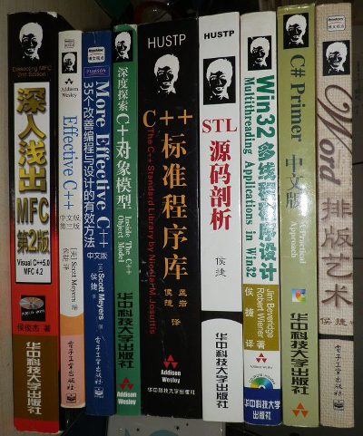
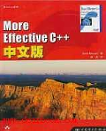
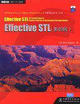
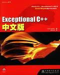
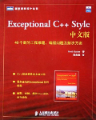
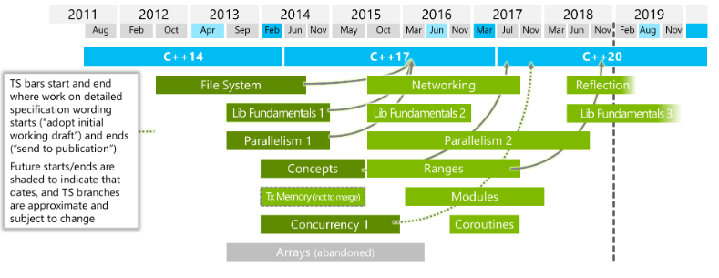

# C++, Farewell~

```C++
#include <iostream>

int main(void) {
    std::cout << "Farewell, C++!" << std::endl;
}
```

年纪大了，就开始返璞归真。聚焦业务，不再把精力投入那些花哨的"语法糖"。

最近在 refactoring 自己的书架，把最喜欢的几本 C++ 书，也送出去了。:-)

包括收藏了很久的 jjhou 的几本书。


## 侯捷(jjhou)

侯捷，台湾技术作家。在大陆 C++ 风靡一时的时候，我觉得大部分学习过 C++ 的程序员，都读过 jjhou 的书。能把技术书籍写得文雅清秀，我看过的技术书作家中，应该无人能出其右。我最喜爱的中文技术作家，没有之一。

jjhou 个人网站（[http://www.jjhou.com][29]）已经无法访问，随着 C++ 技术教育不再那么流行，jjhou 也慢慢谈出这个时代。在他网站上，有很多90年代初，给台湾技术杂志写的技术小段子，非常有意思。我久不久都会去翻翻。失联了呀，有点可惜。

知乎上找到的[一张图片][30]，每一本我都有 :-)。满满的回忆，现在只留着《Win32多线程程序设计》《Word排版艺术》。

侯捷还有本《左手程序右手诗》，可惜没能出版。



云课堂上还能看到 [jjhou的课程][31]，还在讲 C++。偶尔也能收到技术培训公司的广告邮件，还能看到 jjhou 的身影。:-)

新生代程序员，我已经不推荐去看 C++ 了。Java、C#、go、node.js、python，在应用程序语言群雄并立的年代，C++，必将远去。（写游戏引擎除外）


## C++学习历程

大学开始学习 C++，直接开始啃 [Lippman][47] 的 《[C++ Primer][5]》（还有本《C++ Primer Plus》，和 [Lippman][47] 没毛关系，别看）。不过大部分语法特性，都是边写边用学会的，《[C++ Primer][5]》 太厚，没认真读完一遍。哈哈。

学习 C++ 的过程中，还去看了 Charles Petzold 的《[Programming Windows 5th][6]》，基本了解了 Win32 API，理解了 Windows 一个窗体消息循环的样貌。

当时市面上流行的 Win32 GUI 制作方式，是 [MFC][62]，在还不会 [MFC][62] 编程的基础上，开始读 jjhou 的 《[深入浅出MFC][4]》，里面印象最深的是"勿在浮沙筑高台"那一章，将类、继承、多态等等概念，都讲清楚了。还模拟了 [MFC][62] 整个 Message Bump 的实现。

其实，更推荐先看《[Programming MFC][7]》，再读《[深入浅出MFC][4]》。先学会使用 [MFC][62]，再去研究原理。就不会像我，看完整本 《[深入浅出MFC][4]》，却不会写 [MFC][62] 程序。如今，[MFC][62] 肯定不要学了，当前 C++ GUI 主流是 [Qt][17]。

从现在来看，[MFC][62] 这套东西，无非是做了一套反射系统，然后把 Win32 API 全部 class 封装了一遍。当年，第一次见识，心情澎湃、兴奋无比。从 Win32 API 到 [MFC][62]，从 [WinForm][63] 到 [WPF][64]，每一次进化，都是设计思想的飞跃。


C++ 有了基础之后，在老师推荐下，开始看 Scott Meyers 的《[Effective C++][8]》，然后顺道把《[More Effective C++][9]》和 [Herb Sutter][11] 的《[Exceptional C++][12]》《[More Exceptional C++][13]》《[More Exceptional C++ Style][14]》，都看了一遍。

毕业之后，还买过《[Effective STL][15]》，不过就没看了。

当年人邮出版的这一堆 C++ 书籍，都是红色封面，放在书架上，煞是好看。

     

上面这些 Effective XXX 太多了，[Herb Sutter][11] 又总结出精华，出了本《[C++ Coding Standards][18]》。我觉得有骗稿费的嫌疑。其实这一大堆 Effective XXX，只需读最早的两本《[Effective C++][8]》《[More Effective C++][9]》就好。

之后，又买了 Bjarne Stroustrup 的《[The C++ Programming Language][16]》，因为对 C++ 已经很熟悉，基本就没再读这本基础书。

之间，还读过 [Andrew Koenig][34] 的《[C++沉思录][32]》和《[Accelerated C++][33]》。其中，《[Accelerated C++][33]》是本 C++ 入门书籍，可以在看《[C++ Primer][5]》之前读读，快速地对C++有个初步的了解。而《[C++沉思录][32]》则是一本思考文集，总结了作者使用C++过程中很多经验。当年读《[C++沉思录][32]》时，缺乏工程经验，书中描述的内容，共鸣不多。后来工作后，却又没时间再次温故一遍此书。其实 [Andrew Koenig][34] 最出名的一本书，应该是 《[C Traps and Pitfalls][35]》，地位相当于《[Effective C++][8]》。

大学还看了 Lippman 的 《[Inside the C++ Object Model][3]》，从编译器的角度，讲解了如何实现 C++ 的语法，特别是 virtual function 的实现 -- vtable。如今面试，所有学生都会准备一下 vtable 的面经，不管是否真的理解。因为提问的这一群面试官，都是从 C++ 鼎盛时代长大的，总喜欢问 vtable。:-)

读这些 Effective XXX，总觉得没啥实践，感觉不会写 C++ 代码。之后读到《[道法自然][19]》《[C++实践之路][20]》，拍手称好。这两本，才是 C++ 实践的好书，接地气，讲解的都是具体问题。

 * 《[道法自然][19]》，如何 OO 地去设计一个嵌入式 GUI 系统
 * 《[C++实践之路][20]》，讲了怎么 OO 的封装 Win32 API，我现在 Win32 API 的封装方式，还在沿用这里学到的方法

写代码的过程中，经常要用容器，就去看《[The C++ Standard Library][21]》，又喜欢弄懂原理，而且 jjhou 写书风雅有趣，又读了《[STL源码分析][22]》。

毕业后，读过《[Large-Scale C++ Software Design][36]》，只记得有讲一些技巧，加快编译速度的。对于大量 C++ 代码的项目，编译效率是个问题。于是有了 [fastbuild][37]、[IncrediBuild][38] 这样的项目。

读书到此，都还算没脱离 C++ 正轨。直到后来开始玩 template，一入魔道，道已偏。

**不推荐读的 C++ 书籍**

 * 《[C++设计新思维][23]》
 * 《[Imperfect C++][24]》
 * 《[C++ Templates: The Complete Guide][25]》
 * 《[C++ Template Metaprogramming][26]》

我看过《[C++设计新思维][23]》，对 Alexandrescu 把 C++ template 玩得如此神乎其技表示惊叹不已。除非是你要去维护 [boost][27] 的代码，否则上面这几本书，还是不要碰了。哈哈。

我试过几次，打算看《[Imperfect C++][24]》和《[C++ Templates: The Complete Guide][25]》，实在看不下去。《[C++ Templates: The Complete Guide][25]》最多能看到第四还是第五章。

不过，经过这么多 C++ 书籍熏陶，有个好处，基本的 C++ 编译器报错，我大约都知道为啥。:-)，什么 template partial specialization 我都懂，读 [boost][27] 代码也不吃力。嘿嘿。


## 我的项目经验

毕业进入公司，写了五年服务端(2006-2011)，主要用 C 、LPC。写了七年客户端(2011-now)，主要用 C++、Python。C++ 用于维护客户端引擎和工具，工具用的 MFC。算是大量写过 C++ 代码了。

引擎的 C/C++ 代码统计（200w+，不包括编辑器）

```
---------------------------------------------------------------------------------------
Language                             files          blank        comment           code
---------------------------------------------------------------------------------------
C++                                   2920         362853         279490        1763680
C/C++ Header                          5741         201325         386047         686346
C                                     1313          87382         144801         650331
MSBuild script                         610              1              3         596584
Python                                1974          75768          97044         364865
...
```


## C++设计上的对与错

C++ 有一个设计原则"提供 C 的所有能力；性能第一，为了性能，宁可让语言使用者去handle一定的复杂度"。这是 Stroustrup 很执着的一点。

C 是一门面向底层的语言，用来写操作系统、写编译器的。C++要保持对其的兼容，就要接受 C 中所有的"不完美"。手动内存管理，就是 C++ 继承而来的最大的问题。

手动管理内存没问题，那只能在 C 这样一种简单的语言框架之下。当 C++ 引入了越来越多语法之后，内存管理就像个毒瘤，越来越痛。


### 内存管理之殇

没有 gc，是 C++ 永远之殇。我们来看看 C++ 继承了 C 手工管理内存，带来了多少问题。

当 class 遇上 memory management。

 * malloc / free
 * new / delete
 * new[] / delete[]
 * ::operator new / ::operator delete
 * ::operator (address) new / ::operator (address) delete

:-) 不知道有多少新生代程序员能完全理解上面这些 keyword。反正作为 C++ 程序员，这些都是基础，《[Effective C++][8]》开场好几篇，都在讲这些东东。

而基类的虚析构函数，本质上也是要解决内存释放问题。

```C++
class Base {
    void Base();
    virtual ~Base();
    ...
};
```

所以，大规模 C++ 项目第一个基础设施，就是发明 smart pointer（智能指针）。于是有了 C++11 中的 std::shared_ptr。

然后，想把 class instance 的 this，作为 member function 的返回值，返回成 std::shared_ptr。这又成了浩大工程。

```C++
class MyClass : std::enable_shared_from_this<MyClass> {
  std::shared_ptr<MyClass> getptr() {
    return shared_from_this();
  }
};
```

再然后，C++11 还给你带来了雪上加霜的 lambda。

```C++
void ClassName::MethodName(int a, float b) {
    this->AsyncCall(..., [&] {
        ...
    })
}
```

不知道有多少人能记得 [&], [=] 的区别。哈哈。

而且内存问题，写得不好就 SEGMENT FAULT，coredump 没商量。


### STL -- 在一个错误的道路上奔袭

C++98 标准化了 template，然后在 template 上实现了 STL。为了这事，C++ 标准晚了五年才面世。不得不说，STL 是一个精巧的设计，template 本身的 meta-programming 能力，相当于在编译期给你造了一套图灵完备的计算机。各种 C++ 大牛在 template 上玩得不亦乐乎。

继续说内存问题。遵循"性能第一"原则，C++ 给每个容器声明时，都保留了一个 std::allocator 的入口，你可以插入自己实现的 allocator。但你想精巧统计 STL 每一分内存是如何使用的，很难。

只有自己实现容器类，完全不用 STL（很多游戏引擎是这么干的），再配上自己的内存管理模块，才能做到。而尝试与 STL 共舞[这个事情][40]，总是不完美。

说到 STL，还看过一本书《[Generic Programming and the STL][39]》，也是 jjhou 翻译的。讲解了 STL 设计上的所有 policy。真想理解 STL 的设计原理，可以读读。


### 精巧的天书 -- boost

[boost][27] 被认为是 STL 的试验田，很多内容，都在 [boost][27] 中先尝试。

asio 第一个 example 就是教你[如何写一个 allocator][41]，配合着 asio 一起工作的。是不是很像天书。

如果你碰到 gcc 编译器 template 相关的报错，简直没法看。需要长期的训练，才能一眼看出问题所在。


## C++不容易用好

### 案例一：script binding

做游戏，很多时候要给引擎嵌入一个脚本语言：Python、Lua 等等。那自然要将 C++ 写得一些功能，注册到脚本。如何注册，各路神仙就发明了很多方法。

先看一个反例，我们项目中现存的方法。需要将胶水代码插入到 C++ 各个类中，而且只能绑定 Python。是不是很反人类。哈哈。

```C++
/*==== .h ====*/
class XXX : public PyObjectPlus
{
     Py_Header(XXX, PyObjectPlus)

public:
     PY_FACTORY_DECLARE()                // static pyNew(), 交给每个 class 自己实现
                                         // static _pyNew(), 调用 pyNew()
                                         // static PyFactoryMethodLink s_link_pyNew
public:
     void foo(int a);
     PY_AUTO_METHOD_DECLARE(foo, ...)    // 定义 PY_METHOD(foo) 所需要的 member func

     int bar() const;
     void bar(int v);
     PY_RW_ATTRIBUTE_DECLARE(bar_, bar)  // 定义 PY_ATTRIBUTE(bar) 所需要的 member func
private:
     int bar_;
};

/*==== .cpp ====*/
PY_TYPEOBJECT( XXX )                     // 定义PyTypeObject

PY_BEGIN_METHODS( XXX )                  // 定义methods, attr, 自动加到 s_attributes_ 中
  PY_METHOD(foo)
PY_END_METHODS()

PY_BEGIN_ATTRIBUTES( XXX )
  PY_ATTRIBUTE(bar)
PY_END_ATTRIBUTES()

PY_FACTORY(XXX, ModuleName)              // 通过 s_link_pyNew, 将PyTypeObject加入某个module中

XXX* XXX::pyNew() { return new XXX() }

```

然后 [Boost.Python][60] 进步了，通过模板推导来获得信息，只需要写一个 .cpp 文件去注册你的 class 给 Python。缺点就是引入了 [boost][27] 这一大坨难维护的东西。

源文件

```C++
struct World
{
    void set(std::string msg) { this->msg = msg; }
    std::string greet() { return msg; }
    std::string msg;
};
```

注册文件

```C++
#include <boost/python.hpp>
using namespace boost::python;

BOOST_PYTHON_MODULE(hello)
{
    class_<World>("World")
        .def("greet", &World::greet)
        .def("set", &World::set)
    ;
}
```

在 Python 中使用。

```Python
>>> import hello
>>> planet = hello.World()
>>> planet.set('howdy')
>>> planet.greet()
'howdy'
```

做到 Boost.Python，基本 C++ template 这种玩法，就算做到头了。其实主流还有两种做法：

 * 方法一，以 pure c 的方式，暴露模块接口。比如：Lua 的 [ffi][55]、Python 的 [cffi][54]。
 * 方法二，写一个 parser，把 C++ 的文件扫描一遍，然后对应生成注册代码。比如：[swig][56]

显然，方法一的可维护性更佳。方法二，为了某些需求，很多时候需要自己写 parser。

这里还涉及 C++ 对象生命期的问题，云风已经讨论得很清楚，[这里][57]、[这里][58]和[这里][59]。不再赘述。


### 案例二：build system

最近在整理项目中一个老的 C++ 代码，想把项目 build 起来。然后发现从 SVN checkout 下来的代码，缺少一堆依赖库。而且 bulidsystem 还是用的 [bjam][53]，有点脱离时代。无法，自己给重新设计了下，改用 cmake，并且把所有第三方依赖库代码（boost 代码除外，太tm大了），都丢入 SVN 管理。

最后我打算 cmake 都不用，直接改用 emake。

 * [C/C++项目构建 (CMAKE & EMAKE)][52]

使用 cmake 的前提，是 C++ 代码非常非常多，比如：[GNOME][61]，项目不到那个规模，就别用。

其实项目真到了一定规模，自己写个专属 build system，也许比只用 cmake，维护性更佳。参考 [Qt][17]。

Simple is better，根据项目需求做选择。经常从一个 build system 切换到另一个 build system，可能还不如搞个 Makefile 来的快。

构建这一块，Go 做了彻底的改进，可以参考下。


## C++正确的打开方式

如果你不得不用 C++，下面是建议：

读最基本的书籍

 * 《[C++ Primer][5]》
 * 《[Effective C++][8]》
 * 《[道法自然][19]》
 * 《[C++实践之路][20]》

读优秀的 C++ 开源项目

 * [Doom3 Source][42]
 * [fastbuild Source][43]

配上语言参考手册

 * [https://en.cppreference.com/w/][44]

不要滥用语言特性。用到多少内容，学习多少内容，把精力留给业务。


## C++的过去和未来

C++ 正史看 [这里][46]。

写写野史，just for fun~

早年大家都用 C，随着项目越来越大，越来越多人一起写代码，就发现 C 好像不适合多人协作，封装性不足。于是 Stroustrup 尝试发明了 C++。

最早 C++ 的设计，叫做"C with Class"，这是不错的尝试，很多 C++ 项目，都严格保持在"C with Class"这个层面上。比如：[Doom3 Source][42]。

之后，C++ 被 Microsoft 发现了，开始用来做 Windows 除了内核之外的一切内容。C++，或者说 OO，最适用的场景，是写 GUI。不小心，Windows 很流行，然后 C++ 也很流行。

从 MFC，到 COM，到 COM+，到 ActiveX。Microsoft 搞出来了一坨又一坨的 C++ 技术。然后还把 C++ 的两位泰斗（[Lippman][47]、[Herb Sutter][11]）都挖去写编译器（VC++）。[Lippman][47] 已经不干了，要是没记错，目前 [Herb Sutter][11] 是 C++标准委员会的主席，同时也是 VC++ 编译器的 leader。

据说 VC++ compiler team 那些人，每天研究的就是怎么多写点 template，让 compile 时间可以久一点，然后多点时间喝咖啡。:-)

之后 Google 商业上也很成功，招了很多牛逼程序员，大家都是用 C++，构建了 Google 的业务。看看 [gperftools][48]、[gflags][49]、[gtest][50]、[protobuf][51] 就可以知道 Google 是如何使用 C++ 的。

Microsoft、Google 为啥要招牛人？因为**写 C++ 比较耗脑力，一般人写不动**。:-)

最新标准可以看 [https://isocpp.org/std/status][45]



越来越多的模块加入到标准库了，但，对比 Java、Go 等语言，标准库还是不够丰富。

最核心的问题，还是 C++ 期望大而全，从最开始背负了太多内容。最终导致写 C++ 的程序员，负担太重，写代码需要"脑子里背着个编译器"。

随着 Java/C#/Go/Python/Node.js 的发展，C++ 在应用程序开发这一块，市场越来越小。

 * C，kernel/嵌入式开发
 * C++，嵌入式、性能相关的地方（游戏引擎）、现存的各种老系统
 * Go，会慢慢蚕食很多之前 C/C++ 所在的领域
 * Java/C#/Python/Node.js，Web开发、企业应用开发、游戏逻辑开发

C++ 程序员最大的存在价值，就是世界上还有一大堆老系统是用 C++ 写的，这坨代码，总要人维护吧。看来我很难失业了。:-)

面向业务的新项目，可以考虑尝试下其它语言。Go 就是不错的选择。


## 别人的观点

 * skywind3000 写过一篇《[什么时候用C而不用C++？][2]》，谈到了 C 和 OO 的不同设计思想，解读精辟。
 * 云风很早就开始抵制 C++，新写的代码，只用 C，拒绝 C++，《[看着 C++ 远去][28]》。当然，云大大这个有点极端。
 * pongba 的《[C++11（及现代C++风格）和快速迭代式开发][1]》，正确使用 modern C++。

在我看来，pongba 文章中谈到的很多问题，还是 C++ 语言本身带来的。当然，pongba 身在 Microsoft，是没法离开 C++ 的，要不就只能去写 C#。:-)


[1]:http://mindhacks.cn/2012/08/27/modern-cpp-practices/
[2]:http://www.skywind.me/blog/archives/1407
[3]:https://book.douban.com/subject/1484262/
[4]:https://book.douban.com/subject/1482240/
[5]:https://book.douban.com/subject/24089577/
[6]:https://book.douban.com/subject/1456779/
[7]:https://book.douban.com/subject/1128016/
[8]:https://book.douban.com/subject/1842426/
[9]:https://book.douban.com/subject/1241385/
[10]:https://book.douban.com/subject/1241385/
[11]:https://herbsutter.com/
[12]:https://book.douban.com/subject/1241386/
[13]:https://book.douban.com/subject/1244943/
[14]:https://book.douban.com/subject/1470842/
[15]:https://book.douban.com/subject/1243751/
[16]:https://book.douban.com/subject/7053134/
[17]:https://www.qt.io/
[18]:https://book.douban.com/subject/1480481/
[19]:https://book.douban.com/subject/1231194/
[20]:https://book.douban.com/subject/1102104/
[21]:https://book.douban.com/subject/1786365/
[22]:https://book.douban.com/subject/1110934/
[23]:https://book.douban.com/subject/1119904/
[24]:https://book.douban.com/subject/1470838/
[25]:https://book.douban.com/subject/1455780/
[26]:https://book.douban.com/subject/1920800/
[27]:https://www.boost.org/
[28]:https://blog.codingnow.com/2007/02/cplusplus.html
[29]:http://www.jjhou.com
[30]:https://www.zhihu.com/question/28400554
[31]:https://study.163.com/courses-search?keyword=%E4%BE%AF%E6%8D%B7#/?ot=5
[32]:https://book.douban.com/subject/1102180/
[33]:https://book.douban.com/subject/1456835/
[34]:https://en.wikipedia.org/wiki/Andrew_Koenig_(programmer)
[35]:https://book.douban.com/subject/2778632/
[36]:https://book.douban.com/subject/1127940/
[37]:http://www.fastbuild.org/docs/home.html
[38]:https://www.incredibuild.com/
[39]:https://book.douban.com/subject/1241423/
[40]:https://github.com/kasicass/kasicass/tree/master/cpp/MemoryReport
[41]:https://www.boost.org/doc/libs/1_68_0/doc/html/boost_asio/example/cpp03/allocation/server.cpp
[42]:https://github.com/TTimo/doom3.gpl
[43]:https://github.com/fastbuild/fastbuild
[44]:https://en.cppreference.com/w/
[45]:https://isocpp.org/std/status
[46]:http://www.cplusplus.com/info/history/
[47]:https://en.wikipedia.org/wiki/Stanley_B._Lippman
[48]:https://github.com/gperftools/gperftools
[49]:https://github.com/gflags/gflags
[50]:https://github.com/abseil/googletest
[51]:https://github.com/protocolbuffers/protobuf
[52]:https://github.com/kasicass/blog/blob/master/cpp/2018_11_07_cmake_and_emake.md
[53]:https://www.boost.org/doc/libs/1_43_0/doc/html/jam/usage.html
[54]:https://cffi.readthedocs.io/en/latest/
[55]:http://luajit.org/ext_ffi.html
[56]:http://swig.org/
[57]:https://blog.codingnow.com/2007/10/lua_c_object_reference.html
[58]:https://blog.codingnow.com/2013/01/binding_c_object_for_lua.html
[59]:https://blog.codingnow.com/2016/01/reference_count.html
[60]:https://www.boost.org/doc/libs/1_61_0/libs/python/doc/html/index.html
[61]:https://www.gnome.org/
[62]:https://en.wikipedia.org/wiki/MFC
[63]:https://en.wikipedia.org/wiki/Windows_Forms
[64]:https://en.wikipedia.org/wiki/Windows_Presentation_Foundation
