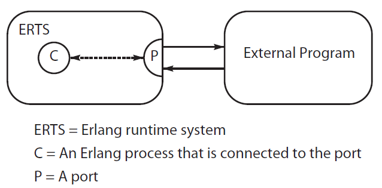
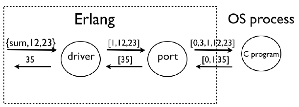
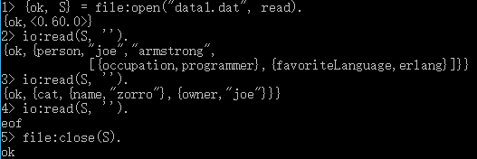
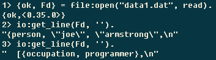

# 《Programming Erlang 2nd》读书笔记

* spawn() 等函数，其实是 erlang:spawn()
* 文档在 Erlang Run-Time System Application (ERTS) 下面的 erlang 里面


## CH03 - Basic Concepts

### tuple

```erlang
2> F = {firstName, joe}.
{firstName,joe}

3> L = {lastName, armstrong}.
{lastName,armstrong}

4> P = {person, F, L}.
{person,{firstName,joe},{lastName,armstrong}}
```

获取tuple的内容

```erlang
1> Point = {point, 10, 45}.
{point, 10, 45}.

2> {point, X, Y} = Point.
{point,10,45}

3> X.
10

4> Y.
45

3> Person={person,{name,joe,armstrong},{footsize,42}}.
{person,{name,joe,armstrong},{footsize,42}}

4> {_,{_,Who,_},_} = Person.
{person,{name,joe,armstrong},{footsize,42}}
```


## CH05 - Records and Maps

### records

语法糖，就是 tuple。

```erlang
%% records.hrl
-record(todo, {status=reminder,who=joe,text}).

1> rr("records.hrl").
[todo]

2> #todo{}.
#todo{status = reminder,who = joe,text = undefined}

3> X1 = #todo{status=urgent, text="Fix errata in book"}.
#todo{status = urgent,who = joe,text = "Fix errata in book"}

4> X2 = X1#todo{status=done}.
#todo{status = done,who = joe,text = "Fix errata in book"}

```

从 record 中读取数据

```erlang
5> #todo{who=W, text=Txt} = X2.
#todo{status = done,who = joe,text = "Fix errata in book"}

6> W.
joe

7> Txt.
"Fix errata in book"
```

看看 record 在 function 中如何 pattern match

```erlang
clear_status(#todo{status=S, who=W} = R) ->
  %% Inside this function S and W are bound to the field
  %% values in the record
  %%
  %% R is the *entire* record
  R#todo{status=finished}
  %% ...

%% To match a record of a particular type, we might write the function definition.
do_something(X) when is_record(X, todo) ->
  %% ...
```

### maps

* [http://learnyousomeerlang.com/maps][1]
* R17 开始引入了 map

```erlang
1> M = #{a => 1, b => 2}.     %% define a map
#{a => 1,b => 2}

2> M2 = M#{a := 3}.           %% update a value
#{a => 3,b => 2}

3> #{a := V} = M2.            %% get a value
#{a => 3,b => 2}

4> V.
3
```

另一种写法

```erlang
1> M = maps:new().
#{}

2> M1 = maps:put(a, 1, M).
#{a => 1}

3> M2 = maps:put(b, 2, M1).
#{a => 1,b => 2}

4> M3 = maps:update(a, 3, M2).
#{a => 3,b => 2}

5> maps:get(a, M3).
3

6> maps:find(a, M3).
{ok,3}

7> erlang:is_map(M3).
true

8> erlang:map_size(M3).
2
```

* 其中，=> 表示 put，而 := 表示 update。
* update 的话，如果 key 不存在，会失败。

### map 的 pattern matching

```erlang
count_characters(Str) ->
  count_characters(Str, #{}).

count_characters([H|T], #{ H := N }=X) ->
  count_characters(T, X#{ H := N+1 });
count_characters([H|T], X) ->
  count_characters(T, X#{ H => 1 });
count_characters([], X) ->
  X.
```

作者原书写的是上面的例子，但最新的 R20 都编译不过。。。

```erlang
1> c(mycount).
mycount.erl:7: viriable 'H' is unbound
```

改写为

```erlang
count_characters(Str) ->
  count_characters(Str, #{}).
count_characters([H|T], X) ->
  case maps:find(H, X) of
    {ok, N} ->
      count_characters(T, X#{H := N+1});
    error ->
      count_characters(T, X#{H => 1})
  end;
count_characters([], X) ->
  X.
```

R20 可以通过了。R17 还是不对，要把 count_characters(T, X#{H := N+1}); 改为 count_characters(T, maps:update(H, N+1, X)); 才可以。


## Compiling and Running Your Program

看所有模块的加载路径：

```erlang
1> code:get_path().
[".",
 "/usr/local/lib/erlang/lib/kernel-2.15/ebin",
 "/usr/local/lib/erlang/lib/stdlib-1.18/ebin",
 ...
```

$HOME 目录在哪里呢，如此可知：

```erlang
1> init:get_argument(home).
{ok,[["C:\\Users\\kasicass"]]}
```

如何运行程序？
```erlang
%% hello.erl
-module(hello).
-export([start/0]).

start() ->
    io:format("Hello world~n").
%% hello.erl ends.

1> c(hello).
{ok,hello}

2> hello:start().
Hello world
ok
```

除了在shell也可以直接运行，如下：

* 两个 -s 分别顺序执行 hello:start(), init:stop()
* 不过注意，运行前一定要 erlc 编译出 .beam 文件

```erlang
> erl -noshell -s hello start -s init stop
Hello world
```

看当前内存占用

```erlang
io:format("Memory: ~p~n", [erlang:memory(total)]).
```

不编译也想执行，请用 escript。

```erlang
%% hello_escript.erl
-module(hello_escript).
-export([main/1]).

main(_) ->
    io:format("Hello escript~n").

> escript hello_escript.erl
Hello escript
```


## CH11 - Real-World Concurrency

real-world 的数据模型就是 message-passing 的，所以 erlang 的模型是正確的。哇哈哈哈。


## CH12 - Concurrent Programming

本章教你怎么用 spawn, send, receive。

```erlang
Pid = spawn(Mod, Func, Args)
Pid = spawn(Fun)

Pid ! Message

receive ... end
```

看看怎么用 spawn

```erlang
%% area_server0
-module(area_server0).
-export([loop/0]).
loop() ->
    receive
        {rectangle, Width, Height} ->
            io:format("Area of rectangle is ~p~n", [Width*Height]),
            loop();
        {square, Side} ->
            io:format("Area of square is ~p~n", [Side*Side]),
            loop()
    end.
%% area_server0 ends

1> Pid = spawn(area_server0, loop, []).
<0.36.0>

2> Pid ! {rectangle, 6, 10}.
Area of rectangle is 60
{rectangle,6,10}

3> Pid ! {square, 12}.
Area of square is 144
{square, 12}
```

有了 spawn，process A => process B 发消息，如果让 process B 返回消息给 process A。

```erlang
%% area_server1
-module(area_server1).
-export([loop/0, rpc/2]).

rpc(Pid, Request) ->
    Pid ! {self(), Request},
    receive
        Response ->
            Response
    end.

loop() ->
    receive
        {From, {rectangle, Width, Height}} ->
            From ! Width*Height,
            loop();
        {From, {circle, Radius}} ->
            From ! 3.14159*Radius*Radius,
            loop();
        {From, Other} ->
            From ! {error, Other},
            loop()
    end.
```

关键就是，将 current process 的 Pid 作为参数，发送给 process B。从语法上来说，func 和 data 是严格分开的，切记。

```erlang
1> Pid = spawn(area_server1, loop, []).
<0.36.0>

2> area_server1:rpc(Pid, {rectangle,6,8}).
48

3> area_server1:rpc(Pid, {circle,6}).
113.097

4> area_server1:rpc(Pid, socks).
{error,socks}
```

上面的写法，还有一个问题，就是 current process 会接受任何消息，哪个才是 process B 发送过来的呢？所以 rpc/2 还要改一改。

```erlang
rpc(Pid, Request) ->
    Pid ! {self(), Request},
    receive
        {Pid, Response} ->
            Response
    end.

loop() ->
    receive
        {From, {rectangle, Width, Height}} ->
            From ! {self(), Width*Height},
            loop();
         ...
```

给 pid 一个固定的名字

```erlang
register(AnAtom, Pid)
unregister(AnAtom)
whereis(AnAtom) -> Pid | undefined
registered() -> [AnAtom::atom()]

1> Pid = spawn(area_server0, loop, []).
<0.51.0>

2> register(area, Pid).
true

3> area ! {rectangle, 4, 5}.
Area of rectangle is 20
{rectangle,4,5}
```

一个 cocurrent program 的模板

```erlang
%% ctemplate.erl
-module(ctemplate).
-compile(export_all).

start() ->
  spawn(?MODULE, loop, []).

rpc(Pid, Request) ->
  Pid ! {self(), Request},
  receive
    {Pid, Response} ->
      Response
  end.

loop(X) ->
  receive
    Any ->
      io:format("Received:~p~n", [Any]),
      loop(X)
  end.
```

开发期，可以用 export_all

```erlang
-compile(export_all).
```


## CH13 - Errors in Concurrent Programs

processes, links, link sets, monitors 之间的关系。

process A 和 B link 起来之后，如果 A 挂了，B 也会自动被系统干掉。如果不希望 B 被干掉，要设置：

```
process_flag(trap_exit, true).
```

这样 B 可以收到 A 挂掉的消息，自行决定如何处理。

Performing an Action When a Process Dies

```erlang
on_exit(Pid, Fun) ->
  spawn(fun() ->
    Ref = monitor(process, Pid),
    receive
      {'DOWN', Ref, process, Pid, Why} ->
        Fun(Why)
    end
  end).

> Pid = spawn(...)
> on_exit(Pid, fun(Why) ->
                 io:format(" ~p died with:~p~n", [Pid, Why])
               end).
```

Making a Set of Processes That All Die Together

```erlang
start(Fs) ->
  spawn(fun() ->
          [spawn_link(F) || F <- Fs],
          receive
            after
              infinity -> true
          end
        end).

> Pid = start([F1, F2, ...]).
> on_exit(Pid, fun(Why) -> ...
```

Making a Process That Never Dies

```erlang
keep_alive(Name, Fun) ->
  register(Name, Pid = spawn(Fun)),
  on_exit(Pid, fun(_Why) -> keep_alive(Name, Fun) end).
```

keep_alive 有个 race condition 问题：register 和 on_exit 之间，如果 Pid 退出了，则没法自动重启 Pid。


## CH14 - Distributed Programming

**同一机器**，启动两个 erl vm。设置相同 cookie，立即就可以通讯。

```erlang
> erl -sname phay -setcookie abc
(phay@KASI-WIN10)1> kvs:start().
true

> erl -sname kasi -setcookie abc
(kasi@KASI-WIN10)1> nodes().
[]
(kasi@KASI-WIN10)2> net_adm:ping('phay@KASI-WIN10').
pong
(kasi@KASI-WIN10)3> nodes().
['phay@KASI-WIN10']
```

**不同机器**做实验，-name 会提示 "Can't set long node name"

```erlang
> erl -name gandalf -setcookie abc
出错

可以通过本机 ip 地址作为 domain name，来绕过去。
> erl -name bilbo@192.168.0.77 -setcookie abc
```

具体原理，有空研究下。

**一些跨node的常用BIF**

```erlang
rpc:call(Node, Mod, Function, Args) -> Result | {badrpc, Reason}

spawn(Node, Fun) -> Pid
spawn(Node, Mod, Func, ArgList) -> Pid
spawn_link(Node, Fun) -> Pid
spawn_link(Node, Mod, Func, ArgList) -> Pid

disconnect_node(Node) -> bool() | ignored
  this forcibly disconnects a node.

monitor_node(Node, Flag) -> true
  true, 则 node 加入/离开 会给当前进程发送 {nodeup, Node} / {nodedown, Node}

node() -> Node
  returns the name of the local node. nonode@nohost is returned if the node is not distributed.

node(Arg) -> Node
  This returns the node where Arg is located. Arg can be a PID, a reference, or a port.
  If the local node is not distributed, nonode@nohost is returned.

nodes() -> [Node]
  This returns a list of all other nodes in the network to which we are connected.

is_alive() -> bool()
  This returns ture if the local node is alive and can be part of a distributed system. Otherwise, it returns false.

{RegName, Node} ! Msg
  跨node发消息
```

**如何监控node**

```erlang
start(Node) ->
  spawn(?MODULE, start_loop, [Node]).

start_loop(Node) ->
  monitor_node(Node, true),
  loop().

loop() ->
  io:format("monitor begins~n"),
  receive
    {nodeup, Node} ->
      io:format("nodeup ~p~n", [Node]),
      loop();
    {nodedown, Node} ->
      io:format("nodedown ~p!n", [Node]),
      loop()
  end.
```


## CH15 - Advanced Interfacing Techniques

如何写一个 C 程序，于 erl 程序通讯。

* [https://github.com/kasicass/kasicass/tree/master/erlang/v2/ch15/ports][2]





除了 Port 方式，还有其它方式：

* Linked-in Drivers
  * 直接link代码进入erl vm。git://github.com/erlang/linked_in_drivers.git
* NIFS
  * natively implemented functions，写一个 func link 到 erl vm。
  * git://github.com/erlang/nifs.git
* C-Nodes
  * C nodes are nodes implemented in C that obey the Erlang distribution protocol
  * C-nodes are described in the Interoperability tutorial at
  * http://www.erlang.org/doc/tutorial/introduction.html


## CH16 - Programming with Files

和文件相关的几个库

* file，打开/关闭/读/写文件，以及访问目录。
* filename，各种和文件名相关的函数
* filelib，在 file 基础上构建的一些 utils func
* io，routines that work on opened files

分类

* file 隶属于 kernel。
* filename/filelib/io 隶属于 stdlib。

对比 C#，file 就像 Stream，而 io 就像 XXXReader。

```erlang
> type date1.dat
{person, "joe", "armstrong",
  [{occupation, programmer},
   {favoriteLanguage, erlang}]}.
{cat, {name, "zorro"},
      {owner, "joe"}}.
```

直接读取文件中的 terms

```erlang
> file:consult("date1.dat").
{ok, [{person, ...}, {cat, ...}]}
```

看看 file 配合 io 怎么用



看看代码在哪里

```erlang
1> code:which(file).
"/usr/local/lib/erlang/lib/kernel-2.16.1/ebin/file.beam"
```

一行一行读取 io:get_line()



读取整个文件

```erlang
1> file:read_file("data1.dat").
{ok,<<"{person, \"joe\", \"armstrong\""...>>}
```

### Reading a File with Random Access

file:pread(IoDevice, Start, Len)** reads exactly Len bytes from IoDevice starting at byte Start

```erlang
1> {ok, S} = file:open("data1.dat", [read,binary,raw]).
{ok,{file_descriptor,prim_file,{#Port<0.106>,5}}}

2> file:pread(S, 22, 46).
{ok,<<"rong\",\n\t[{occupation, programmer},\n\t {favorite">>}

3> file:pread(S, 1, 10).
{ok,<<"person, \"j">>}

4> file:pread(S, 2, 10).
{ok,<<"erson, \"jo">>}

5> file:close(S).
ok
```

### Writing to a Random-Access File

```erlang
1> {ok, S} = file:open("some_filename_here", [raw,write,binary]).
{ok, ...}

2> file:pwrite(S, 10, <<"new">>).
ok

3> file:close(S).
ok
```

### Grab HTML URLs

接下来一个例子很有意思，从html页面中，将url抽取出来。

```erlang
bin2urls(Bin) -> gather_urls(binary_to_list(Bin), []).

gather_urls("<a href" ++ T, L) ->
  {Url, T1} = collect_url_body(T, reverse("<a href")),
  gather_urls(T1, [Url|L]);
gather_urls([_|T], L) ->
  gather_urls(T, L);
gather_urls([], L) ->
  L.

collect_url_body("</a>" ++ T, L) -> {reverse(L, "</a>"), T};
collect_url_body([H|T], L)       -> collect_url_body(T, [H|L]);
collect_url_body([], _)          -> {[],[]}.
```

这里只需要

```erlang
> {ok, B} = file:read_file("index.html").
{ok, ...}

> L = bin2urls(B).
[urlA, urlB, ...]
```

gather_urls() 一个一个byte去访问html页面内容，碰到 <a href 就用 collect_url_body() 获取 <a ... </a>
之间的所有内容。pattern matching + recursion 函数式编程的精髓。

### 目录操作

```erlang
1> file:list_dir(".").
{ok,["gathered.html","scavenge_urls.beam","lib_misc.erl",
     "data1.dat","myfile.erl","lib_misc.beam",
     "scavenge_urls.erl","lib_find.erl","index.html",
     "id3_v1.erl"]}

2> rr(file).
[file_descriptor,file_info]

3> {ok, Info} = file:read_file_info("data1.dat").
{ok,#file_info{size = 137,type = regular,
               access = read_write,
               atime = {{2018,1,2},{17,45,24}},
               mtime = {{2018,1,2},{17,41,45}},
               ctime = {{2018,1,2},{17,41,45}},
               mode = 33188,links = 1,major_device = 65025,
               minor_device = 0,inode = 657714,uid = 1001,gid = 1001}}
```

实现简单的 ls 功能

```erlang
-include_lib("kernel/include/file.hrl").

file_size_and_type(File) ->
  case file:read_file_info(File) of
    {ok, Facts} ->
      {Facts#file_info.type, Facts#file_info.size};
    _ ->
      error
  end.

ls(Dir) ->
  {ok, L} = file:list_dir(Dir),
  lists:map(fun(I) -> {I, file_size_and_type(I)} end, lists:sort(L)).
```

### filelib 中有一些很实用的功能

```
9> filelib:wildcard("*.erl").
["id3_v1.erl","lib_find.erl","lib_misc.erl","myfile.erl",
"scavenge_urls.erl"]

10> filelib:is_dir(".").
true

13> filelib:is_regular("lib_misc.erl").
true
```

* file:copy(Source, Destination).
* file:delete(File).


## Programming with Sockets

* 如何写 tcp，参考这里。
  * [https://github.com/kasicass/kasicass/blob/master/erlang/v2/ch17/socket_examples.erl][3]
* 每个 Socket 创建出来后，就和创建它的 controlling process 绑定了。
* 当 controlling process 退出时，Socket 会自动关闭。参考 socket_examples.erl error_test/0。
* 所以，写逻辑就好了，出错，就让它出错吧。

###Active Message Reception (Nonblocking)

* 使用 active = true 模式的 Socket，client可以不停地给 server 发送数据，无法做流量控制。
* 注意，这里说的 nonblocking 和传统的 nonblocking socket 没啥关系。

```
{ok, Listen} = gen_tcp:listen(Port, [..,{active, true}...]),
{ok, Socket} = gen_tcp:accept(Listen),
loop(Socket).

loop(Socket) ->
  receive
    {tcp, Socket, Data} ->
      ... do something with the data ...
    {tcp_closed, Socket} ->
      ...
  end.
```

### Passive Message Reception (Blocking)

* 使用 active = false，由 process 自己决定什么时候 recv。但每次自还能 recv 单一 Socket。

```erlang
{ok, Listen} = gen_tcp:listen(Port, [..,{active, false}...]),
{ok, Socket} = gen_tcp:accept(Listen),
loop(Socket).

loop(Socket) ->
  case gen_tcp:recv(Socket, N) of
    {ok, B} ->
      ... do something with the data ...
      loop(Socket);
    {error, closed}
      ...
  end.
```

### The Hybrid Approach (Partial Blocking)

然后就有了 once 这种模式，既能控制流量，又可以并发多个 Socket。

```erlang
{ok, Listen} = gen_tcp:listen(Port, [..,{active, once}...]),
{ok, Socket} = gen_tcp:accept(Listen),
loop(Socket).

loop(Socket) ->
  receive
    {tcp, Socket, Data} ->
      ... do something with the data ...
      %% when you're ready enable the next message
      inet:setopts(Sock, [{active, once}]),
      loop(Socket);
    {tcp_closed, Socket} ->
      ...
  end.
```

查看 Socket 的 ip:port

```erlang
inet:peername(Socket) -> {ok, {IP_Address, Port}} | {error, Why}
```


## CH19 - Storing Data with ETS and DETS

ETS and DETS

* ETS, 纯内存
* DETS, 可序列化
* 其中保存的内容是 tuple，且 tuple[0] 作为 key

基本数据结构

* set, hash_map
* ordered_set, binary_tree
* bag, key 可以重复
* duplicate_bag, key+value可以重复

```erlang
-module(ets_test).
-export([start/0]).

start() ->
  lists:foreach(fun test_ets/1, [set, ordered_set, bag, duplicate_bag]).

test_ets(Mode) ->
  TableId = ets:new(test, [Mode]),
  ets:insert(TableId, {a,1}),
  ets:insert(TableId, {b,2}),
  ets:insert(TableId, {a,1}),
  ets:insert(TableId, {a,3}),
  List = ets:tab2list(TableId),
  io:format("~-13w => ~p~n", [Mode, List]),
  ets:delete(TableId).

1> ets_test:start().
set           => [{b,2},{a,3}]
ordered_set   => [{a,3},{b,2}]
bag           => [{b,2},{a,1},{a,3}]
duplicate_bag => [{b,2},{a,1},{a,1},{a,3}]
```

ets:new() 细节

```erlang
-spec ets:new(Name, [Opt]) -> TableId
  set | ordered_set | bag | duplicate_bag
  private, owner process read/write only
  public, all processes read/write
  protected, owner process write, other processes read, *default*
  named_table, Name 作为 TableId

1> Tab = ets:new(bigbag, [set, named_table]).
bigbag

2> Tab2 = ets:new(smallbag, [set]).
16401

3> ets:insert(bigbag, {a, 1}).
true
```


## CH20 - Mnesia: The Erlang Database

简单使用，参考
https://github.com/kasicass/kasicass/blob/master/erlang/v2/ch20/test_mnesia.erl

Mnesia 可以配置在多个node上，自动会同步数据。

observer:start(), 可以用来看 Mnesia Table。

Mnesia User Guide
http://erlang.org/doc/apps/mnesia/Mnesia_chap1.html


## CH21 - Profiling, Debugging, and Tracing

### Profiling Erlang Code

* cprof, 统计函数调用次数，light-weight
* fprof，统计函数消耗时间，overhead 比较大

```erlang
1> cprof:start(). %% start the profiler
4501

2> shout:start(). %% run the application
<0.35.0>

3> cprof:pause(). %% pause the profiler
4844

4> cprof:analyse(shout). %% analyse function calls
{shout,232,
[{{shout,split,2},73},
{{shout,write_data,4},33},
{{shout,the_header,1},33},
...

5> cprof:stop(). %% stop the profiler
4865
```

## Testing Code Coverage

用 cover 模块

```erlang
1> cover:start(). %% start the coverage analyser
{ok,<0.34.0>}

2> cover:compile(shout). %% compile shout.erl for coverage
{ok,shout}

3> shout:start(). %% run the program
<0.41.0>
Playing:<<"title: track018 performer: .. ">>

4> %% let the program run for a bit
4> cover:analyse_to_file(shout).
...
```

### Generating Cross-References

检查哪些函数 deprecated, undefined, and unused functions

```erlang
$ cd /home/joe/2007/vsg-1.6
$ rm *.beam
$ erlc +debug_info *.erl
$ erl
1> xref:d('.').
[{deprecated,[]},
{undefined,[{{new,win1,0},{wish_manager,on_destroy,2}},
{{vsg,alpha_tag,0},{wish_manager,new_index,0}},
...
```


[1]:http://learnyousomeerlang.com/maps
[2]:https://github.com/kasicass/kasicass/tree/master/erlang/v2/ch15/ports
[3]:https://github.com/kasicass/kasicass/blob/master/erlang/v2/ch17/socket_examples.erl
