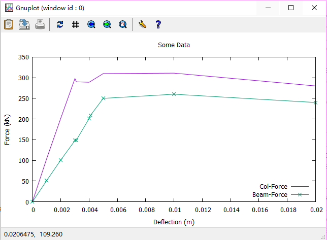

# 用 gnuplot 来画图

安装好 [gnuplot][1]。


## 基本操作

准备两个文件：

plot_command.txt

```
set key inside bottom right
set xlabel 'Deflection (m)'
set ylabel 'Force (kN)'
set title 'Some Data'
plot "plot_data.txt" using 1:2 title 'Col-Force' with lines, "plot_data.txt" using 1:3 title 'Beam-Force' with linespoints
```

plot_data.txt

```
0.000              0              0
0.001            104             51
0.002            202            101
0.003            298            148
0.0031           290            149
0.004            289            201
0.0041           291            209
0.005            310            250
0.010            311            260
0.020            280            240
```

命令行执行

```
D:\> gnuplot
gnuplot > load "plot_command.txt"
```

就可以画出图了。




## 命令解读

 * using 1:2 就是 "第一列除以第二列"。
 * title 'Col-Force'，标题是啥
 * with lines，用什么风格绘制

```
plot "plot_data.txt" using 1:2 title 'Col-Force' with lines, "plot_data.txt" using 1:3 title 'Beam-Force' with linespoints
```


## 参考资料

online gnuplot 这个，我没在线渲染成功。不知道为啥。

 * [demos for gnuplot][2]
 * [online gnuplot][3]

[1]:http://www.gnuplot.info/
[2]:http://gnuplot.sourceforge.net/demo_5.2/
[3]:http://gnuplot.respawned.com/
