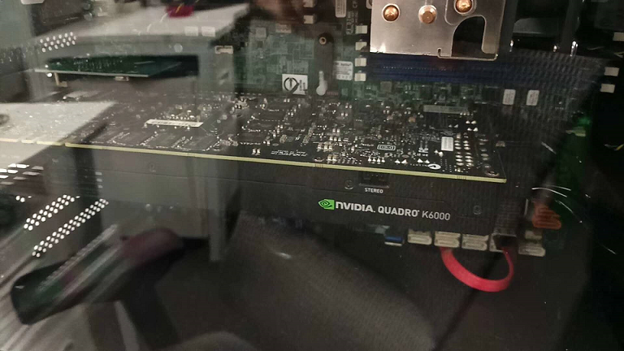
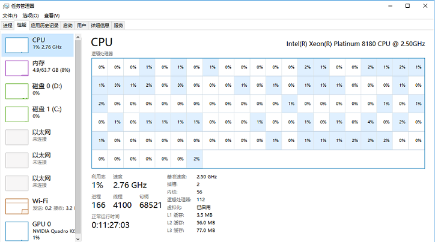

# My Working Machines

## PC

### Performance Beast

 * CPU: Two of [Intel Xeon Platinum 8180 (28 cores / 56 threads)][1]
 * GPU: [NVidia Quadro K6000 with GDDR5 12GB][2]
 * Memory: 128GB

## Laptop

### ROG Zephyrus S15 - 2020

 * CPU: Intel Core i7-10875H
 * GPU: NVIDIA GeForce RTX 2070 SUPER with 8GB GDDR6 VRAM
 * MEM: DDR4 16GB (3200MHz)
 * [Specification][3]

### ASUS Vivobook 14 X411UN - 2018

 * CPU: Intel Core i5-8250U @ 1.6GHz (4 cores)
 * GPU: NVIDIA GeForce MX150
 * Memory: 16G DDR4
 * [Specifiation][13]

### Macbook Air - 2017

 * CPU: Intel Core i7-5650U @ 2.2GHz
 * GPU: Intel HD Graphics 6000
 * Memory: 8GB of 1600MHz LPDDR3 onboard memory
 * [Specifiation][4]

### Macbook Pro - 2010

 * CPU: Intel Core 2 Duo P8600 @ 2.4GHz
 * GPU: NVIDIA GeForce 320M graphics processor with 256MB of DDR3 SDRAM shared with main memory
 * Memory: 4GB of 1066MHz DDR3 SDRAM
 * [Specification][5]

## Smartphone

### 低端机 - 魅蓝 U10

 * [硬件参数][6]
 * SoC: [MT6750][7]
 * GPU: [ARM Mali-T860 MP2][8]

### 高端机 - 魅族 16th

 * [硬件参数][9]
 * Chipset: [Snapdragon 845][10]
 * GPU: [Adreno 630][11]

## History

**2024-09-02**

咸鱼上850淘了一台 [ASUS Vivobook 14 X411UN][13]，轻薄本，用来安装 OpenBSD 7.5。没有具体的项目要求，尝试用 OpenBSD 做桌面系统。

**2020-09-29**

本来入的是 [MSI Prestige 14 - 2020][12]，但连续送了两台本，都有硬件问题。直接放弃 MSI 了，失望。再次回归 Asus 怀抱，选了 [ROG Zephyrus S15(冰刃4)][3]。直接上了 RTX 的卡，hardware-accelaration ray-tracing is coming~

**2020-09-20**

将 HUAWEI Matebook X Pro 卖了，换了 [MSI Prestige 14 - 2020][12] 作为主力工作本。Matebook 配的 3000x2000 的显示屏，显卡推起来比较吃力，这次 Prestige 14 特意选了只有 1920x1080 的普通屏。

**2020-09-13**

给 Macbook pro 2010 换了个 1T SSD 硬盘，满血复活，跑 Win7 很流畅。只要不是 CPU-bound 的应用，都没问题。

[1]:https://ark.intel.com/content/www/us/en/ark/products/120496/intel-xeon-platinum-8180-processor-38-5m-cache-2-50-ghz.html
[2]:https://www.nvidia.com/content/PDF/data-sheet/NV_DS_Quadro_K6000_OCT13_NV_US_LR.pdf
[3]:https://rog.asus.com/laptops/rog-zephyrus/rog-zephyrus-s15-series/spec/
[4]:https://support.apple.com/kb/SP583?viewlocale=en_US&locale=zh_CN
[5]:https://support.apple.com/kb/SP753?viewlocale=en_US&locale=zh_CN
[6]:https://www.meizu.com/en/products/u10/spec.html
[7]:https://www.mediatek.com/products/smartphones/mt6750
[8]:https://www.notebookcheck.net/ARM-Mali-T860-MP2-Benchmarks-and-Specs.163318.0.html
[9]:https://www.meizu.com/en/16/spec/
[10]:https://www.qualcomm.com/products/snapdragon-845-mobile-platform
[11]:https://www.notebookcheck.net/Qualcomm-Adreno-630-GPU.299832.0.html
[12]:https://www.msi.com/Laptop/Prestige-14-A10X/Specification
[13]:https://kelaptop.com/en/asus-vivobook-x411un-eb253t-90nb0gt3-m03770
