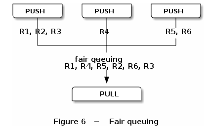

# [ZeroMQ] messaging pattern (2) -- pipeline

pipeline，单向的数据发送。

要点：
  1. bind() 要先于 connect()，否则 connecting fail
  2. 如下两种情况，zmq_connect() / zmq_bind() 要用对。

可以多个 push 一个 pull，此时 push 要使用 zmq_connect()，而 pull 要使用 zmq_bind()。



另一种情况是一个 push，多个 pull，则 push 使用 zmq_bind()，而 pull 使用 zmq_connect()。


下面演示了第一种情况。

```C++
#include <zmq.h>
#include <pthread.h>
#include <unistd.h>
#include <string.h>
#include <stdio.h>

void *push_thread(void *ctx)
{
    pthread_t pid;
    zmq_msg_t msg;
    void *push;
    char buf[80];

    pid  = pthread_self();
    push = zmq_socket(ctx, ZMQ_PUSH);
    zmq_connect(push, "inproc://pull-it");

    while (1)
    {
        sprintf(buf, "#%p send\n", pid);

        zmq_msg_init_size(&msg, strlen(buf)+1);
        memcpy(zmq_msg_data(&msg), buf, strlen(buf)+1);
        zmq_send(push, &msg, 0);
        zmq_msg_close(&msg);

        sleep(5);
    }

    return (void *)0;
}

int main()
{
    zmq_msg_t msg;
    void *ctx, *pull;
    pthread_t pid1, pid2;

    ctx  = zmq_init(0);
    pull = zmq_socket(ctx, ZMQ_PULL);
    zmq_bind(pull, "inproc://pull-it");

    pthread_create(&pid1, NULL, push_thread, ctx);
    pthread_create(&pid2, NULL, push_thread, ctx);

    while (1)
    {
        zmq_recv(pull, &msg, 0);
        printf("recv: %s", (char *)zmq_msg_data(&msg));
        zmq_msg_close(&msg);
    }

    return 0;
}
```

运行结果。

```
$ gcc -g -Wall -I/usr/local/include main.c -L/usr/local/lib -lzmq -pthread
$ ./a.out 
recv: #0x28429ec0 send
recv: #0x2842a140 send
recv: #0x28429ec0 send
recv: #0x2842a140 send
recv: #0x28429ec0 send
recv: #0x2842a140 send
```

## FAQ

1. 如果1个producer对应N个consumer，我想优雅的结束一个consumer，让其从producer的load balance中删除，同时这个consumer本身还可以把队列中余下的message都处理完？

目前，做不到。zmq_close() 可以关闭socket，但此时在队列中的message都会被释放。只有让producer先结束，才能关闭consumer。

