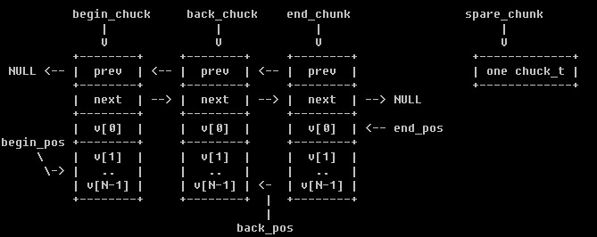
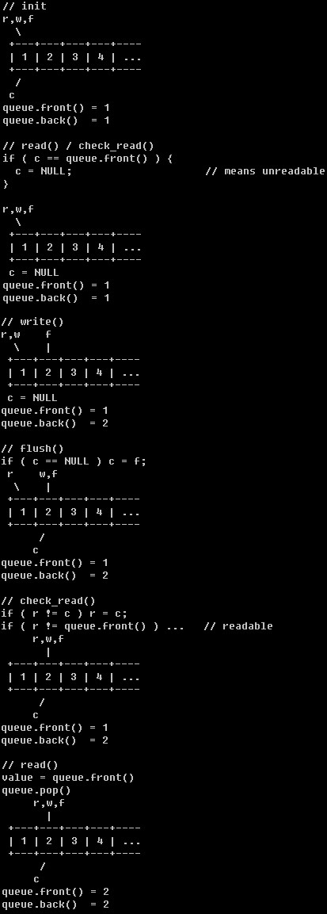

# [ZeroMQ] 深入分析(1) -- 几个基础数据结构

### array.hpp

class array_item_t, 作为 array_t 的子类，要继承 array_item_t，保存了一个 array_index，翻遍快速删除元素。

class array_t, 内部 vector 实现。

### atomic_ptr.hpp

封装了对 T* 的 xchg, cas 等原子操作。下面的 yqueue/ypipe 就是依赖 xchg, cas 来实现 lock-free 的。

### yqueue.hpp

  1. 允许 A线程push()/B线程pop()
  2. 每次申请N个元素，减少malloc/free
  3. lock-free

 * begin_chuck + begin_pos, 第一个元素 front()
 *  back_chunk +  back_pos, 最后一个元素 back()
 *   end_chunk +   end_pos, 最后一个元素 + 1

spare_chunk, 如果 pop() 之后, begin_chunk 移到下一个 chunk_t, 则将使用完毕的 chunk_t 交给 spare_chunk 下次 push() 的时候说不定可以用上，减少 malloc/free。

### ypipe.hpp

 * 依旧是个 queue，在 yqueue, atomic_ptr 基础上作了封装。
 * 上层 reader_t/writer_t 用其在进程间传递 zmq_msg_t。
 * 下面简单分解下 read/check_read/write/flush 的逻辑。

