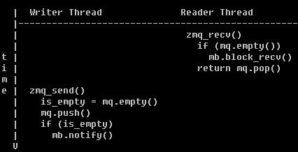

# [ZeroMQ] 深入分析(2) -- 线程间通讯"inproc://"


## 基本原理

mb, mailbox, 线程间的事件通知（用 domain socket 实现），每次 send 的 command_t 都很小，认为此一定是原子的（< PIPE_BUF）

mq, msg queue, 线程间 zmq_msg_t 传递的 lock-free queue。



"inproc://"，thread 间通讯，通过 domain socket 连接 thread，告知 command_t 之类的信息。

而 zmq_msg_t 通过 reader_t/writer_t(ypipe) 的 lock-less queue 来直接传递 pointer。

```C++
push = zmq_socket(ctx, ZMQ_PUSH);     // new push_t
zmq_bind(push, "inproc://xxx");       // 将 push 在 ctx.endpoints 注册

pull = zmq_socket(ctx, ZMQ_PULL);     // new pull_t
zmq_connect(pull, "inproc://xxx");    // 从 ctx.endpoints 中找到 push, 创建 reader_t/writer_t
                                      // reader_t 绑定到 pull, 发消息 'bind' to pull.mailbox
                                      // push 收到 'bind' 消息, 绑定 writer_t

zmq_send(push, &msg, 0);              // msg 丢给 writer_t
zmq_recv(pull, &msg, 0);              // 从 reader_t 获取 msg
```


### object_t 之间的消息通讯

```
object_t ==> ctx.mailbox[tid] ==> [kernel pipe] ==> object_t
```


### pipe.hpp

定义了 reader_t/writer_t, 一个 pipe 的两端；writer_t 还支持一个 swap_t (ypipe满了，则msg自动保存到磁盘)

create_pipe(), 创建一个 ypipe<zmq_msg_t> 给 reader_t/writer_t 使用。reader_t/writer_t 可以分别在不同的线程。

i_reader_events/i_writer_events, reader_t/writer_t 通过这两个 interface 知会上层 activated/terminated 等事件


### push/pull pattern

通过 lb_t/fq_t (load balance/fair queue) 来实现：

```
-- one-push/multi-pull
                /- writer_t/reader_t -> fq_t -> pull_t
push_t -> lb_t --- writer_t/reader_t -> fq_t -> pull_t
                \- writer_t/reader_t -> fq_t -> pull_t

-- multi-push/one-pull
push_t -> lb_t -> writer_t/reader_t -\
push_t -> lb_t -> writer_t/reader_t --- fq_t -> pull_t
push_t -> lb_t -> writer_t/reader_t -/
```


### fq.hpp

 * class fq_t : public i_reader_events
 * fair queue 实现 (round-robin)
 * fq_t ==> [r1|r2|...], 带一个 reader_t 的数组
 * recv() 时, 从 reader_t数组中选择一个 active 的来读


### lb.hpp

 * class lb_t : public i_writer_events
 * load balance 实现 (round-robin)
 * lb_t ==> [w1|w2|...], writer_t的数组
 * send() 时, 从 writer_t数组 中选择一个 active 来写

ps. ZeroMQ 还有个 "sys://"，内部实现和 "inproc://" 是一个东西，其用于 ZeroMQ kernel 给 app 发送内部的 log，由 app 自己 write to file。当然，2.1.0 的 "sys://" 还没有向 app 发送任何具体的 log内容。
