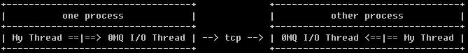
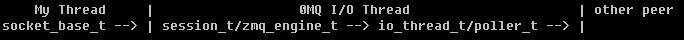
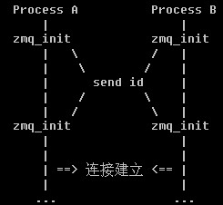

# [ZeroMQ] 深入分析(3) -- 进程间通讯"tcp://"  




### epoll 在哪里？

poller_base_t, 定义了统一的事件reactor接口

```
        poller_base_t
              |
select/poll/epoll/kqueue/devpoll
```

 * i_poll_events.hpp, 定义 interface i_poll_events, 用于通知某个 fd 事件到达。
 * poller.hpp, 根据平台不同，干了 typedef select_t(epoll_t/...) poller_t; 这么个事情。


### io_thread_t

io_thread_t

 * 拥有一个 poller_t, 用于监听事件
 * 拥有一个 mailbox_t, 放到 poller_t 中监听事件, io_thread_t 本身实现 i_poll_events, 处理 mailbox_t 到达的事件。

poller_t

 * 使用 thread_t 创建一个操作系统的 thread


### listen/accept and connect

```
         i_poll_events
               |
          io_object_t
               |
  zmq_listener_t/zmq_connector_t
zmq_init_t/zmq_session_t/zmq_engine_t
```

 * tcp_listener_t, 封装 platform-specific 监听相关的操作
 * zmq_listener_t, 定义了listen事件, 控制 tcp_listener_t 完成监听的事情
 * zmq_connecter_t, 定义了connect事件
 * zmq_engine_t, 一个 connected socket 的事件处理

监听过程

```
zmq_socket("tcp://...")
 -> socket_base_t::bind()
    -> from ctx, choose a I/O thread A
    -> new zmq_listener_t, binding to I/O thread A, bind and listen
    -> send 'plug' to I/O thread

I/O thread A
 -> recv 'plug', add zmq_listener_t.fd to poller_t
```

接受连接的过程

```
I/O thread A
 -> poller_t recv connection, zmq_listener_t.accept()
    -> from ctx, choose a I/O thread B
    -> new zmq_init_t, bind to I/O thread B, bind accepted fd
       -> new zmq_engine_t
    -> send 'plug' to I/O thread

I/O thread B
 -> recv 'plug', put zmq_init_t.fd to poller_t
 -> zmq_init_t recv peer_identity
    -> new session_t, bind zmq_engine_t to session_t
    -> delete this
 -> 连接建立完成，交给 session_t 来管理 remote connection
```

zmq_init_t 只是个中间过程, 对于 listen 而言, zmq_init_t 用来创建 session_t, 并绑定 zmq_engine_t。

connect 的过程与 listen 类似。




### zmq_init_t 的工作流程

```
Process A
  zmq_bind()
  zmq_listener_t

Process B
  zmq_connect()
  connect_session_t
  zmq_connector_t (定期重试)

交换 identity 的过程
  1. 连接建立, new zmq_init_t
  2. zmq_init_t 相互发送 identity
  3. 两者的 zmq_init_t 收到 identity 后，new session_t, 发送 'attach' 给 session_t
  4. session_t::process_attach(), 发送 'bind' 给 socket_base_t
  5. socket_base_t::process_bind(), 调用子类的 xattach_pipes()
  6. xxx_t::xattach_pipes()
```




### multi-endpoints

一个 socket_base_t(继承自own_t), 可以拥有多个 zmq_listener_t(继承自own_t), 达到同时监听多个 endpoints 的目的。

```
                          /- zmq_listener_t
 socket_base_t  -> own_t --- zmq_listener_t
 (pull/push/...)          \- zmq_listener_t
```


### multi-io-threads

一个 ctx 包含多个 io_thread_t, 一个 io_thread_t 为多个 io_object_t 服务。

zmq_init(io_threads) 的参数决定使用多少个 io threads, 对于没有 tcp 连接的程序, io_threads 传入 0 即可。

```
                     /- zmq_listener_t
     /- io_thread_t --- zmq_connecter_t
ctx --- io_thread_t  \- zmq_engine_t
     \- io_thread_t
```

ps. ZeroMQ 内部，在 *nix 下，"ipc://" 使用了domain socket；win32 下不支持 "ipc://"。
