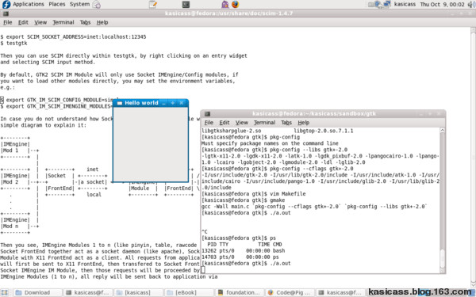

# [OpenBSD] Desktop on 4.4/4.5/4.7

最近升级了 Fedora 10，然后用着用着就挂掉了，很奇怪。无奈，只能换个系统来耍耍。自己十分喜欢ob，不过一直都没用起来当桌面，这回尝试一把。

## 基本安装

```
  1. 正常安装系统，X Window 可工作。我一般是登录后，用 startx 启动。
  2. cd /usr/ports/x11/icewm; make install，漫长等待后，icewm 终于装好了。（KDE, GNOME太重了，换个 lightweight 来玩玩）
  3. IceWM 的配置比较简单，默认配置会放在 /usr/local/share/icewm，把里面的内容全部 copy 到 ~/.icewm。基本结构：
      preferences     基本的配置
      menu            自己配置 start 菜单里面的内容
      theme           默认主题的路径 
      [icons]         常用 icon 都放在里面
      [themes]        所有主题
      ....
      IceWM 的配置确实不复杂，看看他的 tutorial  就好。
  4. startx 的 system-wide 配置文件在 /etc/X11/xinit/xinitrc ，将起复制到 ~/.xinitrc，然后修改下
      #  fvwm || xterm
      exec icewm-session
   aha, see IceWM runs, huh~
  5. 配置 IceWM 的主题也很简单，到 www.icewm.org 里面推荐的几个，全部下载放到 ~/.icewm/themes 里面，然后自己挑啦。
  ```

## 常用软件 (/usr/ports)

```
audio/xmms                Winamp
graphics/blender
graphics/gimp
graphics/gqview           ACDsee
print/epdfview            pdf viewer
net/firefox
net/pidgin
x11/xchm                  chm viewer
x11/mplayer
```

## XTerm 设置

默认 xterm 的字体实在太小了，而且是 non-color 的。

如下，可以设置漂亮的英文字体，大小也恰好。（我的分辨率：1280 x 800）

```
xterm -fa 'Mono' -fs 14      # fa - fontface(字体), fs - fontsize(字体大小)
```

设置 color xterm，如下：

```
cp /etc/X11/app-defaults/XTerm-color ~/.Xdefaults
```

并 uncomment 下面几行即可

```
!*VT100*colorULMode: on
!*VT100*underLine: off
!*VT100*colorBDMode: on
```

:-) 方法都是来自 faq，参见：

 * [http://www.openbsd.org/faq/faq2.html][1]
 * [http://www.openbsd.org/faq/truetype.html][2]

## 中文输入

Bibby兄有一篇 step by step，看这里啦。

 * [http://code.google.com/p/openbsdonly/wiki/ChineseEnv_OpenBSD_44][3]

不过我的 ~/.xinitrc 里面稍有不同：

```shell
# 不设置 LC_CTYPE 也可以的，不过感觉这样英文好看了一点
export LC_CTYPE=en_US.UTF-8
export XMODIFIERS=@im=scim
export GTK_IM_MODULE="scim"
scim -d &
exec dbus-launch icewm-session
```

我就是多了 scim -d &，否则就是不行。而 gtk-query-immodules 那一步，不做似乎也行。

配置的相关解释，参见：

 * [http://www.scim-im.org/wiki/documentation/installation_and_configuration/all/system_configuration][4]

ps. 切记，测试输入法时，要打开 pidgin 等能输入中文的程序，用 xterm 你怎么都看不到 scim-智能拼音。非常奇怪 :-)

## 漂亮的中文字体 ([http://wenq.org][5])

OpenBSD 自带的中文字体惨不忍睹，赶紧用文泉驿（[http://wenq.org][5]）的换掉。因为 4.4 ports 还没有 wqy-zenhei 字体，所以得手工加一下啦。

```
# cd /usr/X11R6/lib/X11/fonts/TTF
# cp /pathto/wqy-zenhei.ttf ./
# /usr/X11R6/bin/mkfontscale            # 给 X server 注册下
# /usr/X11R6/bin/mkfontdir
```

OK，字体已经装备上了，然后修改  icewm 的配置文件 ~/.icewm/preferences

英文用 Fixed, 中文用 WenQuanYi Zen Hei (wqy-正黑)：

```
TitleFontNameXft="Fixed:size=12,WenQuanYi Zen Hei:size=14"
MenuFontNameXft="Fixed:size=12,WenQuanYi Zen Hei:size=14"
StatusFontNameXft="Fixed:size=12,WenQuanYi Zen Hei:size=14"
QuickSwitchFontNameXft="Fixed:size=12,WenQuanYi Zen Hei:size=14"
NormalButtonFontNameXft="Fixed:size=12,WenQuanYi Zen Hei:size=14"
ActiveButtonFontNameXft="Fixed:size=12,WenQuanYi Zen Hei:size=14"
NormalTaskBarFontNameXft="Fixed:size=12,WenQuanYi Zen Hei:size=14"
ActiveTaskBarFontNameXft="Fixed:size=12,WenQuanYi Zen Hei:size=14"
ToolButtonFontNameXft="Fixed:size=12,WenQuanYi Zen Hei:size=14"
NormalWorkspaceFontNameXft="Fixed:size=12,WenQuanYi Zen Hei:size=14"
ActiveWorkspaceFontNameXft="Fixed:size=12,WenQuanYi Zen Hei:size=14"
MinimizedWindowFontNameXft="Fixed:size=12,WenQuanYi Zen Hei:size=14"
ListBoxFontNameXft="Fixed:size=12,WenQuanYi Zen Hei:size=14"
ToolTipFontNameXft="Fixed:size=12,WenQuanYi Zen Hei:size=14"
ClockFontNameXft="Fixed:size=12,WenQuanYi Zen Hei:size=14"
ApmFontNameXft="Fixed:size=12,WenQuanYi Zen Hei:size=14"
InputFontNameXft="Fixed:size=12,WenQuanYi Zen Hei:size=14"
LabelFontNameXft="Fixed:size=12,WenQuanYi Zen Hei:size=14"
```

根据网上的一些文章，说开启 anti-aliasing 中文效果不好，可通过下面的方法关闭之。不过我还是觉得 AA 之后，英文效果好太多，不舍得关闭。

```
$ vi ~/.fonts.conf
<fontconfig>
  <match target="font">
    <test compare="more" name="pixelsize" qual="any">
      <double>10</double>
    </test>
    <test compare="less" name="pixelsize" qual="any">
      <double>15</double>
    </test>
    <edit mode="assign" name="antialias">
      <bool>false</bool>
    </edit>
  </match>
</fontconfig>
```

如此这般，中文字体终于漂亮起来也。不过我的 scim 有时候在启动时会挂掉，不知道为何。重新 startx 一次即可。

参考：[http://www.openbsd.org/faq/truetype.html][6]

## Screenshot



## 后记

相对 win32，linux/OpenBSD 性能上还是差一些，firefox 打开复杂些的网页就得卡一会。smallka 同学用 FreeBSD desktop 时，也有同感。

ps. 2009-02-21，换成 wqy-正黑 后，浏览中文网页的速度反而变快了。看来是原来字体不好，反而花费的大量的渲染时间。

----------------------------------
```
2009-05-12  OpenBSD 4.5 出来鸟，顺便更新下这篇文档
2010-08-12  OpenBSD 4.7 跑在我的龙芯上，基本和 4.5 没啥变化
                        firefox 不支持 loongson cpu，Orz ...
```

## 常用软件 (/usr/ports)

/www/mozilla-firefox

## 漂亮的中文字体 ([http://wenq.org][5])

可以使用 port 安装拉。

```
# cd /usr/ports/x11/wqy-zenhei-ttf
# make install
```

默认安装到 /usr/local/lib/X11/fonts/wqy，还需要手动添加 font path 到配置文件。

默认装好的是 xfs 管理字体，所以是改这个配置文件 /etc/X11/fs/config:

```
catalogue = /usr/X11R6/lib/X11/fonts/TTF/,
            /usr/local/lib/X11/fonts/myfonts/
```

参见：http://www.openbsd.org/faq/truetype.html

## 加快上网速度

修改 firefox 配置

[http://www.openbsdonly.org/viewtopic.php?f=17&t=719&p=3833&hilit=firefox#p3833][7]

设置一个速度快的 DNS (/etc/resolv.conf)

[http://www.maoshen.org.cn/show.asp?Newsid=125][8]

ps. 不过 4.5 的桌面速度，感觉还没 4.4 快 - -#

我的 glxgears 在 4.4 跑的 500+ fps，而 4.5 DRI 开启后只有 100+ fps


[1]:http://www.openbsd.org/faq/faq2.html
[2]:http://www.openbsd.org/faq/truetype.html
[3]:http://code.google.com/p/openbsdonly/wiki/ChineseEnv_OpenBSD_44
[4]:http://www.scim-im.org/wiki/documentation/installation_and_configuration/all/system_configuration
[5]:http://wenq.org
[6]:http://www.openbsd.org/faq/truetype.html
[7]:http://www.openbsdonly.org/viewtopic.php?f=17&t=719&p=3833&hilit=firefox#p3833
[8]:http://www.maoshen.org.cn/show.asp?Newsid=125
