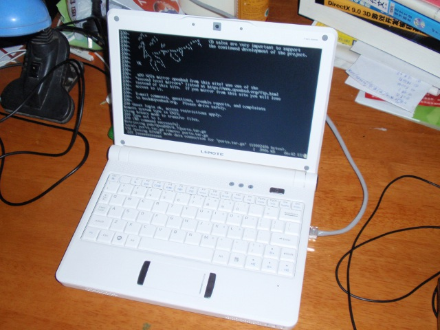

# 跑在龙芯上的 OpenBSD 4.7

[http://www.openbsd.org/47.html][1]

## [OpenBSD/loongson][2]

New platform for systems based on the Loongson 2E and 2F MIPS-compatible processors. Supported machines include:

 * Lemote Fuloong 2F mini-PC
 * Lemote Lynloong all-in-one-PC
 * Lemote Yeeloong netbook (8.9" and 10.1" models)
 * EMTEC Gdium Liberty 1000 netbook

4.7 出来几个月了，一直未关注。无意看了下 release note，原来已经支持“龙芯”。

下定决心，支持一把国货。打算买一台逸珑8101迷你笔记本（Lemote Yeeloong netbook）

过几天把本本的图片贴上来，hoho。此本只安装 OpenBSD，哇咔咔。

有跟风购买的同学，请找下面的链接。:-)

* [http://loogson.taobao.com/][3]
* [http://www.lemote.com/][4]

## loongson初体验

慢，很慢~~

预装的RedFlag Linux实在有点慢，放了个 .avi，和播放幻灯片一样。算了，格了，装 OpenBSD。

## loongson上安装OpenBSD

超级详细的安装指引在这：

[ftp://ftp.openbsd.org/pub/OpenBSD/4.7/loongson/INSTALL.loongson][5]

```
1. 弄个U盘，格式化为 ext2，把 4.7/loongson 的内容复制进去。（mkfs.ext2 /dev/sdb1）
2. loongson 的 bios 使用的 PMON，默认有个启动菜单，用 c 进入命令行 PMON> 模式
3. PMON> boot -k /dev/fs/ext2@usb0/bsd.rd，进入安装程序，按步骤安装
4. 安装完毕，reboot，启动时按 Del 进入 PMON>
  4.1 PMON> set moresz 30
  4.2 PMON> set bsd /bsd
  4.3 PMON> set ShowBootMenu no
  4.4 PMON> set al /dev/fs/ext2@wd0/boot/boot
5. 断电，重启。
```

好，关闭了启动菜单，设置了 OpenBSD 为默认启动。



设置线网络（关闭有线网卡 rl0，设置好无线网卡 urtw0）

```
# cat /etc/hostname.rl0
# inet 192.168.0.93 255.255.255.0
# cat /etc/hostname.urtw0
inet 192.168.0.93 255.255.255.0
nwid my_networkid wpa wpapsk `wpa-psk my_networkid my_passphrase`
```

参考：[http://www.cromwell-intl.com/unix/openbsd-wireless-wpa2.html][6]

[1]:http://www.openbsd.org/47.html
[2]:http://www.openbsd.org/loongson.html
[3]:http://loogson.taobao.com/
[4]:http://www.lemote.com/
[5]:ftp://ftp.openbsd.org/pub/OpenBSD/4.7/loongson/INSTALL.loongson
[6]:http://www.cromwell-intl.com/unix/openbsd-wireless-wpa2.html
