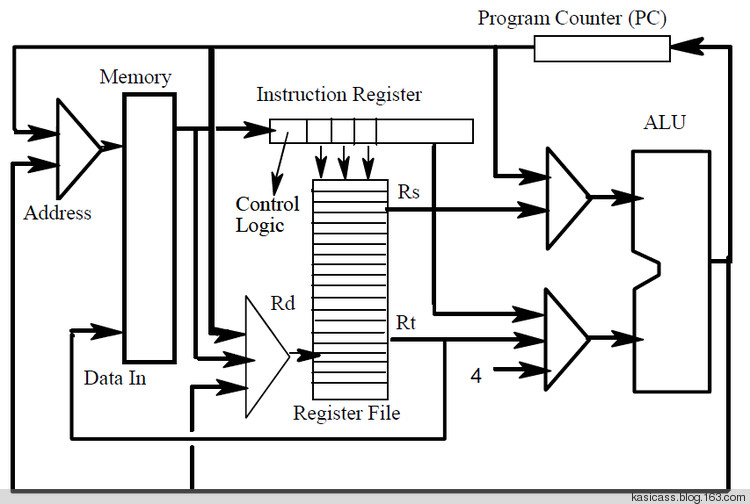
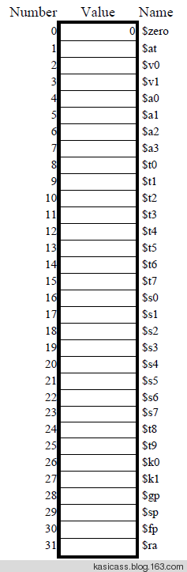

# [MIPS] Simple Architecture

mips构架的简化版，其中 Register File 就是一堆 registers。

5-bit Rs, Rt，用来指定使用 Register File 中的哪个 register。因为只有 32 个 registers，所以 5-bit 足已。

Register File 都有哪些呢？自然，不同的 register 功用不同。习惯性用法：

* $t0 - $t7, caller-saved register, f() { $t0 = 2; g(); $t0 = $t0 + 2; }，f() 在调用 g() 之后，还需要使用 $t，则需要在调用 g() 之前将 $t0 的值保存到 stack 中，因为 g() 有可能用到 $t0 且不会为其恢复值。
* $s0 - $s7, callee-saved register, f() { $s0 = 2; g(); $s0 = $s0 + 2; }，同理，这次 f() 调用 g() 之前，不需要保存 $s0 的值，因为 g() 要负责恢复 $s0。

caller-saved, callee-saved 并存两种用法，主要是为了给 compiler 做程序优化的。

* $a0 - $a3, used to pass arguments to functions
* $v0 - $v1, used to return values from functions

相比 x86，mips is goddam simple.
