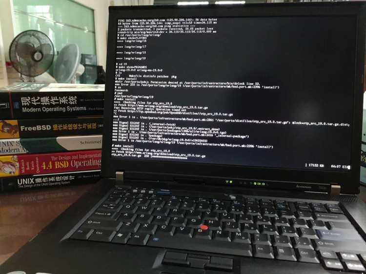

# 跑在 Thinkpad T60p 上的'肥刺鱼'

一眨眼，OpenBSD 6.0 都出来了。距上一次玩 OpenBSD 估计也是五、六年前的事情。


最近脑抽，花了 580 大洋淘了台 T60，到货一看，居然是 T60p，=_= 当年的顶配神机，值了～



（左边那排书是我放上去衬托画面的，其实好几年都没看过了 =_=!）

折腾了半天，给我的 T60p 装上 OpenBSD 6.0，记录下安装过程，备忘。

OpenBSD FAQ 就是 handbook。
[http://www.openbsd.org/faq/index.html][1]

Ctrl + Alt + F1~F6，默认的六个 console。

==== 安装 OpenBSD ====

将 [install60.fs][2] 刻录到U盘

* [https://mirrors.tuna.tsinghua.edu.cn/OpenBSD/6.0/i386/install60.fs][2]
* windows 下，用 [https://sourceforge.net/projects/win32diskimager/][3]
* openbsd 下，参见 [http://www.openbsd.org/faq/faq4.html#MkInsMedia][4]

安装步骤

* 启动电脑，按下 ThinkVantage 蓝色按钮，然后 F1，进入 BIOS。
* 修改 BIOS，用 USB-HDD 启动。
* 一路 Next 下来。
* 记得在安装 distribution sets 时，选择 disk，然后选择 sd1，作为安装媒介。

==== 安装 firmware ====

装好 OpenBSD 6.0，启动时会提示缺少 radeon xxx firmware。

而且查看有哪些无线网络
```
# ifconfig wpi0 scan
```
也提示缺少 wpi-3945abg fireware。这些是什么鬼？

原来是 license 的问题。OpenBSD 对许可证要求很严，不满足要求的 firmware 安装时就不带了。

需要自己从 [http://firmware.openbsd.org/firmware/6.0/][5] 下载。

```
方法一：
  a) 插上有线网络
  b) fw_update -p http://firmware.openbsd.org/firmware/6.0/
方法二：
  a) 下载所有 firmware，用 U盘 复制到 openbsd 机器上
  b) fw_update -p /path/to/firmware
搞定。

参考 wpi, fw_update 的 man page。
```

==== 无线网络配置 ====

ifconfig 看到无线网卡名叫 wpi0。然后
man wpi，看看如何配置。

```
# ifconfig wpi0 nwid YourNetworkName wpakey YourNetworkPassword
# dhclient wpi0    # 我机器上有提示出错，但网络还是通了。
```
搞定，网络通。

写配置文件 hostname.wpi0，下期机器启动，保证网络正常。
```
# cat /etc/hostname.wpi0
nwid YourNetworkName
wpakey YourNetworkPassword
dhcp
# chmod o-r /etc/hostname.wpi0       # 去掉 other 的 read 权限，安全一点
# reboot
```

==== 安装完毕后，希望更新系统组件(distribution sets) ====

用安装盘启用，然后选择 Upgrade。参考：

[http://www.openbsd.org/faq/faq4.html#FilesNeeded][6]

[1]:http://www.openbsd.org/faq/index.html
[2]:https://mirrors.tuna.tsinghua.edu.cn/OpenBSD/6.0/i386/install60.fs
[3]:https://sourceforge.net/projects/win32diskimager/
[4]:http://www.openbsd.org/faq/faq4.html#MkInsMedia
[5]:http://firmware.openbsd.org/firmware/6.0/
[6]:http://www.openbsd.org/faq/faq4.html#FilesNeeded