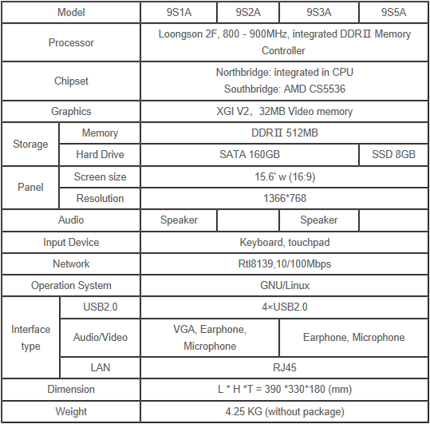

# [OpenBSD] 6.4 on Lynloong All-in-one PC

最近弄了台二手龙芯 All-in-one PC。介绍在这里：[英文][1]、[中文][2]。

型号 9S2A



自认为轻车熟路，之前龙芯上网本就安装过 OpenBSD。依样画葫芦做一遍，定能顺利安装好。

没想到还是折腾了一番。

## 安装 OpenBSD 6.4

### 1. 将openbsd文件复制到linux上

1. 从[清华的mirror下][6]载所有文件。
2. 将U盘格式化为FAT32，把openbsd文件复制到U盘
3. 通过U盘将文件复制到linux上
4. 格式化U盘为ext2格式（参见下面），再把文件复制回U盘

### 2. 格式化U盘

找一台 Linux 机器，用 fdisk + mkfs.ext2 将U盘格式化为 ext 格式。

用 mkfs.ext2 格式化出来的U盘，只能识别为 disk，但没有 partition。

lynloong 启动时，无法识别此U盘

正好 lynloong 还带在 ubuntu，默认 root 密码是：loongson。Lucky，这台机器 root 密码没被改过。

将U盘插到 ubuntu 上，fdisk -l 看一下：（/dev/sdb 是U盘识别出来的 disk）

```
# fdisk -l /dev/sdb
...
Disk /dev/sdb doesn't contain a valid partition table
```

```
# mkfs.ext2 /dev/sdb1
```

参考

* [fdisk][10] 
* [dd][11]

这里有个坑，参见 坑2。

### 3. 安装之

```
1. loongson 的 bios 使用的 PMON，默认有个启动菜单，用 c 进入命令行 PMON> 模式
2. PMON> boot -k /dev/fs/ext2@usb0/bsd.rd，进入安装程序，按步骤安装
3. 安装完毕，reboot，启动时按 Del 进入 PMON>
  3.1 PMON> set moresz 30
  3.2 PMON> set bsd /bsd
  3.3 PMON> set ShowBootMenu no
  3.4 PMON> set al /dev/fs/ext2@wd0/boot/boot
4. 断电，重启。
```
参见 坑3

理想状态是按上面的步骤，可以进入安装界面的。但 boot -k 之后，蓝屏了 :-(

搞不定了。放弃 =_=!。

## 踩坑记录

### 坑1 - 不要用 miniboot.fs

最开始我用 win32diskimager 将 miniboot.fs 写入U盘。然后U盘大小被改写了（变成8M了）。导致 base64.tgz 等文件没法复制进去。

需要低格（low level format）才能恢复。好在我的百度网盘里面保存了一个低格工具。=_=!

### 坑2 - /dev/sdc 和 /dev/sdc1

最早打算在 windows 下用 cygwin 做 fdisk + mkfs.ext2。但 fdisk 在 cygwin 下是用不了的。然后我做了：

```
# /usr/sbin/mkfs.ext2 /dev/sdb
```

导致一个没有 partition 的 disk。

下面步骤不要用：

安装cygwin

1. 安装 [cygwin][7]，mirror：[http://mirrors.163.com/cygwin/][8]
2. 记得选 e2fsprogs, util-linux 包，我们需要 mkfs.ext2 命令
3. [http://www.cygwin.com/cygwin-ug-net/using-specialnames.html][9]

格式化U盘

```
$ cat /proc/partitions
major minor  #blocks  name   win-mounts
    ...
    8    33      9184 sdc1   F:\

$ df
文件系统           1K-块      已用     可用 已用% 挂载点
...
F:                  9184      6476     2708   71% /cygdrive/f

$ /usr/sbin/mkfs.ext2 /dev/sdc1
```

将安装文件复制到U盘

1. 从[清华的mirror下][6]载所有文件。
2. windows 上，安装 [ext2fsd][3]，就可以访问 ext2 格式的U盘
3. 然后把其它文件都复制到U盘

即使有了 /dev/sdc1，[ext2fsd][3] 写文件还是有问题的。

### 坑3 - LM9013

通过 PMON 启动，居然碰到不支持的硬件？WTF。。。

```
This kernel doesn't support model "LM9013-1.5.9".
```

找 kernel 代码

```
# cd /usr/src/sys/                                                 # find . -name "*.c" | xargs grep "support model"
./arch/loongson/loongson/machdep.c:     pmon_printf("This kernel doesn't support model \"%s\"." "\n", version);
```

只是这种型号的硬件，没有写上去。

```
const struct bonito_flavour bonito_flavours[] = {
#ifdef CPU_LOONGSON2
        ...
        /* Lemote Lynloong all-in-one computer */
        { "LM9001",     &lynloong_platform },
#endif
```

修改下 LM9001 这里就可以了。不过要重新 build kernel，有点麻烦。

There is always another way to make things done.

```python
>>> f = open('bsd.rd', 'rb')
>>> data = f.read()
>>> f.close()

>>> i = data.find('LM9001')
>>> data[i:i+6]
LM9001

>>> data2 = data[:i] + 'LM9013' + data[i+6:]
>>> assert len(data) == len(data2)
>>> data2[i:i+6]
LM9013

>>> f = open('bsd.rd', 'wb')
>>> f.write(data2)
>>> f.close()
```

## 后记

玩 *nix 系统，就是要折腾。:-)

ps. [ext2fsd][3] 作者是国人，blog [在此][4]，是关于 windows 内核开发的。

[1]:http://zkml.lemote.com/en/products/all-in-one/2010/0311/122.html
[2]:http://zkml.lemote.com/products/computer/linglong/11.html
[3]:http://www.ext2fsd.com/
[4]:https://blog.dynox.cn/
[5]:https://mirrors.tuna.tsinghua.edu.cn/OpenBSD/6.4/loongson/
[6]:https://sourceforge.net/projects/win32diskimager/
[7]:http://www.cygwin.com/
[8]:http://mirrors.163.com/cygwin/
[9]:http://www.cygwin.com/cygwin-ug-net/using-specialnames.html
[10]:https://www.tecmint.com/fdisk-commands-to-manage-linux-disk-partitions/
[11]:https://en.wikipedia.org/wiki/Dd_%28Unix%29#Master_boot_record_backup_and_restore