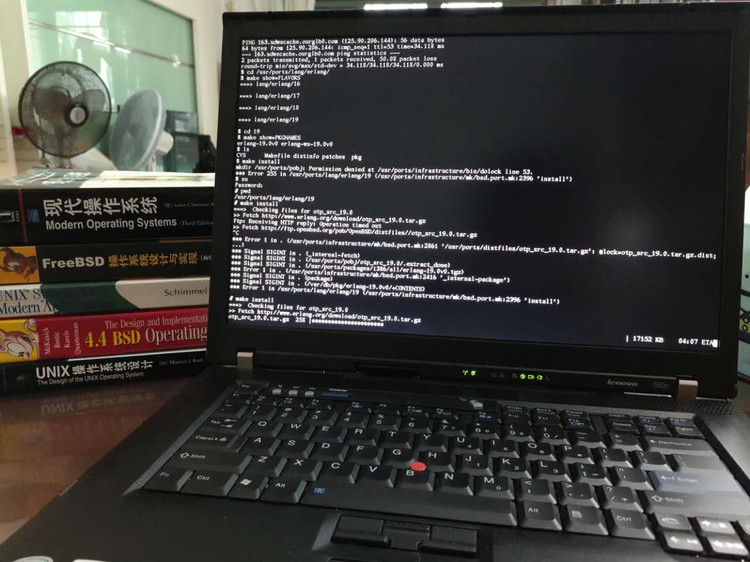

# 跑在 Vivobook 14 上的'肥刺鱼'

一眨眼，OpenBSD 7.0 都出来了。


最近淘了一台轻薄本 ASUS Vivobook 14，用 OpenBSD 来做桌面系统。一台2018年出品的轻薄本，咸鱼上只需要花850大洋。配置真的不错，普通办公绰绰有余，完全没有买最新 notebook 的动力。



折腾了半天，终于装好了 OpenBSD 7.5，记录下安装过程，备忘。

OpenBSD FAQ 就是 handbook。
[http://www.openbsd.org/faq/index.html][1]

Ctrl + Alt + F1~F6，默认的六个 console。

==== 安装 OpenBSD ====

下载 [instal75.iso][2]

* [https://mirrors.aliyun.com/pub/OpenBSD/7.5/amd64/install75.iso][2]
* 刻录好光盘，启动安装，即可

==== 安装 firmware ====

装好 OpenBSD 7.5，启动时会提示缺少 radeon xxx firmware。

而且查看有哪些无线网络
```
# ifconfig wpi0 scan
```
也提示缺少 wpi-3945abg fireware。这些是什么鬼？

原来是 license 的问题。OpenBSD 对许可证要求很严，不满足要求的 firmware 安装时就不带了。

需要自己从 [http://firmware.openbsd.org/firmware/6.0/][5] 下载。

```
方法一：
  a) 插上有线网络
  b) fw_update -p http://firmware.openbsd.org/firmware/6.0/
方法二：
  a) 下载所有 firmware，用 U盘 复制到 openbsd 机器上
  b) fw_update -p /path/to/firmware
搞定。

参考 wpi, fw_update 的 man page。
```

==== 无线网络配置 ====

ifconfig 看到无线网卡名叫 wpi0。然后
man wpi，看看如何配置。

```
# ifconfig wpi0 nwid YourNetworkName wpakey YourNetworkPassword
# dhclient wpi0    # 我机器上有提示出错，但网络还是通了。
```
搞定，网络通。

写配置文件 hostname.wpi0，下期机器启动，保证网络正常。
```
# cat /etc/hostname.wpi0
nwid YourNetworkName
wpakey YourNetworkPassword
dhcp
# chmod o-r /etc/hostname.wpi0       # 去掉 other 的 read 权限，安全一点
# reboot
```

==== 安装完毕后，希望更新系统组件(distribution sets) ====

用安装盘启用，然后选择 Upgrade。参考：

[http://www.openbsd.org/faq/faq4.html#FilesNeeded][6]

[1]:http://www.openbsd.org/faq/index.html
[2]:https://mirrors.aliyun.com/pub/OpenBSD/7.5/amd64/install75.iso
[3]:https://sourceforge.net/projects/win32diskimager/
[4]:http://www.openbsd.org/faq/faq4.html#MkInsMedia
[5]:http://firmware.openbsd.org/firmware/6.0/
[6]:http://www.openbsd.org/faq/faq4.html#FilesNeeded

* KasiFold3 网络可用，tangtang 就不行
* 清华的源好像失效了，改用 aliyun
* pkg_info 提示 tls handshake failure
  * 系统时间不对，rdate 同步下
