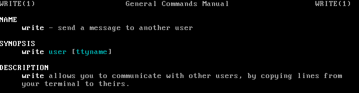
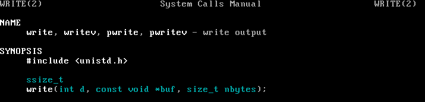
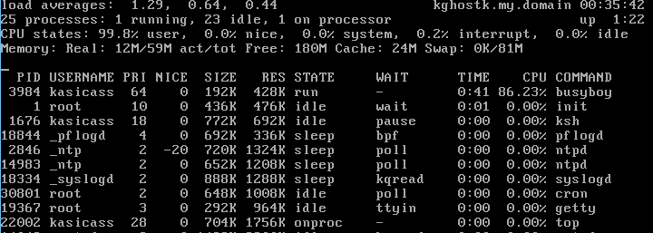
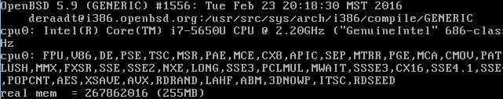
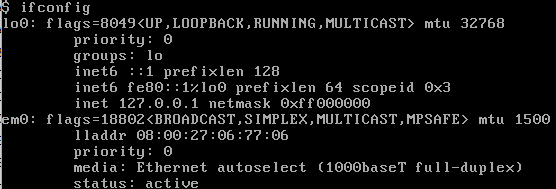
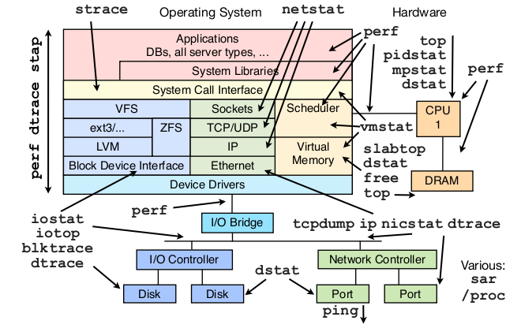

# Shell 命令偷偷教

掌握最基本的、最实用 *nix shell 命令。

## 总纲

shell 中有很多常用命令，日常维护看看 log 啥的，很实用。

shell 也可以用来写一些复杂的逻辑，但逻辑复杂后，shell 就远不如一门脚本语言（比如 python）来得方便了。

不是专业的 SA (system administrator)，不学 shell 中编程相关的那些 if ... else ... 等等。
只专注学习基本的一些命令就好。

随便找个 Linux/BSD/Mac 系统，打开 shell，开始玩吧。
（本教程例子是在 OpenBSD 5.9 中玩的）


## 基础篇

```Shell
$ <- shell 的提示符
# <- 我是注释
```


**pwd，请告诉我，当前在哪个目录？**

```Shell
$ pwd
/home/kasicass/shell_beginner
```


**whoami，显示当前登录的 user id**

```Shell
$ whoami
kasicass
```


**ls，看看当前目录下有啥**

```Shell
$ ls
a.out    hello    hello.c my.c

# -l 显示详细信息
$ ls -l
total 40
-rwxr-xr-x  1 kasicass  kasicass  6709 Mar   9 23:25 a.out
-rwxr-xr-x  1 kasicass  kasicass  6710 Mar   9 18:19 hello
-rw-r--r--  1 kasicass  kasicass    60 Mar   9 18:59 hello.c
-rw-r--r--  1 kasicass  kasicass    77 Mar   9 23:40 my.c

# -a 显示隐藏文件（目录也是文件的一种）
$ ls -la
total 48
drwxr-xr-x  2 kasicass  kasicass   512 Mar   9 23:25 .
drwxr-xr-x  4 kasicass  kasicass   512 Mar   9 18:06 ..
-rwxr-xr-x  1 kasicass  kasicass  6709 Mar   9 23:25 a.out
-rwxr-xr-x  1 kasicass  kasicass  6710 Mar   9 18:19 hello
-rw-r--r--  1 kasicass  kasicass    60 Mar   9 18:59 hello.c
-rw-r--r--  1 kasicass  kasicass    77 Mar   9 23:40 my.c
```


**echo，我说啥，你说啥**

```Shell
$ echo hello
hello

$ echo "Baby aaa"
Baby aaa

$ echo "Baby\"aaa"
Baby"aaa

# > 创建新文件，并写入内容
# >> 将内容写入文件尾部(append to file)
# 以及如何用 echo 输入多行内容
$ echo "#include <stdio.h>" > my.c
$ echo "int main(void) {" >> my.c
$ echo "  printf(\"Hello, Shell\");
>   return 0;
> }" >> my.c

# cat 干啥用的，看下一节
$ cat my.c
#include <stdio.h>
int main() {
  printf("Hello, Shell");
  return 0;
}

# 啊哈，帅不帅，我们写了个 C 程序
# "Hello, Shell" 后面没有 '\n'，所以提示符($) 跟在了 Shell 后面。
$ cc my.c
$ ./a.out
Hello, Shell$
```


**man，呼叫 help~**

man，取 manual 之意。通常也称 man page。

```Shell
$ man echo
```


manpage 其实就是整个 Linux/BSD/Mac 系统中 shell命令、系统API、Driver 等等各种文档的大集合。如果 shell命令 和 系统API 有重名咋办。这就涉及到不同的 section 了。

```Shell
# 用 j, k 或者 上/下箭头，上下翻滚页面内容
$ man write
```



```Shell
# 去 section 2 中查找
$ man 2 write
```



用浏览器打开 [http://www.openbsd.org/cgi-bin/man.cgi][1]，可以看到 OpenBSD 所有 manpage 的分类(sections)。


**cat，看看文件中有啥内容**

```Shell
$ echo "aaa" > foo.txt
$ cat foo.txt
aaa

$ echo "bbb" > bar.txt
$ cat bar.txt
bbb

$ cat foo.txt bar.txt > concat.txt
$ cat concat.txt
aaa
bbb
```


**cd，跳转目录**

```Shell
$ cd /home/kasicass/c_beginner
$ pwd
/home/kasicass/c_beginner

# $HOME 和 ~ 是等价的
# $HOME 返回 HOME 这个环境变量的值
$ cd $HOME
$ pwd
/home/kasicass
$ cd ~
$ pwd
/home/kasicass

# 顺带讲讲环境变量，比如 $PATH 是 shell command 的搜寻顺序
# 如果 /bin/foo 和 /sbin/foo 这两个程序同时存在，输入 $ foo 优先执行 /bin/foo
# $PATH 中的路径，使用 : 分隔的
$ echo $PATH
/home/kasicass/bin:/bin:/sbin:...
```


**mkdir，创建目录**

```Shell
$ pwd
/home/kasicass/shell_beginner

$ mkdir mydir
$ cd mydir
$ pwd
/home/kasicass/shell_beginner/mydir
```


**touch，创建空文件**

```Shell
$ touch foo.c
$ ls
foo.c
$ cat foo.c
$             # display nothing
```


**rm，删文件、目录**

```Shell
# rm -rf 用来删除整个目录
# 小心，别乱用 "rm -rf /"，嘿嘿
$ touch bar.c
$ rm bar.c
$ cd ../
$ rm -rf mydir
```


**tail, 显示文件最后几行**

```Shell
# 其实最常用的是 tail -f，用来看最新的 log 内容
# 比如有个文件叫 foo.txt，有个程序会不停地给 foo.txt 中写 log
# tail -f 可以一直看到最新的 log。
$ touch foo.txt
$ tail -f foo.txt &       # & 表示将 tail -f 放到后台运行

$ echo "aaa" >> foo.txt
aaa                       # tail -f print出来的 内容

$ echo "bbb" >> foo.txt
bbb
```


**ps, 看进程列表**

```Shell
$ ps
  PID TT  STAT           TIME COMMAND
 1676 C0  Ssp         0:00.39 -ksh (ksh)
13684 C0  Ip          0:00.00 tail -f foo.txt
15914 C0  R+p         0:00.00 ps
```


**kill，干掉某个进程**

```Shell
$ kill 13684
[1] + Terminated         tail -f foo.txt

$ echo "ccc" >> foo.txt
$                        # tail -f 已经被干掉了，不再有 print 内容
```


**top, 监控当前CPU占用情况**

```Shell
$ cat busyboy.c
int main(void) {
  while (1)
    ;
  return 0;
}

$ cc busyboy.c -o busyboy
$ ./busyboy &

$ top
```



```Shell
# 按 q 退出 top
$ kill 3984    # 干掉这只 busyboy

$ clear        # top 显示的内容占着屏幕，好烦躁。clear 清理一下。
```


**du, 查看文件大小**

```Shell
# du, display disk usage statistics
# 查看当前目录下哪个文件最大
$ du -sh `ls` | sort -r
4.0K   foo
2.0K   sedtest.txt
2.0K   data.txt
2.0K   bar.c
```

**df，查看磁盘空余大小**

```Shell
# -h 是 human readable 的意思，Size 改为 M/K 等大小。上面 du 那个也一样。
$ df -h
Filesystem     Size     Used    Avail    Capacity    Mounted on
/dev/wd0a      788M    46.0M     702M       6%       /
/dev/wd0e      252M    90.0K     239M       0%       /home
/dev/wd0d      893M     494M     354M      58%       /user   
```


**dmesg, 看看系统 log**

```Shell
# 查看机器启动后的一些系统log，方便查证一些问题
$ dmesg | more
```



```Shell
# 看看有没有进程因为内存不足，被干掉了
$ dmesg | grep "Out of mem"
...
```


**ifconfig, 看看本机IP**

```Shell
$ ifconfig
```




**lsof, ls opend file (看看哪些文件被打开了)**

```Shell
# OpenBSD 上默认没有这个命令，就没有具体的测试截图了
# 查找被进程占用的文件，必须要把对应的进程关掉，才会释放硬盘
$ lsof | grep deleted
...
```


## 文本处理篇

**find，找文件呀、找文件**

```Shell
# 目录结构
# ./bar.c
# ./foo/foo.c
$ find . -name "*.c"
./foo/foo.c
./bar.c
```


**grep，在文件中找内容**

```Shell
$ cat bar.c
#include <stdio.h>
int main(void) {
  printf("Baby");
  return 0;
}

$ grep "printf" bar.c
  printf("Baby");

# 带上 filename
$ grep -H "printf" bar.c
bar.c:  printf

$ cat foo/foo.c
#include <stdio.h>
int main(void) {
  printf("Hello\n");
  return 0;
}

# 其实 grep 只需要会下面一招：显示"当前目录以及子目录下，所有 *.c 中 printf 的那一行"。
# | 是将上一个程序的 stdout 丢给下一个程序的 stdin。shell 中称为 pipe(管道)。
# 管道是 unix 中很强大的设计，将各种 shell command 组合起来，完成一件任务，是 unix 的设计哲学。
$ find . -name "*.c" | xargs grep -H "printf"
./foo/foo.c:  printf("Hello\n");
./bar.c:   printf("Baby");

# xargs 就是将 stdin 中的内容变成 grep 的 args
# 对比下没有 xargs 的情况
$ find . -name "*.c" | grep "foo"
./foo/foo.c
```

**sed，替换文件中的内容**

```Shell
$ cat sedtest.txt
aaa bbb ccc
ddd eee fff

# 替换后的内容，输出到 stdout，并没有修改 sedtest.txt
$ sed 's/eee/qqq/g' sedtest.txt
aaa bbb ccc
ddd qqq fff

# 立即修改 sedtest.txt 的内容，原始文件备份为 sedtest.txt.bak
$ sed -i.bak 's/eee/qqq/g' sedtest.txt
```


**awk/gawk，简单文本处理的神器**

gawk 是 gnu awk，是原版 awk 的加强版。某些 linux 上好像只有 gawk，没有原版 awk。

```Shell
$ cat foo.txt
aaa 10
bbb 20
ccc 30

# 第一列
$ awk '{ print $1; }' foo.txt
aaa
bbb
ccc

# 第二列
$ awk '{ print $2; }' foo.txt
10
20
30

# $0 是整列，不切分
$ awk '{ print $0; }' foo.txt
aaa 10
bbb 20
ccc 30

# 要求，将第二列的数字求和
# 卧槽，是不是觉得 awk 很牛逼。但又觉得这么一行代码有点复杂。。。
$ awk 'BEGIN { sum = 0; } { sum += $2; } END { print sum; }' foo.txt
60
```

好了，接下来将讲解全世界最快的 awk 学习方法。

 * 你会写C吧？你会写C吧？你会写C吧？
 * 重要的事情说三遍。=_=!

```Shell
$ cat sum.awk
BEGIN {
  sum = 0;
}

{
  sum += $2;
}

END {
  printf("%d\n", sum);
}

$ awk -f sum.awk foo.txt
60
```

awk 的本质

 * 三段C函数
 * BEGIN、END 这两个函数是可选的，分别在本次 awk 流程的开始、结束各执行一次
 * 而中间函数，是针对每一行数据，执行一次。把 C 中学会的东西，往里面用，就是了
 * 为啥会如此之像呢？因为 C 和 awk 是同一批人设计出来的嘛。哈哈~

```Shell
$ cat bar.txt
aaa BABY 10
bbb BABY 20
ccc BABY 30

# 最后还有一招，-F 改变默认分隔符
$ awk -FBABY '{ printf("\"%s\", \"%s\"\n", $1, $2); }' bar.txt
"aaa ", " 10"
"bbb ", " 20"
"ccc ", " 30"
```


**sort + uniq, 将重复的内容过滤掉**

```Shell
$ cat data.txt
bbb 10
aaa 20
bbb 30

$ awk '{print $1}' data.txt
bbb
aaa
bbb

# 单独使用 uniq 貌似没啥用？？？
$ awk '{print $1}' data.txt | uniq
bbb
aaa
bbb

# 先用 sort 将内容排序
$ awk '{print $1}' data.txt | sort
aaa
bbb
bbb

# 这下知道 sort + uniq 为啥都是一起用的了吧 :-)
$ awk '{print $1}' data.txt | sort | uniq
aaa
bbb
```

**awk/grep/sort 的具体例子**

```Shell
$ cat log.txt
[2016-03-10 10:56:38] cid 50156001 user 5585332 get arbor2016 score 1 for task:10254007 ring:3 cnt:7
[2016-03-10 10:56:38] cid 50156001 user 5593171 get exp 59101 for task:10254007 ring:9 cnt:7
[2016-03-10 10:56:38] cid 50156001 user 5593201 get exp 3867 for task:10254007 ring:9 cnt:7
[2016-03-10 10:56:38] cid 50156001 user 5593201 get exp 8889 for task:10254007 ring:9 cnt:7

# 统计一个玩家得了多少经验，经验从小到大排序 （看懂这条命令，你的awk就过关啦）
$ grep "task:10254007" log.txt | awk '{if ($8=="exp"){a[$6]+=$9}} END{for(u in a){print u,a[u]}}' | sort -k2 -n
5593201 12756
5593171 59101
```


**vi/vim 以及 emacs**

在 shell 下，一款好用的文本编辑器是必须的。至于是学习 vi/vim 还是 emacs，个人口味不同，随意啦。

 * 所有 Linux/BSD/Mac 系统，默认会装 vi。（vim是vi加强版，需要安装）
 * 服务端程序猿很多是从 Windows 直接 ssh 到服务器上，vim 写代码的。（写C/C++/Python等等）

这两款编辑器都很不错，如何学习，请自行找教程吧。


## Beyond Shell

这一节不是讲 shell 的，而是演示 python 如何完成 shell 的一些功能。（Oh no!!!不要跟我提 Perl，一提 Perl 我就满眼都是 $$$$$$$$）

```Shell
$ cat bar.c
#include <stdio.h>
int main(void) {
  printf("Baby");
  return 0;
}

$ cat foo/foo.c
#include <stdio.h>
int main(void) {
  printf("Hello\n");
  return 0;
}

$ python mygrep.py
./bar.c: printf("Baby!");
./foo/foo.c: printf("Hello\n");
```

看看 mygrep.py 的实现。

```Python
# mygrep.py
# 模拟了 $ find . -name "*.c" | xargs grep printf
# 如果我们想做的，不仅仅是 grep 和 awk 能完成的事情，python 作为一个完整的编程语言，更胜任
import os
import re
import fnmatch
import gzip, bz2

def gen_find(filepat, top):
  for path, dirlist, filelist in os.walk(top):
    for name in fnmatch.filter(filelist, filepat):
      yield os.path.join(path, name)

def gen_open(filenames):
  for name in filenames:
    if name.endswith(".gz"):
      yield name, gzip.open(name)
    elif name.endswith(".bz2"):
      yield name, bz2.BZ2File(name)
    else:
      yield name, open(name)

def gen_cat(sources):
  for name, s in sources:
    for item in s:
      yield name, item

def gen_grep(pat, lines):
  patc = re.compile(pat)
  for line in lines:
    if patc.search(line[1]):
      yield line

if __name__ == '__main__':
  cppnames = gen_find("*.cpp", ".")
  cppfiles = gen_open(cppnames)
  cpplines = gen_cat(cppnames)

  printf_lines = gen_grep(r'printf', cpplines)
  for line in printf_lines:
    print line[0] + ': ' + line[1].strip()
```


## 参考资料



 * 这里有个很好的[ppt][2]。推荐阅读。

《[Linux Shell Scripting Tutorial - A Beginner's Handbook][3]》

 * shell 入门书
 * 真的需要写 shell script 了，读读。

《[Mastering Unix Shell Scripting Bash Bourne and Korn Shell Scripting for Programmers System Administrators and Unix Gurus][4]》

 * 等在 shell 上干了一段时间活了，推荐读读这本书。
 * 没有 shell 工作经验的人，是无法体会这本书的价值的。

The AWK Programming Language

 * [https://github.com/wuzhouhui/awk][5]
 * 想把 awk 玩出花来，就请读 awk作者 的原著 :-)
 * 只记得附书源码只有一个 .txt 文件，然后通过 awk 处理一下，生成所有源文件。帅爆了~

Generator Tricks for Systems Programmers

 * [http://www.dabeaz.com/generators-uk/][6]
 * mygrep.py 的代码，来自这里。

免费的编程中文书籍索引

 * [https://github.com/justjavac/free-programming-books-zh_CN][7]
 * 写这篇教程过程中，发现的一个网址。汇集了很多不错的资料，赞。
 * 收藏一下，作为留念~

Introduction to the Command Line

 * [https://launchschool.com/books/command_line][8]
 * 这也有本 shell 入门的小书，可以看看

《[Advanced Bash-Scripting Guide][9]》

 * 还没看过 :-)


**感谢**

感谢杰哥、伟爷、小舟舟、龙爷、小田田帮助完善此文档。:-)


[1]:http://www.openbsd.org/cgi-bin/man.cgi
[2]:http://www.socallinuxexpo.org/scale11x/presentations/linux-performance-analysis-and-tools
[3]:http://www.freeos.com/guides/lsst/
[4]:https://www.amazon.com/Mastering-Unix-Shell-Scripting-Administrators/dp/0470183012/
[5]:https://github.com/wuzhouhui/awk
[6]:http://www.dabeaz.com/generators-uk/
[7]:https://github.com/justjavac/free-programming-books-zh_CN
[8]:https://launchschool.com/books/command_line
[9]:http://tldp.org/LDP/abs/html/
