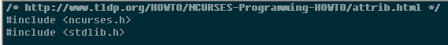
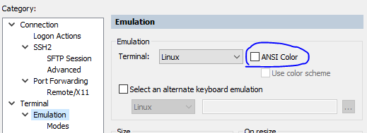

# NCURSES Crash Course

学了下 ncurses，总结之。

 * 教程原文，[http://www.tldp.org/HOWTO/NCURSES-Programming-HOWTO/index.html][1]
 * 代码实现，[https://github.com/kasicass/kasicass/tree/master/ncurses][2]
 * emake，[https://github.com/skywind3000/emake][3]
 * 所有练习，在 [Debian 9.5][5]、[OpenBSD 6.4][4] 下测试通过


## 1. Introduction

很久很久以前，没有漂亮的显示器，只有终端（terminal）。

SVR4(System V Release 4.0) 的程序员们，发明了在 terminal 上作画的 API --  CURSES。

GNU 出现了，因为 SVR4 要钱嘛，所以，重写一遍罗。就有了 NCURSES。

### 1.1 安装开发环境

Debian 9.5

```
# aptitude install ncurses-dev
```

OpenBSD 6.4 自带 ncurses 库，不需要安装。

### 1.2 man page

ncurses 的 man page 在 debian 下没找到。OpenBSD 下直接：

```
$ man ncurses
...
   Routine Name Index
       The following table lists each curses routine and the name of the
       manual page on which it is described.  Routines flagged with `*' are
       ncurses-specific, not described by XPG4 or present in SVr4.

                     curses Routine Name     Manual Page Name
                     ===========================================
                     chgat                   curs_attr(3)
                     clear                   curs_clear(3)
                     clearok                 curs_outopts(3)
...
```

函数 initscr, clear 等等的 man page，需要加上 curs_ 前缀：

```
$ man curs_clear
...
DESCRIPTION
       The erase and werase routines copy blanks to every position in the
       window, clearing the screen.

       The clear and wclear routines are like erase and werase, but they also
       call clearok, so that the screen is cleared completely on the next call
       to wrefresh for that window and repainted from scratch.
...
```
### 1.2 示例代码

原文代码

 * [http://www.tldp.org/HOWTO/NCURSES-Programming-HOWTO/ncurses_programs.tar.gz][6]
 * 使用 [Makefile][7]

我的代码

 * [https://github.com/kasicass/kasicass/tree/master/ncurses][2]
 * 使用 [emake][3]

代码目录结构

```
ncurses
   |
   |----> JustForFun     -- just for fun programs
   |----> basics         -- basic programs
   |----> demo           -- output files go into this directory after make
   |          |
   |          |----> exe -- exe files of all example programs
   |----> forms          -- programs related to form library
   |----> menus          -- programs related to menus library
   |----> panels         -- programs related to panels library
   |----> perl           -- perl equivalents of the examples (contributed
   |                            by Anuradha Ratnaweera)
   |----> Makefile       -- the top level Makefile
   |----> README         -- the top level README file. contains instructions
   |----> COPYING        -- copyright notice
```


## 2. Hello World

 * initscr() / endwin()，初始化/释放
 * refresh()，刷新屏幕(stdscr)
 * printw()，类似 printf，内容输出到 stdscr

```C
#include <curses.h>

//! mode: exe
//! int: obj
//! flag: -Wall
//! link: ncurses
//! src: hello_world.c
int main(void)
{
    initscr();                // Start curses mode
    printw("Hello World!");   // Print Hello World
    refresh();                // Print it on the real screen
    getch();                  // Wait for user input
    endwin();                 // End curses mode

    return 0;
}
```

## 3. The Gory Details

nothing~


## 4. Initialization

raw() / cbreak()

 * raw()，raw mode，任意键按下，都直接接收到
 * cbreak()，ctrl + break mode，会收到 CTRL+Z / CTRL+C

echo() / noecho()

 * echo() / noecho()，是否开启 echo

keypad()

 * keypad()，是否启用 F1, F2 ...

halfdelay()

 * halfdelay()，等待 0.X 秒后，结束输入。密码框可以用这个设定

看例子

```C
#include <curses.h>

//! mode: exe
//! int: obj
//! flag: -Wall
//! link: ncurses
//! src: init_func_example.c
int main(void)
{
    int ch;

    initscr();                     // Start curses mode
    raw();                         // Line buffering disabled
    keypad(stdscr, TRUE);          // We get F1, F2 etc..
    noecho();                      // Don't echo() while we do getch

    printw("Type any character to see it in bold\n");
    ch = getch();                  // If raw() hadn't been called
                                   // we have to press enter before it
                                   // gets to the program

    if (ch == KEY_F(1))            // Without keypad enabled this will
    {                              //   not get to us either
        printw("F1 Key pressed");  // Without noecho() some ugly escape
    }                              // characters might have been printed
    else                           // on screen
    {
        printw("The press key is ");
        attron(A_BOLD);
        printw("%c", ch);
        attroff(A_BOLD);
    }

    refresh();                // Print it on the real screen
    getch();                  // Wait for user input
    endwin();                 // End curses mode

    return 0;
}
```

## 5. A Word about Windows

stdscr 是 defualt window / 全屏

输出到 stdscr：

```C
printw("Hi There !!!");
refresh();
```

输出到某个 window：

```C
wprintw(win, "Hi There !!!");
wrefresh(win);
```

```C
/* Print on stdscr at present cursor position */
printw(string);

/* Move to (y, x) then print string */
mvprintw(y, x, string);

/* Print on window win at present cursor position in the window */
wprintw(win, string);  

/* Move to (y, x) relative to window co-ordinates and then print */
mvwprintw(win, y, x, string);   
```


## 6. Output functions

* addch(), Print single character with attributes
* printw(), Print formatted output similar to printf()
* addstr(), Print strings

### 6.1 addch()

向 stdscr 输出单个字符，带属性，例如：

```
addch(ch | A_BOLD | A_UNDERLINE);
```

### mvaddch(), waddch() and mvwaddch()

```
move(row,col);
addch(ch);
```

等价于

```
mvaddch(row,col,ch);
```

waddch() / mvwaddch() 则是针对 window 的操作。

### 6.2 printw()

 * printw() / mvprintw()，对 stdscr 操作
 * wprintw() / mvwprintw()，对 window 操作
 * vwprintw()，对 window 操作，类似 vprintf

例子，显示 stdscr 的 row & col：

```C
#include <curses.h>
#include <string.h>

//! mode: exe
//! int: obj
//! flag: -Wall
//! link: ncurses
//! src: printw_example.c
int main(void)
{
    char mesg[] = "Just a string";
    int row, col;

    initscr();
    getmaxyx(stdscr, row, col);
    mvprintw(row/2, (col-strlen(mesg))/2, "%s", mesg);
    mvprintw(row-2,0,"This screen has %d rows and %d columes\n", row, col);

    printw("Try resizeing your window(if possible) and then run this program again");
    refresh();
    getch();
    endwin();

    return 0;
}
```

getmaxyx() 中 row, col 并没有传入指针，如何获得数据的？看 curses.h 这里：

```
#define getmaxyx(win,y,x)   (y = getmaxy(win), x = getmaxx(win))
```

### 6.3 addstr()

类似 puts()

 * addstr() / mvaddstr()，对 stdscr 操作
 * waddstr() / mvwaddstr()，对 window 操作


## 7. Input functions

* getch()，等待输入 a character
* scanw() / mvscanw()，和 scanf() 类似
* wscanw() / mvwscanw()，针对 windows 的 scanw()
* vwscanw()，和 vscanf() 类似
* getstr()，等待输入 a line of string

看代码，一目了然：

```C
#include <ncurses.h>
#include <string.h>

//! mode: exe
//! int: obj
//! flag: -Wall
//! link: ncurses
//! src: scanw_example.c
int main()
{
    char mesg[]  = "Enter a string: ";
    char mesg1[] = "Enter a int: ";
    char str[80];
    int row, col;
    int v;

    initscr();

    // getstr()
    getmaxyx(stdscr, row, col);
    mvprintw(row/2, (col-strlen(mesg))/2, "%s", mesg);

    getstr(str);
    mvprintw(LINES-2, 0, "You Entered: %s", str);
    getch();

    // sacnw()
    clear();
    getmaxyx(stdscr, row, col);
    mvprintw(row/2, (col-strlen(mesg))/2, "%s", mesg1);

    scanw("%d", &v);
    mvprintw(LINES-2, 0, "You Entered: %d", v); 
    getch();

    endwin();
    return 0;
}
```


## 8. Attributes

 * attron() / attroff(), 开/关某个显示属性
 * attrset(), 设置显示属性（覆盖之前的）
 * attr_ 开头系列函数，通过 attr_t 来操作属性。

```
int attr_get(attr_t *attrs, short *pair, void *opts);
int attr_off(attr_t attrs, void *opts);
...
```

属性列表

```
    A_NORMAL        Normal display (no highlight)
    A_STANDOUT      Best highlighting mode of the terminal.
    A_UNDERLINE     Underlining
    A_REVERSE       Reverse video
    A_BLINK         Blinking
    A_DIM           Half bright
    A_BOLD          Extra bright or bold
    A_PROTECT       Protected mode
    A_INVIS         Invisible or blank mode
    A_ALTCHARSET    Alternate character set
    A_CHARTEXT      Bit-mask to extract a character
    COLOR_PAIR(n)   Color-pair number n 
```

设置方式

```C
	attron(A_REVERSE | A_BLINK);
```

### 8.1 attron() / attroff() 例子

将"/* */"之间的内容加粗。

```C
/* http://www.tldp.org/HOWTO/NCURSES-Programming-HOWTO/attrib.html */
#include <ncurses.h>
#include <stdlib.h>

//! mode: exe
//! int: obj
//! flag: -Wall, -Wno-unused-but-set-variable
//! link: ncurses
//! src: simple_attr.c
int main(int argc, char* argv[])
{
    int ch, prev, row, col;
    FILE *fp;
    int y, x;

    if (argc != 2)
    {
        printf("Usage: %s <a c file name>\n", argv[0]);
        exit(1);
    }

    fp = fopen(argv[1], "r");
    if (fp == NULL)
    {
        perror("Can't open input file");
        exit(1);
    }

    prev = EOF;
    initscr();
    getmaxyx(stdscr, row, col);

    while ((ch = fgetc(fp)) != EOF)
    {
        getyx(stdscr, y, x);          // get the current cursor position
        if (y == (row - 1))           // are we at the end of the screen
        {
            printw("<-Press Any Key->");
            getch();
            clear();
            move(0, 0);
        }

        if (prev == '/' && ch == '*') // If it is /* then only switch bold on
        {
            attron(A_BOLD);
            getyx(stdscr, y, x);
            move(y, x - 1);           // back up one space
            printw("%c%c", '/', ch);
        }
        else
        {
            printw("%c", ch);
        }

        refresh();

        if (prev == '*' && ch == '/')
        {
            attroff(A_BOLD);         // bold off
        }

        prev = ch;
    }
    endwin();
    fclose(fp);

    return 0;
}
```

SecureCRT 中，需要设置 ANSI Color off，才能看到 bold 效果。



看看效果。

```
$ emake simple_attr.c
$ ./simple_attr simple_attr.c
```



### 8.2 chgat() functions

chgat() 用于单独设置几个 characters 的属性。

第一个参数 -1，表示从当前位置到本行结束。

```C
chgat(-1, A_REVERSE, 0, NULL);
```

看看具体例子：

```C
#include <ncurses.h>

//! mode: exe
//! int: obj
//! flag: -Wall
//! link: ncurses
//! src: with_chgat.c
int main(void)
{
    initscr();
    start_color();     // start color functionality

    init_pair(1, COLOR_CYAN, COLOR_BLACK);
    printw("A Big string which i didn't care to type fully");
    mvchgat(0, 0, -1, A_BLINK, 1, NULL);
    // First two parameters specify the position at which to start
    // Third parameter number of characters to update. -1 means till
    //   end of line
    // Forth parameter is the normal attribute you wanted to give
    //   to the character
    // Fifth is the color index. It is the index given during init_pair()
    //   use 0 if you didn't want color
    // Sixth one is always NULL

    refresh();
    getch();
    endwin();

    return 0;
}
```


## 9. Windows

### 9.1 The basics

win的创建/删除。

```C
WINDOW* w = newwin(...);
delwin(w);
```

### 9.2. Let there be a Window !!!

来个例子，按 上/下/左/右 移动 window。

```C
// http://www.tldp.org/HOWTO/NCURSES-Programming-HOWTO/windows.html
#include <ncurses.h>

WINDOW* create_newwin(int height, int width, int starty, int startx);
void destroy_win(WINDOW *local_win);

//! mode: exe
//! int: obj
//! flag: -Wall
//! link: ncurses
//! src: win_border.c
int main(int argc, char* argv[])
{
    WINDOW *my_win;
    int startx, starty, width, height;
    int ch;

    initscr();
    cbreak();              // Line buffering diabled, pass on everthing to me
    keypad(stdscr, TRUE);  // I need that notify F1

    height = 3;
    width = 10;
    starty = (LINES - height) / 2; // calculating for center polacement
    startx = (COLS - width) / 2;   // of the window
    printw("Press F1 to exit");
    refresh();
    my_win = create_newwin(height, width, starty, startx);

    while ((ch = getch()) != KEY_F(1))
    {
        switch (ch)
        {
        case KEY_LEFT:
            destroy_win(my_win);
            my_win = create_newwin(height, width, starty, --startx);
            break;

        case KEY_RIGHT:
            destroy_win(my_win);
            my_win = create_newwin(height, width, starty, ++startx);
            break;

        case KEY_UP:
            destroy_win(my_win);
            my_win = create_newwin(height, width, --starty, startx);
            break;

        case KEY_DOWN:
            destroy_win(my_win);
            my_win = create_newwin(height, width, ++starty, startx);
            break;
        }
    }

    endwin();	
    return 0;	
}

WINDOW* create_newwin(int height, int width, int starty, int startx)
{
    WINDOW* local_win;

    local_win = newwin(height, width, starty, startx);
    box(local_win, 0, 0);
    wrefresh(local_win);
    return local_win;
}

void destroy_win(WINDOW* local_win)
{
    // This won't produce the desired result of erasing
    // the window. It will leave it's four corners and so
    // an ugly remnant of window.
    // box(local_win, ' ', ' ');

    // 1. win: the window on which to operate
    // 2. ls: character to be used for the left side of the window 
    // 3. rs: character to be used for the right side of the window 
    // 4. ts: character to be used for the top side of the window 
    // 5. bs: character to be used for the bottom side of the window 
    // 6. tl: character to be used for the top left corner of the window 
    // 7. tr: character to be used for the top right corner of the window 
    // 8. bl: character to be used for the bottom left corner of the window 
    // 9. br: character to be used for the bottom right corner of the window
    wborder(local_win, ' ', ' ', ' ', ' ', ' ', ' ', ' ', ' ');
	
    wrefresh(local_win);
    delwin(local_win);	
}
```

其中，擦除的地方，用了 wborder()。

可以用 wborder() 画框框。

```C
wborder(win, '|', '|', '-', '-', '+', '+', '+', '+');
```

效果如下

```C

    +------------+
    |            |
    |            |
    |            |
    |            |
    |            |
    |            |
    +------------+
```

### 9.3 Other Border functions

上面的例子不高效，每次移动都需要 delwin() / newwin()。这次用 mvhline() / mvvline() 改进下。

* 用 mvhline() / mvvline() 替代 wborder()，只擦除/绘制需要的位置

```C
#include <curses.h>

typedef struct _win_border_struct {
    chtype ls, rs, ts, bs, tl, tr, bl, br;
} WIN_BORDER;

typedef struct _win_struct {
    int startx, starty;
    int height, width;
    WIN_BORDER border;
} WIN;

void init_win_params(WIN *p_win);
void print_win_params(WIN *p_win);
void create_box(WIN *win, bool flag);

//! mode: exe
//! int: obj
//! flag: -Wall
//! link: ncurses
//! src: other_border.c
int main(int argc, char* argv[])
{
    WIN win;
    int ch;

    initscr();
    start_color();           // Start the color functionality
    cbreak();                // Line buffering disabled, Pass on everthing to me

    keypad(stdscr, TRUE);    // I need that nifty F1
    noecho();
    init_pair(1, COLOR_CYAN, COLOR_BLACK);

    init_win_params(&win);

    attron(COLOR_PAIR(1));
    printw("Press F1 to exit");
    refresh();
    attroff(COLOR_PAIR(1));

    create_box(&win, TRUE);
    print_win_params(&win);

    while ((ch = getch()) != KEY_F(1))
    {
        switch (ch)
        {
        case KEY_LEFT:
            create_box(&win, FALSE);
            --win.startx;
            create_box(&win, TRUE);
            break;

        case KEY_RIGHT:
            create_box(&win, FALSE);
            ++win.startx;
            create_box(&win, TRUE);
            break;

        case KEY_UP:
            create_box(&win, FALSE);
            --win.starty;
            create_box(&win, TRUE);
            break;

        case KEY_DOWN:
            create_box(&win, FALSE);
            ++win.starty;
            create_box(&win, TRUE);
            break;
        }

        print_win_params(&win);
	}

    endwin();
    return 0;
}

void init_win_params(WIN *p_win)
{
    p_win->height = 3;
    p_win->width  = 10;
    p_win->starty = (LINES - p_win->height)/2;
    p_win->startx = (COLS - p_win->width)/2;

    p_win->border.ls = '|';
    p_win->border.rs = '|';
    p_win->border.ts = '-';
    p_win->border.bs = '-';
    p_win->border.tl = '+';
    p_win->border.tr = '+';
    p_win->border.bl = '+';
    p_win->border.br = '+';
}

void print_win_params(WIN *p_win)
{
    mvprintw(25, 0, "win params: x:%d y:%d w:%d h:%d", p_win->startx, p_win->starty,
        p_win->width, p_win->height);
    refresh();
}

void create_box(WIN *p_win, bool flag)
{
    int i, j;
    int x, y, w, h;

    x = p_win->startx;
    y = p_win->starty;
    w = p_win->width;
    h = p_win->height;

    if (flag == TRUE)
    {
        mvaddch(y, x, p_win->border.tl);
        mvaddch(y, x + w, p_win->border.tr);
        mvaddch(y + h, x, p_win->border.bl);
        mvaddch(y + h, x + w, p_win->border.br);
        mvhline(y, x + 1, p_win->border.ts, w - 1);
        mvhline(y + h, x + 1, p_win->border.bs, w - 1);
        mvvline(y + 1, x, p_win->border.ls, h - 1);
        mvvline(y + 1, x + w, p_win->border.ls, h - 1);
    }
    else
    {
        for (j = y; j <= y + h; ++j)
        {
            for (i = x; i <= x + w; ++i)
            {
                mvaddch(j, i, ' ');
            }
        }
    }

    refresh();
}
```


## 10. Colors

很简单，看代码就好。

 * init_pair()，定义 color table 上的颜色 pair

```C
#include <ncurses.h>
#include <stdlib.h>
#include <string.h>

void print_in_middle(WINDOW *win, int starty, int startx, int width, char *string);

//! mode: exe
//! int: obj
//! flag: -Wall
//! link: ncurses
//! src: simple_color.c
int main(int argc, char *argv[])
{
    initscr();
    if (has_colors() == FALSE)
    {
        endwin();
        printf("Your terminal does not supprot color\n");
        exit(1);
    }

    start_color();
    init_pair(1, COLOR_RED, COLOR_BLACK);

    attron(COLOR_PAIR(1));
    print_in_middle(stdscr, LINES / 2, 0, 0, "Viola !!! In color ...");
    attroff(COLOR_PAIR(1));

    getch();
    endwin();

    return 0;
}

void print_in_middle(WINDOW *win, int starty, int startx, int width, char *string)
{
    int length, x, y;
    float temp;

    if (win == NULL)
        win = stdscr;
    getyx(win, y, x);

    if (startx != 0) x = startx;
    if (starty != 0) y = starty;
    if (width == 0) width = 80;

    length = strlen(string);
    temp = (width - length) / 2;
    x = startx + (int)temp;
    mvwprintw(win, y, x, "%s", string);
    refresh();
}
```

常见的颜色定义：

```
COLOR_BLACK   0
COLOR_RED     1
COLOR_GREEN   2
COLOR_YELLOW  3
COLOR_BLUE    4
COLOR_MAGENTA 5
COLOR_CYAN    6
COLOR_WHITE   7
```

重新定义 COLOR_RED：

```C
init_color(COLOR_RED, 700, 0, 0);
/* param 1       : color name
 * param 2, 3, 4 : rgb content min = 0, max = 1000 */
```


## 11. Interfacing with the key board


## 附录1 - ncurses for win32

PDCurses(Public Domain Curses)，直接使用 windows console。

* [http://pdcurses.org/][10]
* [https://github.com/wmcbrine/PDCurses][11]

PDCurses win32a，使用 windows gdi。

* [https://www.projectpluto.com/win32a.htm][8]
* [https://github.com/Bill-Gray/PDCurses][9]


[1]:http://www.tldp.org/HOWTO/NCURSES-Programming-HOWTO/index.html
[2]:https://github.com/kasicass/kasicass/tree/master/ncurses
[3]:https://github.com/skywind3000/emake
[4]:http://www.openbsd.org/64.html
[5]:https://www.debian.org/
[6]:http://www.tldp.org/HOWTO/NCURSES-Programming-HOWTO/ncurses_programs.tar.gz
[7]:https://www.gnu.org/software/make/manual/make.html
[8]:https://www.projectpluto.com/win32a.htm
[9]:https://github.com/Bill-Gray/PDCurses
[10]:http://pdcurses.org/
[11]:https://github.com/wmcbrine/PDCurses
