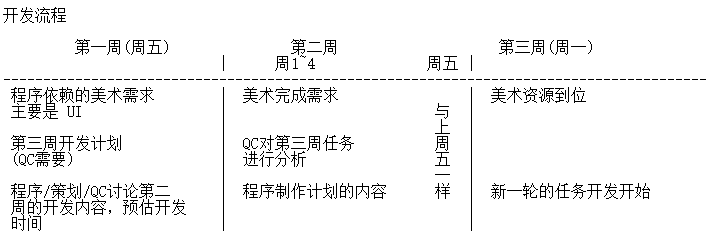

# 好的游戏开发流程？

项目三个月的第一个里程碑并不理想，程序加班比较多，而程序/策划/美术沟通方面也存在着大量问题。美术做的内容程序暂时用不上；程序需要的资源，美术还没开始做；程序的一些要求，美术没弄明白；程序按自己的想法实现玩法，实现出来不是策划想要的效果。

仅仅通过"看文档"，能期望程序/美术彻底理解策划的意思么？我们更多需要面对面的直接交流，逐渐培养、形成属于自己的开发流程。团队比较新，自己也是第一次带团队，路漫漫，上下求索。

下面是三个月来程序/策划/美术的一些反思。

 * 一个玩法/系统的完成，不是程序说了算，是策划
 * 一个美术资源"做完"，是指此资源已经用于具体的玩法/系统。
 * 开发期，为了更好的控制进度，程序的周计划应该细化到"每半天"的工作。
 
 任务分配下去之前，需要程序/策划/QC同时讨论过文档，统一意见，程序做好基本的结构设计、估计开发时间。一旦开发时间敲定，程序每天将按计划，完成工作。开发过程中，所有新的改动需求，一律汇总到 leader 处，再统一安排时间，分派下去，减少程序的正常计划被打断。

