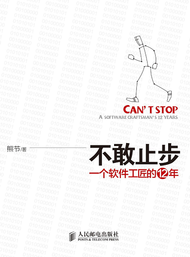

# 软件工厂的精益之路

在 Infoq 上，看了 ThoughtWorks 咨询师熊节的分享。总结之，并写下一点感悟。

 * [http://www.infoq.com/cn/presentations/xj-software-factory-lean][1]

一些总结

```
 * 熟悉SVN的使用，搞干净代码库
   有没有把.obj等中间文件提交到代码库？
   对生产环境的5S，干净的代码库

 * 自动化测试、集成测试，每天需要100%的通过率，否则就是无意义的
   任何测试失败，暂时所有的代码提交

 * 让持续集成的结果，图表化地显示出来，用于分析问题

 * 湖水和岩石的故事（持续改进的激情）
   软件的库存在哪？
   写完没测试的代码？编译时间过长？等等。减少浪费。

 * 系统地思考，尝试改进、收集反馈、再尝试，获得提高。
   流程专家必须首先是生产专家。

 * 造物先造人，改变团队中的人。
   给团队引入新方法的三个阶段
   怀疑期，手把手教地教细节，比如：svn的使用
   兴奋期，像大学教授，带领学生分析问题
   平稳期，讨论剩余的浪费，让其定期思考和分析问题，自主解决浪费

 * 敏捷，持续改进，不断地追求改进
```

说一下技术与方法之间的关系。

方法的实施，一定是在技术不是问题的前提下完成的。比如：

 * 我们做一款MMO，我们团队以前做过类似的产品，有技术积累和经验，这叫做技术不是问题。
 * 我们要开发webgame，但没有flash开发经验，然后花了1个月彻底了解了一下，发现技术不难，这叫做技术不是问题。
 * 我们要开发一个款3D客户端游戏，以前没有玩过3D程序，然后花了几个月也没有搞定，好，这就是技术有问题。

个人的技术修为是内功，软件开发流程是招式。内功卓绝 + 招式轻巧 = Make Software Done。

----------------------------

《番外篇：不敢止步》作于2014.11.25。

读过《重构》中译本的人，应该对熊节这个名字多少有些印象。

一直以为 ThoughtWorks 不加班，流程管理会做得很好。直到后来读熊节的《不敢止步》，才发现，哪都一样。哈哈。

《不敢止步》是本有意思的书，可以看到中国 ThoughtWorks 一路行来的艰辛。ThoughtWorks 咨询师对于敏捷方法、流程管理的不断探索，令人钦佩。

----------------------------

番外篇：不敢止步 -- 一个软件工匠的12年

花了两天，读完了。一本很有意思的IT人成长日记。泪水、热情、欢笑、奋斗，一位技术工作者的自白。

书名很有意思，"不敢"，非不能也，实不敢也。IT行业瞬息万变，life-long learning 是基本品质。工作这么多年，能如作者这般保持着鲜活动力的人，不多。敬佩之情油然而生。

不熟悉 ThoughtWorks 和IT外包业务，这本书给了我很深的体悟，如同自己经历一般。

也带来了一些职业道路上的思考~ 感谢作者。:-)




[1]:http://www.infoq.com/cn/presentations/xj-software-factory-lean
