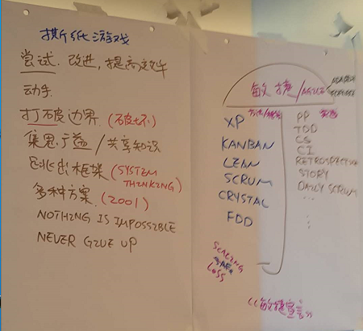
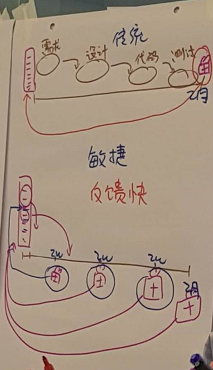
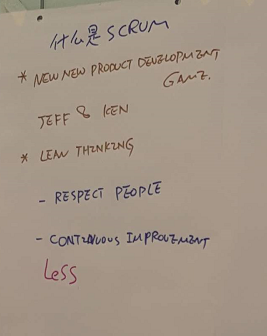
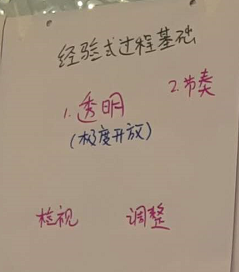
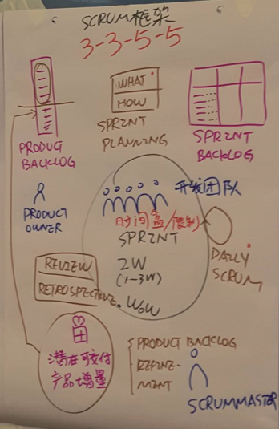
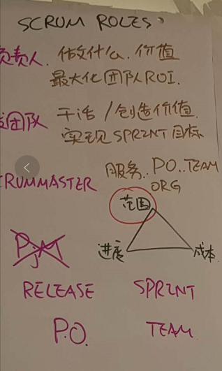
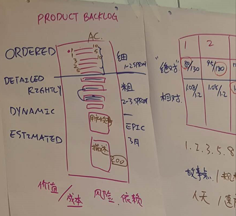

# 成都CSM培训.Day1

## 课程内容

### 个人介绍

每个同学

 * 一张纸划分为16个格子，写入自己的特点
 * 最后针对这些特点，来介绍自己

### 纸游戏

 * 一张A4纸，要求撕出一个圈，能保证一个人能钻过去
 * 引发"没有不可能，寻求改变"的思考
 * 然后介绍敏捷历史：agile 和 XP/Kanban/Lean/Scrum/Crystal/FDD 等的关系。

比较了一下，传统瀑布模型和敏捷的区别。

### 什么是 scrum？

scrum 框架的由来。

Jeff & Ken 看了《[New New Product Development Game][1]》的论文，然后在自己项目中实践敏捷方法论。名曰 Scrum。

 * 相信人（相信每个人都是active，会改变的）
 * 持续改进

Scrum 是一种基于经验的模型，它会反馈出一个团队的问题。

节奏，每周迭代。

梳理 Scrum 框架的具体内容。

 * Product Backlog，任务条目。
 * Product Owner，项目拥有者
 * Sprint Planning/Sprint Backlog，定期将 Backlog 内容放入 planning，通过 Sprint (1-3周)去完成。
 * Review/Retrospective，回顾会/自省，每次 Sprint 之后，大家反馈哪些流程可以改进。

Scrum 下不同角色的定位。

 * Product Owner（产品负责人），最大化团队 ROI（通过 Backlog 优先级来做到）
 * Team（开发团队），干活
 * Scrum Master，服务PO、服务team、服务组织(org)

谈到 backlog 定制和时间预估的问题。

时间预估提出来 story point 的概念。同一个任务，多个团队（成员）预估，认为某个任务价值1 story point；另一个任务，价值2 stroy point。假设：

 * 一个新手团队，1 story point 要做三天。
 * 一个老人团队，1 story point 只需要做一天。

story point 这个很有意思，相当于一个基本的度量单位。

## 总结

一些思考

 * scrum 是一种很奢侈、很理想的模型
 * 对人的要求很高，只适合每个成员都很 active 的团队
 * scrum 团队中的 KPI 如何设定？Scrum 模型避开了这个问题，改用关注团队成长替代了。我司其实做得还不错（积分制，月奖金反馈）
 * 同学中有创业公司的负责人，在自己小公司推广 scrum，一路行来，坑很多。
 * scrum 适合产品（长期迭代，持续改进），不适合项目（周期短，一次交付）
 * 如何很好的定制 story point，是个难题

Scrum Master 和传统 PM 有何不同？

 * Scrum Master 关注团队成长 (be a coach)
 * PM 关注 deadline

[1]:https://hbr.org/1986/01/the-new-new-product-development-game
