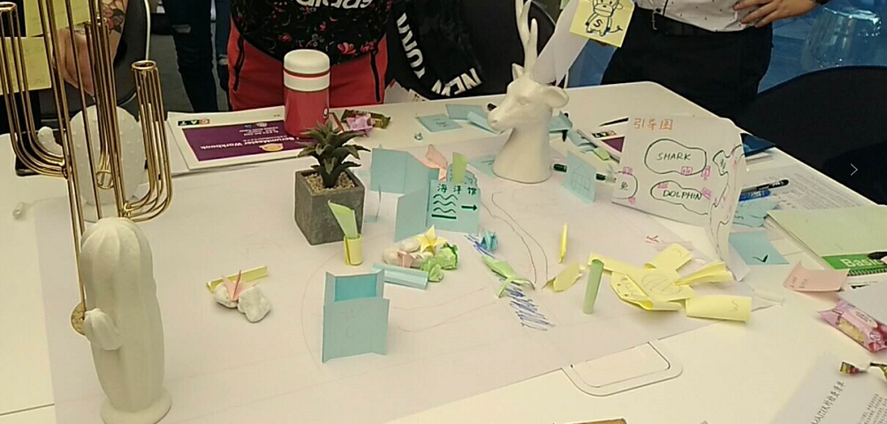
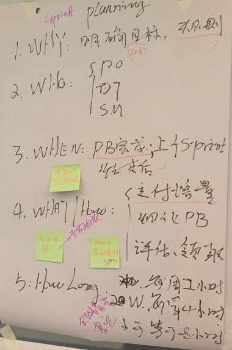
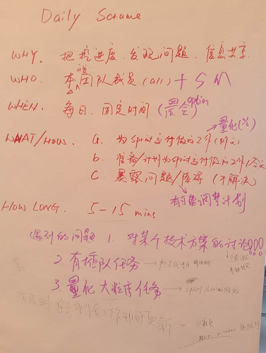
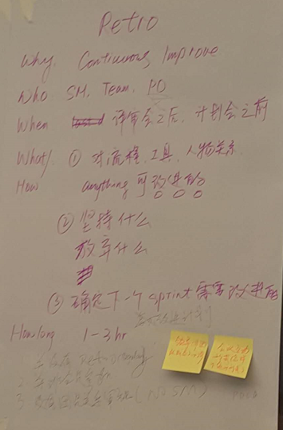
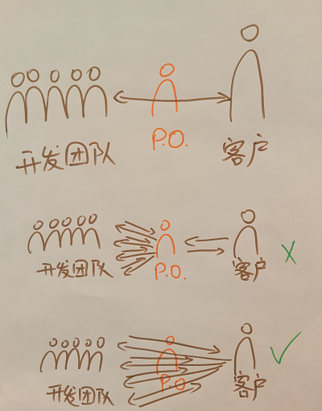
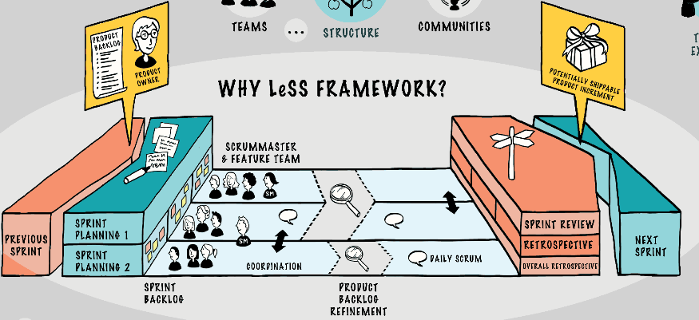
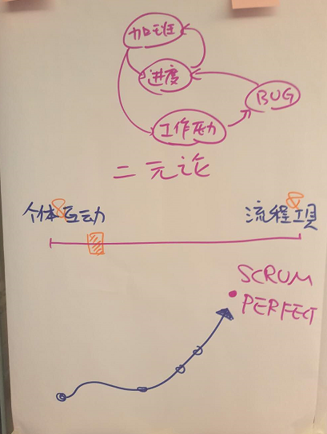

# 成都CSM培训.Day2

## 课程内容

### Scrum in Spotify

看视频：[Scaling agile at spotify][1]

spotify 公司应用 scrum 后的不断改进，相当震撼。

 1. 根据团队需求，选择适用的方法
 2. servant-leadership
 3. 改造组织，适应敏捷
 4. release train
 5. 信任比控制重要
 6. 透明化办公
 7. happy work


### Scrum 流程演练

继续前一天的纸质动物园的模拟游戏，让大家理解 scrum 的流程。

最终构建结果 :-)



培训同学分为3个team（5-6人），每个team认领一个 scrum event，去写出 event 的一些属性。然后轮转，由其它 team 来找出有没有补充和疑问；再轮转，由最后的 team 来解答疑问。（这是一个很好的沟通方法，在多人会议上，把人切分成小组，分内容进行讨论，并交换意见。
让每一个人更好的参与）

**Sprint Planning**

```
 * Why: 明确 Sprint 目标
 * Who: Product Owner、Team、Scrum Master
 * When：一个 Sprint 开始的时候（每周维护）
 * What/How：
   <1> 交付增量
   <2> 细化 Product Backlog，选取 PB 纳入 Sprint Backlog
   <3> 评估/领取
 * How Long：根据项目而定。
 * 实践问题
   <1> 会议过长。Scrum Master要控制会议时间/方向
   <2> 一些无法一致的意见。找上一级专家拍板。
```



**Daily Meeting**

```
 * Why：把控进度、发现问题、信息共享
 * Who：Team、Scrum Master
 * When：每日固定时间（晨会）
 * What/How：
   <1> 昨天做了啥？（跨多天的任务，最好能量化，完成百分比）
   <2> 今天准备做啥？
   <3> 碰到的困难，寻求帮助。（有可能调整计划）
 * How Long：5 - 15 min
 * 实践问题
   <1> 技术人员对某个方案的细节讨论。（会后讨论，Scrum Master打断讨论）
   <2> 有插队任务。（Product Owner重新评估）
   <3> 如何量化大颗粒任务。
```



**Sprint Retro**

```
 * Why：回顾Sprint的流程，对流程做持续改进
 * Who：Team，Scrum Master，Product Owner
 * When：评审会之后，一个 Sprint 的最后一步
 * What/How：
   <1> 对流程、工具等等，任何可改进的点
   <2> 做得好的，继续保持；做得不好的，提出来
   <3> 选取一项大家觉得急需改进的，下一个 Sprint 尝试改进下
 * How Long：1-3 hour
```



**Scrum的客户沟通模型**




### Scrum 扩容 -- LeSS

LeSS 多团队 Scrum：[https://less.works/][2]

应用模型：多团队共同交付一个产品

 * LeSS = Multiple team scrum
 * SAFe = Multiple scrum team (SAFe是另一个模型)

很简单，同一个 Product Owner，业务切分，然后多个 team 同时跑一个时间节奏的 scrum。持续集成是 LeSS 的核心基础构建。

自己暂时还用不上，以后有需要再研究。




### System Thinking

 * 来自《第五项修炼》
 * 找出系统中互相影响的因素。

下图解读：

 * 上面：System Thinking 的一个例子
 * 下面：Scrum 是一个理想状态，团队持续改进，追求这个理想状态




### 讲师的经验

京东没有专门的 Scrum Master 职位，由 Program Leader 兼任。

一个案例
  * 与途牛的一次合作，预估2月完成（3个sprint），后来deadline减少了两周，那就砍最后一个sprint的需求
  * scrum 本质，交付团队此时能交付的最大值。


## 总结

### 同学经验

 * 有做 hardware 的同学，hardware 一个产品制作周期1-2年，需求变更很慢。产品开发更适合传统的瀑布模型。
 * 但在碰到需要查证问题的时候，可以启用 scrum 的方式，快速寻找问题。
 * 有做政府软件的同学，政府软件不可能随时和客户沟通，PO的职责（对业务的理解）很重要。
 * scrum 框架最适合的应用场景：互联网、游戏，需求变化频繁的。
 * 有同学的公司，团队用了 scrum 后，比没有用 scrum 的团队，产出提高了。老板希望全公司推广。
 * 团队成长的指标/成就来源：不断有交付

### 个人经验

 * colabet，一个内部网站，提交代码，导致构建失败的，记录 +1。请程序组喝可乐，记录 -1。
 * ppj制度，对外犯错误，积累错误积分，请全组（程序/策划/QA/美术）吃pizza，花了点钱作为惩罚，大家吃得开心作为奖励。（一次全组pizza价格比较贵，可以积攒几个人的积分全部超出请客范围后，再大家一起AA请客）

### Scrum 认证的商业模型

Scrum 认证本身，就有各种打怪升级路线。

 * [https://www.scrumalliance.org/][3]
 * 想成为 CSM，必须要找 CST 学习一次才可以（直销模式）
 * 升级路线很多，比如：CSM => CSM-Advance => CST
 * 老外设计一个系统，都显示从 business 运作的角度去设计
 * 有价值的东西，也需要商业模型让其传播


[1]:http://v.youku.com/v_show/id_XMzA5MjkxNjUyOA==.html?spm=a2h0k.8191407.0.0&from=s1.8-1-1.2
[2]:https://less.works/
[3]:https://www.scrumalliance.org/
