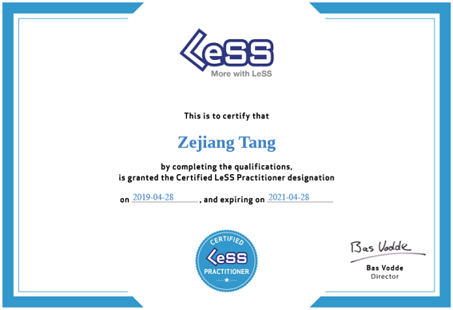

# Scrum Books

上一次读 Scrum 的书，还是在 2008 - 2010 年之间。当时第一次带团队，边读书，边验证，磕磕碰碰，颇为不易。

温故而知新，将看过和计划要看的书单列于此，今年读完它们。:-)


## 正本清源

Jeff & Ken 看了《[New New Product Development Game][6]》的论文，然后在软件开发中实践敏捷方法论。名曰 Scrum。

Scrum 最核心的内容，只有几页纸，称为 Scrum Guide。

 * [https://scrumguides.org/][1]
 * [https://scrumguides.org/scrum-guide.html][2]

发明者之一 [Ken Schwaber][7] 有两本书

 * 《[Agile Software Development with Scrum][8]》，2002年
 * 《[The Enterprise and Scrum][9]》，2007年

2008年3月，第一次带项目，关于《[Agile Software Development with Scrum][8]》的[读书笔记]。

《[Agile Software Development with Scrum][8]》基本就是 Scrum Guide 的简单扩容，讲解了 Scrum 的各种基本概念。比如：Backlog、Scrum Master、Product Owner 等等。推荐直接读《[Essential Scrum][3]》，跳过本书就好。

《[The Enterprise and Scrum][9]》，讲解一个大企业如何去应用 Scrum 的。读了一点，还没读完。TODO


## 开卷有益

近十年过去，又出现了一些好书，just reading。

 * 《[Agile Game Development with Scrum][13]》，2010年
 * 《[Essential Scrum][3]》，2012年
 * 《[The Great Scrum Master][11]》，2017年
 * 《[Coaching Agile Teams][18]》，2010年
 * 《[Coaching the Agile Enterprise][19]》，2019年

《[Agile Game Development with Scrum][13]》，TODO，早年读过，忘光光了，复习之后，来补充评价。

《[Essential Scrum][3]》相当于《[Agile Software Development with Scrum][8]》的威力加强版，写了很多案例，让你更好的理解 Scrum 中的每一个概念。

《[The Great Scrum Master][11]》，TODO

《[Coaching Agile Teams][18]》，TODO

《[Coaching the Agile Enterprise][19]》，TODO


## Scrum 伴侣 -- eXtreme Programming

Scrum 只给出了一个框架，很多举例实践细节，可以从 XP 中寻找。Pair Programming、Continuous Integration 等概念，都是出自 XP。

 * 《[Extreme Programming Explained: Embrace Change][20]》，2004年
 * 《[Planning Extreme Programming][24]》，2000年
 * 《[Extreme Programming Installed][23]》，2000年
 * 《[A Practical Guide to eXtreme Programming][24]》，2002年
 * 《超越传统的软件开发方法——极限编程的幻想与真实》

TODO，重读这些书，再来写笔记。

 * 十年前写的一篇文章《[XP之我见][26]》，将XP中12条practices和游戏行业做了对应


## Scrum Alliance (CSM / A-CSM / CSP-SM / CST)

Scrum 作者 [Ken Schwaber][7] 创立了 Scrum Aliance，用商业的方式，让 Scrum 能更广地传播。

 * [https://www.scrumalliance.org/][10]

2018年初，去成都认真学了一遍 Scrum 的课程（CSM，Certified Scrum Master）。把之前的实践，再理论化了一遍。顺便拿了 CSM 的证，持证上岗。:-)

 * [成都CSM培训 - Day 1][4]
 * [成都CSM培训 - Day 2][5]

其实 Scrum Master 这个名词很有欺骗性，如果是新手，学完 CSM 培训，只算简单入门。想用好 Scrum，需要不断地实践&总结，才能臻至化境。

```
I'm still on the way.
```


## LeSS (Large-Scale Scrum)

如何在多团队下，跑 Scrum。LeSS 是其中一种方法论。

 * [https://less.works/][14]
 * 《[Scaling Lean & Agile Development][15]》，2008年
 * 《[Practices for Scaling Lean & Agile Development][16]》，2010年
 * 《[Large-Scale Scrum: More with LeSS][12]》，2016年

LeSS 的理论模型

 * Principles - 核心原则
 * Frameworks(Rules) - 最基本的方法
 * Guides - 一些普世的方法论
 * Experiments - 特定条件下才适用的具体经验

书籍关系

 * 《[Large-Scale Scrum: More with LeSS][12]》，入门书，讲 Principles / Frameworks(Rules) / Guides
 * 其它两本，讲 Experiments

My LeSS Learning Road

 * [CLP 培训的预习作业][17]
 * LeSS [day1][20] / [day2][21] / [day3][22]
 * 《Large-Scale Scrum: More with LeSS》读书笔记，TODO
 * 《Scaling Lean & Agile Development》读书笔记，TODO
 * 《Practices for Scaling Lean & Agile Development》读书笔记，TODO


### 上岗证





[1]:https://scrumguides.org/
[2]:https://scrumguides.org/scrum-guide.html
[3]:https://www.amazon.com/Essential-Scrum-Practical-Addison-Wesley-Signature/dp/0137043295/
[4]:https://github.com/kasicass/blog/blob/master/scrum/2018_04_13_scrum_master_day_1.md
[5]:https://github.com/kasicass/blog/blob/master/scrum/2018_04_14_scrum_master_day_2.md
[6]:https://hbr.org/1986/01/the-new-new-product-development-game
[7]:https://en.wikipedia.org/wiki/Ken_Schwaber
[8]:https://www.amazon.com/Agile-Software-Development-Scrum/dp/0130676349/
[9]:https://www.amazon.com/Enterprise-Scrum-Developer-Best-Practices/dp/0735623376/
[10]:https://www.scrumalliance.org/
[11]:https://www.amazon.com/Great-ScrumMaster-ScrumMasterWay-Addison-Wesley-Signature/dp/013465711X/
[12]:https://www.amazon.com/Large-Scale-Scrum-More-Addison-Wesley-Signature/dp/0321985710/
[13]:https://www.amazon.com/Agile-Development-Scrum-Addison-Wesley-Signature/dp/0321618521
[14]:https://less.works/
[15]:https://www.amazon.com/Scaling-Lean-Agile-Development-Organizational/dp/0321480961/
[16]:https://www.amazon.com/Practices-Scaling-Lean-Agile-Development/dp/0321636406/
[17]:https://github.com/kasicass/blog/blob/master/scrum/2019_03_31_less_preview_homework.md
[18]:https://www.amazon.com/Coaching-Agile-Teams-ScrumMasters-Addison-Wesley/dp/0321637704/
[19]:https://www.amazon.com/Extreme-Programming-Explained-Embrace-Change/dp/0321278658/
[20]:https://github.com/kasicass/blog/blob/master/scrum/2019_04_25_clp_day_1.md
[21]:https://github.com/kasicass/blog/blob/master/scrum/2019_04_26_clp_day_2.md
[22]:https://github.com/kasicass/blog/blob/master/scrum/2019_04_27_clp_day_3.md
[23]:https://www.amazon.com/Extreme-Programming-Installed-Ron-Jeffries/dp/0201708426/
[24]:https://www.amazon.com/Planning-Extreme-Programming-Kent-Beck/dp/0201710919/
[25]:https://www.amazon.com/Practical-Guide-eXtreme-Programming/dp/0130674826/
[26]:https://github.com/kasicass/blog/blob/master/scrum/2008_02_28_about_xp.md
[27]:https://github.com/kasicass/blog/blob/master/scrum/2008_09_26_scrum_basics.md
