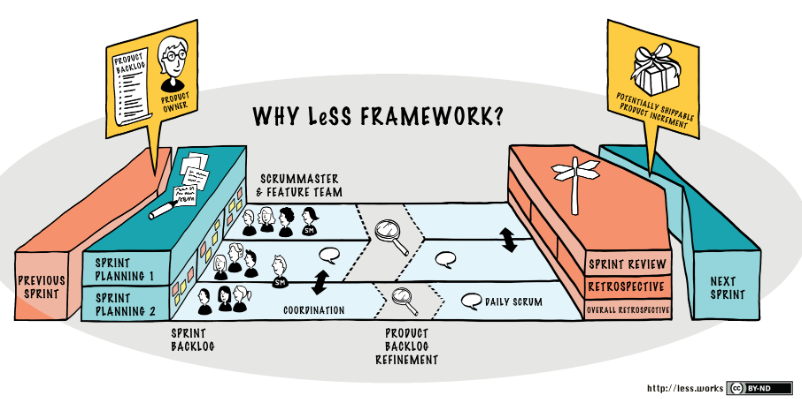
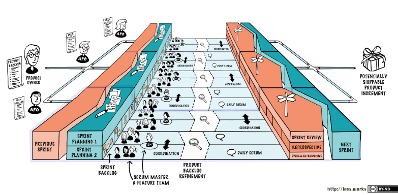
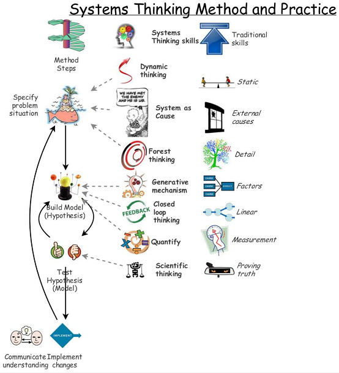
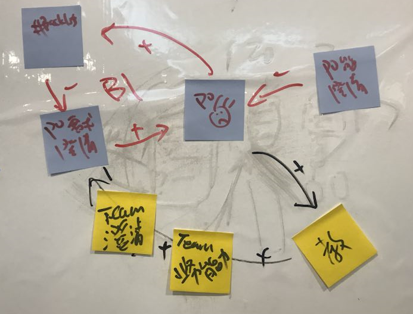
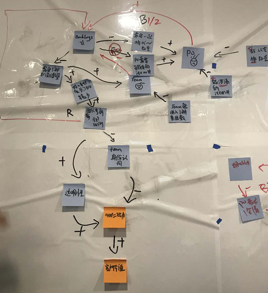

# Certified LeSS Partitioner - Day1

## LeSS Overview

 * 基于 Scrum
 * 让组织变得更敏捷的模型
 * 打造学习型组织、打造赋能型组织 (应对变化)

### 从 Scrum 到 LeSS Huge

 * Scrum - 5 ~ 7 的 team
 * Large-Scale Scrum (LeSS) is Scrum applied to many teams working together on **one product**

LeSS 的思路

 * Scaling with minimum change
 * 加人容易，减人难
 * 管理者的思考：每加入一个人，对于整个组织结构(系统)未来的演进，会有啥影响

本质

 * Scrum Team 包含 PO / SM / Team 三角色 
 * LeSS - 只扩展 Team (和 Team 相关的，对应扩展，比如：Sprint Backlog)
 * LeSS Huge - 扩展 Scrum Team

A Coder's View

 * LeSS - one-process multi-threading
 * LeSS Huge - multi-process multi-threading

### LeSS

 * <= 8 teams
 * <= 50 persons
 * 相比 Scrum，增加了 "Overall Retrospective"

### LeSS Huge

 * 8+ teams
 * 50+ persons
 * 相比 LeSS，增加了 "APO (Area PO)"

### LeSS History

 * 2006年，Nokia Networks 一个产品研发，需要 2 - 3 年
 * 太慢，开始启动组织结构变革
 * 
 * Bas 负责主导这个事情：请了多位 agile 大咖来讲 agile method
 * 最后选择了 Scrum：因为看起来最容易落地 :-)
 * 
 * 当时的 agile method，只有 small team 中的应用经验
 * 而 Nokia 一个产品，最少 50+ persons
 * 
 * Bas 请了 Craig 来做咨询，一起落地 Scrum Scale 实践

实践的经验，写了两本书

 * 《[Scaling Lean & Agile Development][1]》，2008年
 * 《[Practices for Scaling Lean & Agile Development][2]》，2010年

社区反馈，缺乏入门指南，Bas & Craig 又写了一本入门书

 * 《[Large-Scale Scrum: More with LeSS][3]》，2016年

## System Thinking

 * Systems Modeling with CLD (Causal-Loop Diagram, 因果回路图)

组织结构优化

 * 定义优化目标
 * 建模 & 验证
 * 这是一个持续的过程：It's always on the way.

LeSS 的目标

 * 提升组织应对变化的能力，三个维度
 * 
 * 灵活性 => 相应能力
 * 快速交付 => 端到端的交付速度
 * 学习能力
 * 
 * Organizational Design is a first-order factor

## LeSS 之 Backlog / Area / Product Owner

 * PO / Backlogs / Team 都是变量
 * 建模，画出之间的关系
 * 突破口：提升人(团队)的能力，打破旧循环、构建新循环

CLD (Causal-Loop Diagram) 简介

 * [https://yihuode.io/articles/337][4]
 * +表示正相关
 * -表示负相关
 * ||表示延迟生效
 * B平衡回路(单数个-号)
 * R增强回路(偶数个-号)

Team 去理解业务

 * 将一部分 PO 的工作
 * 平摊给 Team
 * PO 能力迁移到 Team 上（能力的迁移）

PO / Backlogs / Team 之间的 CLD

 * 由 Backlogs 的数量出发，推导：Team 的拆分、PO 的能力演变、LeSS 构架的形成
 * 建模无对无错，全看经验(心智模型)

Scrum / LeSS 对 PO 的要求

 * 创业公司老板
 * 啥都要会 :-)

## 游戏开发组织结构变迁

### 独立游戏 (小公司 / 10+ persons)

一个人

 * 策划、程序、美术、营销、客服
 * 啥都要做

多个人

 * 分工，还是会一个人还是横跨多个职能
 * 一个 Scrum Team

### 商业游戏 (大公司 / 1000+ persons)

一个 Team

 * 程序/策划 作为一个 Product Team
 * 美术 / QA / 营销 / HR / 财务 / 税务 / 法务 / ... 等等，作为 Support Team
 * LeSS 模型，解决 Product Team 和 Support Teams 之间的协同问题

多个 Team

 * 程序/策划 人多了，本身需要拆分为多个 Team (同一个 Product)
 * LeSS 模型，解决 Multi Teams in One Product & Support Teams 之间的协同问题

### 总结

 * 业务模型决定组织架构，回归到杨三角
 * 行业趋势 / 公司战略 / 组织结构 / 杨三角(员工思维模式 / 员工能力 / 员工治理方式)
 * LeSS 是软件开发中的一种模型，给整个组织构建"应对变化"的能力
 * LeSS 是软件开发中杨三角的具体应用形式

模型推导的思考原则

 * 人、人的心智模型
 * 人与人之间的信息交互线条 (线条简单、有效即可)

## Misc

沟通交流小技巧

 * Product Planning
 * 纸板，小team，写内容
 * 轮转，同步信息，PO现场做决策

[1]:https://www.amazon.com/Scaling-Lean-Agile-Development-Organizational/dp/0321480961/
[2]:https://www.amazon.com/Practices-Scaling-Lean-Agile-Development/dp/0321636406/
[3]:https://www.amazon.com/Large-Scale-Scrum-More-Addison-Wesley-Signature/dp/0321985710/
[4]:https://yihuode.io/articles/337
