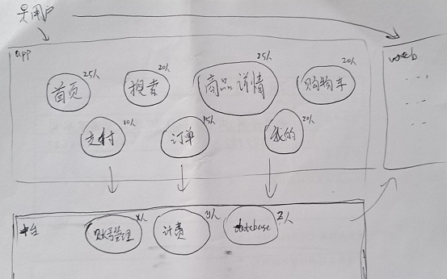
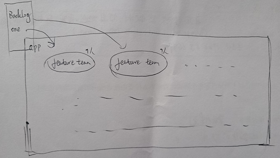
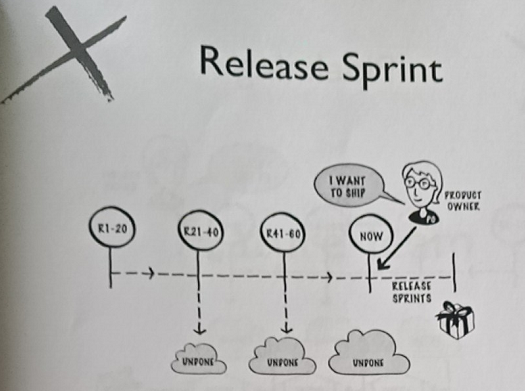
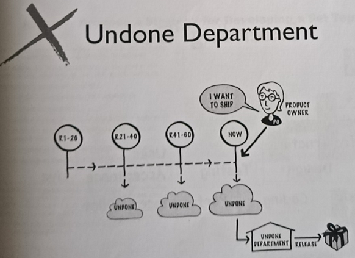
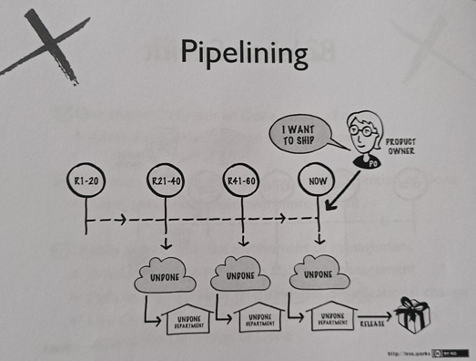
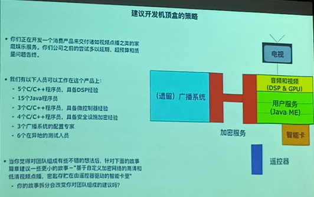
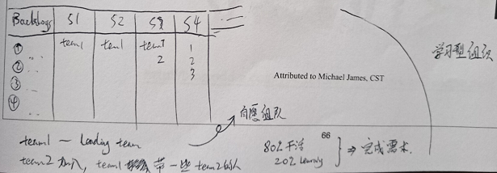
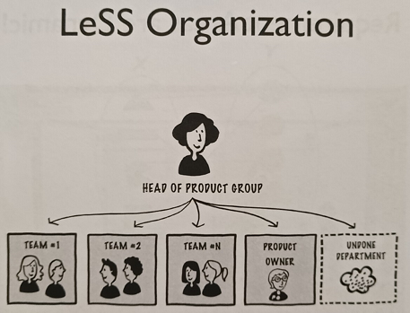
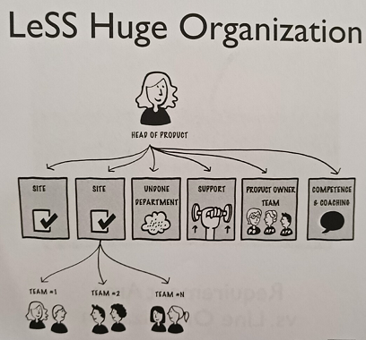

# Certified LeSS Partitioner - Day2

 * SAFe 是温和改革派
 * LeSS 是革命军 (打破藩篱，涅槃重生)

## Product Definition

 * 从 Customer 角度，梳理 Product 是啥
 * 然后反观组织结构，看看有啥可以优化的地方

### 案例 - 电商app

app 事业部

 * 从小到大演进，拆分了很多 component team
 * 
 * 加人容易，减人难。
 * release 周期：2 months => 1 month => 2 weeks
 * 
 * 首页、搜索、商品详情、购物车、支付、订单、我的
 * 每个 page功能 分为一个 develop team
 * 按着客户的购物旅程来切分的，很合理
 * app 整体依赖 中台 的部分组

web 事业部

 * 与 app 平行还有一个 web(浏览器) 入口
 * 因为用 web 下单的用户越来越少了，web 的开发团队人数相对少一些

app 事业部存在的问题

 * 需求太多，忙不过来
 * programmer 和 QA 撕逼 :-)
 * 很标准的组织结构
 * 短期内能改进的，是给每个 develop team 带入 scrum，提高单产

app 事业部导入 LeSS

 * 抹平"首页、搜索、商品详情、购物车、支付、订单、我的"分工概念
 * 所有人自由组队，划分为 feature team
 * app 的需求进入，由 feature team 自己认领

思考：是否需要导入 LeSS

 * 未必，目前的组织结构如果能正常运转，不需要导入
 * 如果加人就可以解决（公司有钱的话），加人就好
 * LeSS 解决的是：不增加人力的情况下，激活整个团队的战斗力 :-)

## Definition of Done

 * 根据业务来定义 Done
 * 每个 Feature Team 可以扩展 Done 的定义
 * 过段时间，把扩展后的 Done 定义，延展到所有 Feature Teams(要求更高了)

例子

 * 早期的 DoD 没有包含 "unit test" 的内容
 * 后来某个 feature team 扩展了这一条，作为他们 team 的 DoD
 * 之后，所有 feature teams 都觉得这一条很必要，修正 feature teams (product) 的 DoD

### 有趣的 Undone

#### Release Sprint

 * 每次 sprint，总有些活没干完
 * 积累到最后，花时间干完，才能 release

#### Undone Department

 * 针对上一种情况，多弄出来一个 team (undone department)，专门处理 undone
 * 把 undone 堆积到最后，丢给 undone department 去处理

#### Pipelining

 * 针对上一种情况，再改进下
 * 每次 sprint 都把 undone 丢给 undone department
 * 其实这个方法也挺敏捷的 :-)

## Feature Team 

### 如何启动一个新项目？

 * 人力充足，真的需要第一个 sprint 就全部投入么？
 * S1，构建 leading team，开始出 demo
 * S2 / S3 / S4, 根据 leading team 的摸索情况，构建更多 feature team
 * 其它 feature team 的成员，会有 leading team 的老司机带队
 * 最终让每个 feature team 都对整个产品全貌有了解，同时要求每个 coder 学习，能应对更多领域的需求（广度）

### 思考

 * 针对原有人员冗余的大机构，LeSS 导入会有很大的效率提升
 * 特别是一个产品，需要几百人去完成的时候
 * 一个公司，早年赚钱容易，它是没有动力去优化组织结构的
 * 当碰到市场变化快了，钱不好赚了，就需要组织结构变革

## LeSS Organization

 * 扁平化
 * 减少沟通成本

LeSS Organization

LeSS Huge Organization

 * site - 不同地域(北京/上海)

Keypoint

 * **Requirement Areas** are Dynamic!
 * 
 * Feature Team 在某段时间内，是属于且只属于某个 RA 的
 * RA 的动态性通常不会是每个迭代变化的，而是拉长时间来看的
 * 
 * 假设：Feature Team 转 RA 还是有更高的学习成本的
 * 所以不会频繁切换，但是考虑长期业务演进，某些 RA 需要更多团队
 * 某些 RA 不需要那么多团队，就需要移动 Feature Team
 * 
 * 相信：人的潜力无限 :-)

## Case Study - 华为

 * [https://yihuode.io/articles/324][1]

[1]:https://yihuode.io/articles/324
