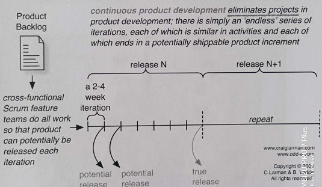
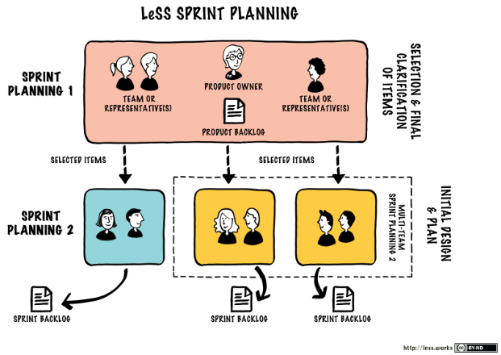
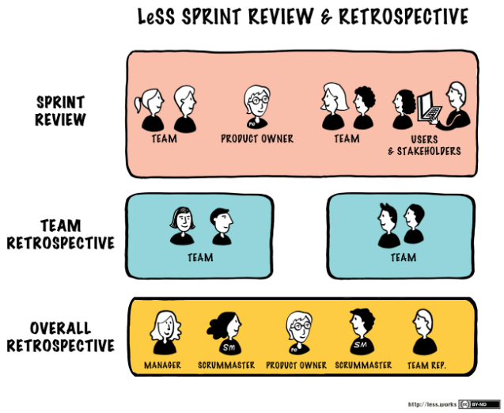
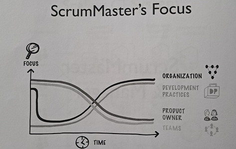
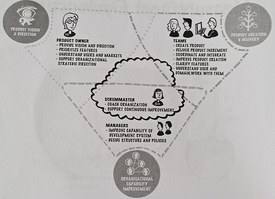
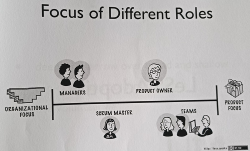
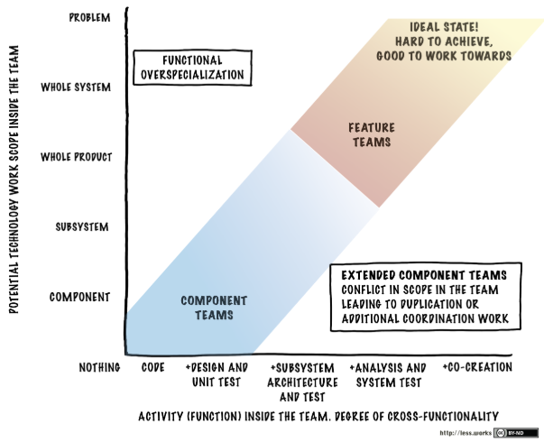
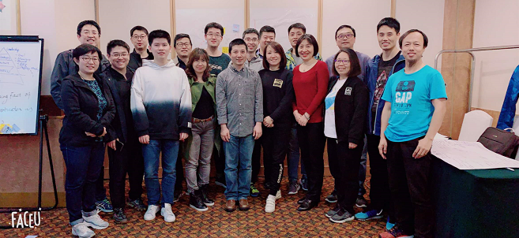

# Certified LeSS Partitioner - Day3

## LeSS Sprint

 * 针对传统软件，release cycle 过长的问题
 * 缩短 release cycle

### LeSS Sprint Planning

### LeSS Sprint Review & Retrospective

## Coordination & Integration

### 项目职能划分

Scrum Master

 * 不对交付负责、只关注如何让团队高效工作
 * Actively doing nothing~

Product Owner

 * 范围：Product Backlog Item
 * 时间：Sprint

Team

 * 范围：Sprint Backlog Item
 * 时间：Daily

成本

 * ???

### 一些方法

 * Just Talk - 有问题，跨 Team 直接沟通
 * Scout(侦察兵) - 听别的晨会，理解信息
 * Open Space - 讨论的空间
 * Traveler - 经验分享
 * Communities - 社区，文化建设 & 加强沟通
 * Component Mentor - 技术专家，核心模块守望者

### CI System

 * 持续集成是可以做到 DevOps 的核心部件
 * 搭建技术团队，保证每个 feature 一旦完成，就可以开始测试

## ScrumMaster & Manager

### ScrumMaster in LeSS

 * ScrumMaster are responsible for **a well-working LeSS adoption**.
 * Their focus is towards the Teams, Product Owner, organization, and developmemnt practices.
 * ScrumMaster does not focus on just one team but on **the overall organizational system**.
 * A ScrumMaster is **a dedicated full-time role**. One ScrumMaster can serve 1-3 teams.
 * 简单说：需要啥学啥，就是啥都要会 :-)

### ScrumMaster's Checklist

 * How is my Product Owner doing?
 * How is my team doing?
 * How are our engineering practices doing!
 * How is my organization doing?
 * [http://scrummasterchecklist.org/][1]

### Focus of Different Roles

## LeSS Adoption

 * 设立目标
 * 缓步渐行
 * 构建"自驱 + 学习型"组织

对团队的要求

 * 人的潜力的无限的
 * 需要啥，学啥

### Case-Studies

 * [https://less.works/case-studies/index.html][2]

## LeSS in My View

 * LeSS 是革命军
 * 打破藩篱，涅槃重生

变革之殇

 * 公司大了之后，每个人是不是真的高效工作
 * 这是做组织变革需要思考的
 * 
 * 哪里市场环境最恶劣，同时没有垄断的基础，活下来的大公司，就最敏捷
 * 互联网 & 游戏行业，相对很敏捷

如何变革？

 * 从打破每个人的舒适区开始

## LeSS in My View

## 课程信息

 * [https://www.odd-e.com/zh_cn/index.html][3]
 * 课程：Odd-e 的 Certified LeSS Practitioner
 * 讲师：吕毅

[1]:http://scrummasterchecklist.org/
[2]:https://less.works/case-studies/index.html
[3]:https://www.odd-e.com/zh_cn/index.html
