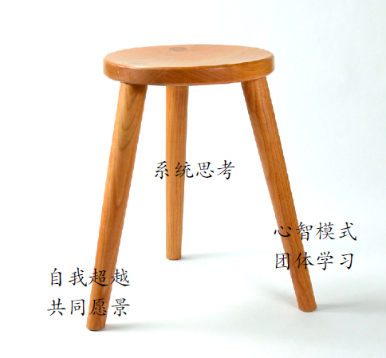
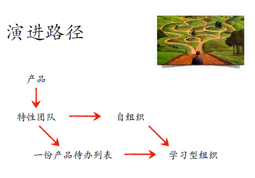
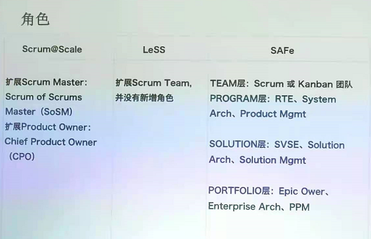
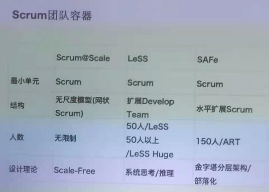
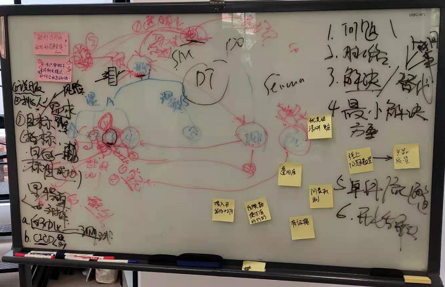

# LeSS 线下交流会


## 构建通往学习型组织的阶梯

* LeSS 只是起点，目标是学习型组织



* 有抱负、有追求（对个人、对组织都一样）
* 能思考
* 会学习（心智模式、团体学习）
* 《[第五项修炼][1]》


### 提问方式

同样一个问题

* 尝试一份 product backlog？
* 多个 product backlog 对 team adoption 的影响（带来思考）


### 构建团队共同愿景

一种方式

* 每个人将愿景写下来
* 然后 merge
* 定期 review，逐步朝愿景进发


### CLD 和 PDCA

* CLD 学习曲线比较高
* 可先尝试 PDCA，也是一种同步思路的方式

```
A3纸 PDCA(Plan, Do, Check, Act)
左边写P，右边写DCA

+-------------+-------------+
| P           |           D |
|             |             |
|             |           C |
|             |             |
|             |           A |
+-------------+-------------+
```

### 演进路径

* 产品：做 daily build、增量开发
* 其他几个内容哦：小范围试错、渐进式改革




### 案例分析

* 某手机研发团队，全公司导入 LeSS
* 产品：android 平台上的定制开发（system layer + apps）

落地过程

* 历时一年半，逐步有成效
* 大领导推动（CEO之下的一位领导）
* 原来的 team leader 进入 feature team，薪资保持不变化
* 实在无法认同变革的人，只能离开组织

KPI定制思路

* PO/Team: 70%(结果) / 30%(Peopel Mgmt评分)
* SM/People Mgmt：60%(结果)


## 规模化敏捷框架

* SAFe/LeSS/Scrum@Scale
* 三个框架的对比





* 个人：只研究 LeSS 就好


## 教练技术

* 曌乾组织教练
* http://www.zqcoach.com/

过程

* Agreement
* Awareness
* Acttion
* Accountability

用教练技术去做 coaching




## 总结

基本思考模型

* 定位目标
* 然后推导形成最小可验证集合
* PDCA


[1]:https://book.douban.com/subject/30133649/
